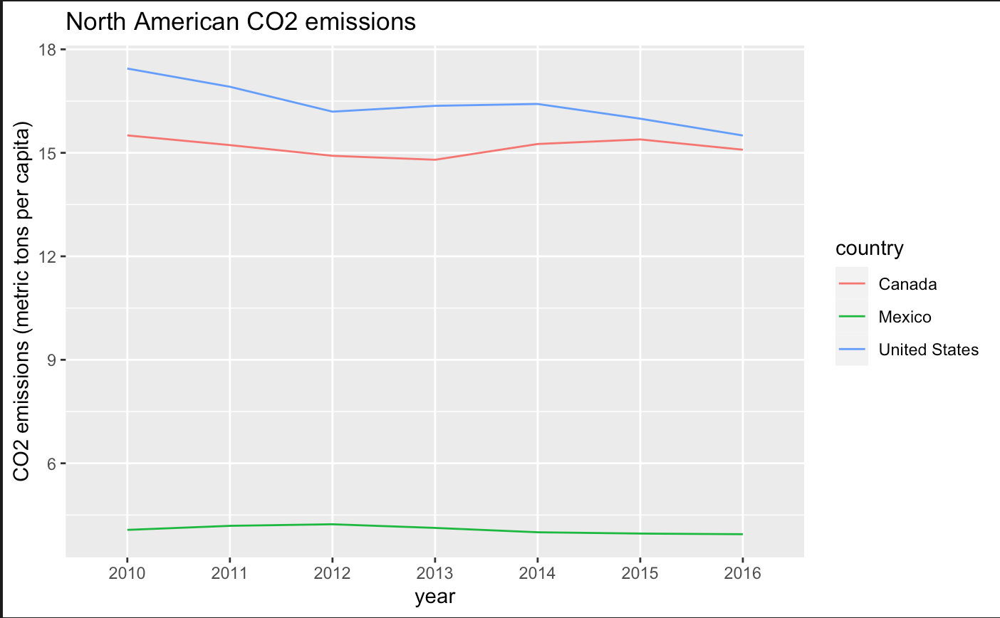
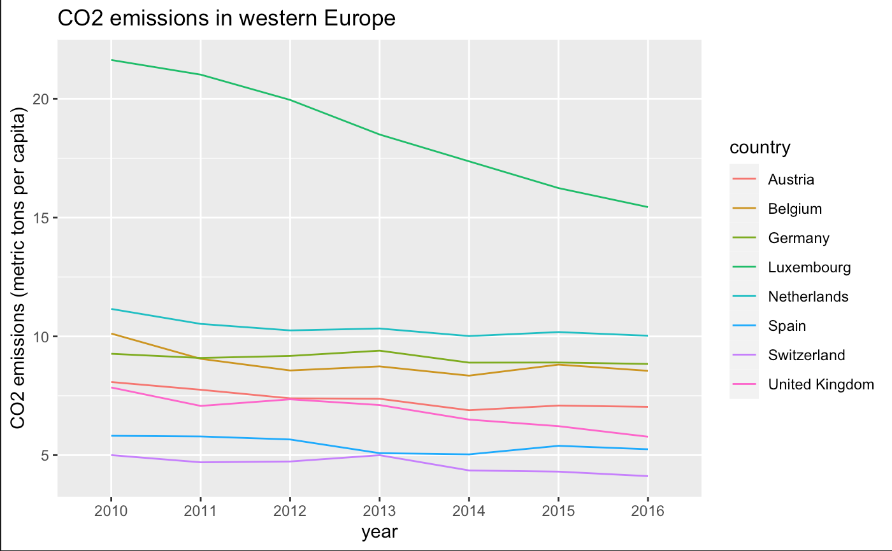

```{r setup, include=FALSE}
knitr::opts_chunk$set(echo = TRUE)
```

## Data

I found a data set from The World Bank <https://databank.worldbank.org/reports.aspx?source=2&type=metadata&series=EN.ATM.CO2E.PC#> on country CO2 emissions over time. Emissions are measured in metric ton per capita.

To learn more about climate change trends and what goals are and aren't being met, visit <https://climateactiontracker.org/>.

```{r packages, include = FALSE}
library(tidyverse)
library(dplyr)
library(ggplot2)
library(knitr)

CO2 <- read.csv("CO2_emissions.csv")

```

The raw data appeared like this: 

```{r raw data, include = TRUE}

kable(CO2[1:5, ], caption = "Raw data")

```

## Cleaning the Data Set

```{r cleaning up the data, include = FALSE}

CO2_tidied <- CO2 %>%
  select(Country.Name, X1990..YR1990.:X2016..YR2016.) # selecting only countries and year

col_labels <- c("country", 1990, 2000, 2010, 2011, 2012, 2013, 2014, 2015, 2016) 
colnames(CO2_tidied) <- col_labels # rename the columns

# convert to numeric -- I'm assuming this could be facilitated with a loop but not sure how to write one in R!
CO2_tidied$`1990` <- as.numeric(CO2_tidied$`1990`)
CO2_tidied$`2000` <- as.numeric(CO2_tidied$`2000`)
CO2_tidied$`2010` <- as.numeric(CO2_tidied$`2010`)
CO2_tidied$`2011` <- as.numeric(CO2_tidied$`2011`)
CO2_tidied$`2012` <- as.numeric(CO2_tidied$`2012`)
CO2_tidied$`2013` <- as.numeric(CO2_tidied$`2013`)
CO2_tidied$`2014` <- as.numeric(CO2_tidied$`2014`)
CO2_tidied$`2015` <- as.numeric(CO2_tidied$`2015`)
CO2_tidied$`2016` <- as.numeric(CO2_tidied$`2016`)

```

The data was cleaned to look like this:
(for code, see .Rmd document)

```{r refined table, include = TRUE}

kable(CO2_tidied[1:5, ], caption = "Refined data")

```

## Net CO2 Change over Time

After adding a "net_change" variable to quantify the difference in production between the years 1990 and 2016, I found that the countries with the greatest drop in production were Russia, Luxembourg, and Nauru. 

```{r CO2 decrease over time, include = FALSE}

decrease <- CO2_tidied %>%
  mutate(net_change = `2016` - `1990`) %>%
  arrange(net_change)

```

```{r CO2 decrease table, include = TRUE}

kable(decrease[1:6, ], caption = "Countries with greatest net decrease")

```

The countries with the greatest increase in production in that time period were Trinidad and Tobago, Qatar, and Gibraltar. 

```{r CO2 increase over time, include = FALSE}

increase <- CO2_tidied %>%
  mutate(net_change = `2016` - `1990`) %>%
  arrange(desc(net_change))

```

```{r CO2 increase table, include = TRUE}

kable(increase[1:6, ], caption = "Countries with least net decrease")

```
  
## North American CO2 Production

The U.S. and Canada have much greater overall production of CO2 per capita than Mexico. All North American countries have shown a slight decrease in CO2 output over time.



```{r CO2 in North America, include = FALSE}

north_america <- CO2_tidied %>%
  filter(country %in% c("Canada", "United States", "Mexico")) # get data for only N.A. countries

na_plot <- north_america %>%
  gather("year", "CO2", "1990":"2016") %>% # gather years together
  filter(year >= 2010)
  
ggplot(na_plot, aes(year, CO2, color = country, group = country)) +
  geom_line() +
  ylab("CO2 emissions (metric tons per capita)") +
  ggtitle("North American CO2 emissions")

```

## Production in Western Europe

A few western European countries were selected at random to visualize trends from the region. Luxembourg shows the greatest decrease, but remains the greatest CO2 producer; Switzerland appears to have the lowest production total.



```{r GDP, include = FALSE}

western <- CO2_tidied %>%
  filter(country %in% c("Germany", "Belgium", "United Kingdom", "Spain", "Austria", "Luxembourg", "Netherlands", "Switzerland"))

western_plot <- western %>%
  gather("year", "CO2", "1990":"2016") %>% # gather years together
  filter(year >= 2010)
  
ggplot(western_plot, aes(year, CO2, color = country, group = country)) +
  geom_line() +
  ylab("CO2 emissions (metric tons per capita)") +
  ggtitle("CO2 emissions in western Europe")

```