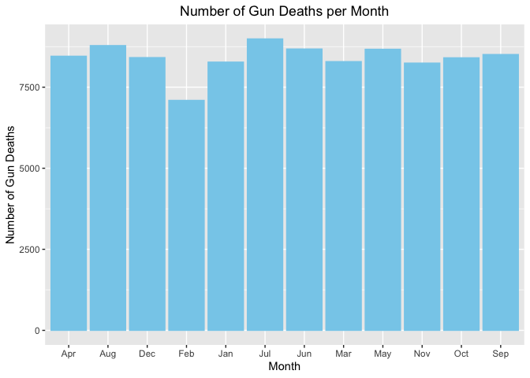
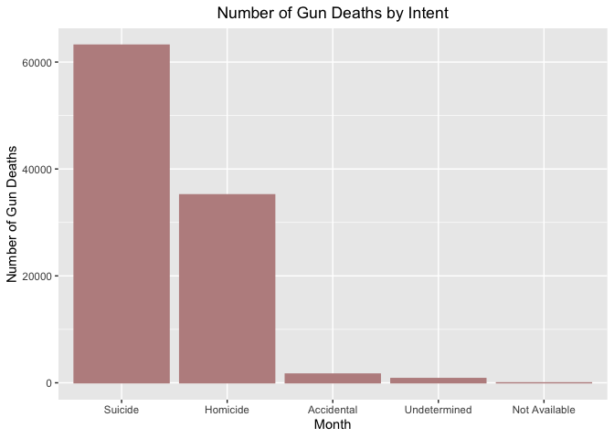
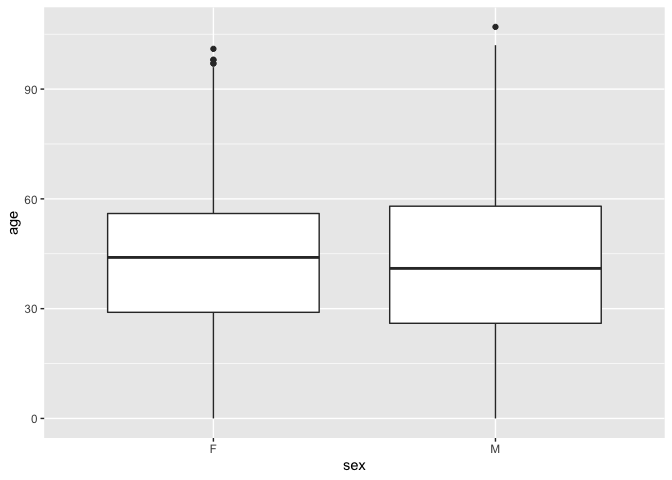

Exploring Gun Deaths in America
================

Objectives
----------

-   To explore gun death data curated by FiveThirtyEight [original data available here](https://github.com/fivethirtyeight/guns-data) by
    -   Month
    -   Intent
    -   Age and sex
    -   Education
    -   Season
    -   Intent by race
    -   Police-relatedness

Read in the data
----------------

The gun\_deaths.csv is provided in the repository.

``` r
library(tidyverse)    # load tidyverse packages, including ggplot2
library(readr)
library(knitr)
library(usethis)

# read in the data
gun_deaths <- read_csv("gun_deaths.csv")
```

Generating a data frame that summarizes the number of gun deaths per month and printing using `kable()`.
--------------------------------------------------------------------------------------------------------

Knitr is part of the knitr package. Allows you to change column names and add captions and make pretty tables in your knitted document. Hint: set the argument format = "markdown"

``` r
death_month <- gun_deaths %>% 
  group_by(month) %>% 
  summarise('Number of Gun Deaths' = n())
kable(death_month)
```

|  month|  Number of Gun Deaths|
|------:|---------------------:|
|      1|                  8273|
|      2|                  7093|
|      3|                  8289|
|      4|                  8455|
|      5|                  8669|
|      6|                  8677|
|      7|                  8989|
|      8|                  8783|
|      9|                  8508|
|     10|                  8406|
|     11|                  8243|
|     12|                  8413|

### Generating a bar chart with human-readable labels on the x-axis. That is, each month should be labeled "Jan", "Feb", "Mar" (full or abbreviated month names are fine), not `1`, `2`, `3`.

``` r
p1 <- ggplot(death_month, aes(x = month.abb[month], y = `Number of Gun Deaths`)) +
  geom_bar(stat = "identity", color = "skyblue", fill = "skyblue") +
  labs(title = 'Number of Gun Deaths per Month', x = "Month") +
  theme(plot.title = element_text(hjust = 0.5))

p1
```



Generating a bar chart that identifies the number of gun deaths associated with each type of intent cause of death. The bars should be sorted from highest to lowest values.
----------------------------------------------------------------------------------------------------------------------------------------------------------------------------

``` r
death_intent <- gun_deaths %>% 
  group_by(intent) %>% 
  summarise('Number of Gun Deaths' = n())

p2 <- ggplot(death_intent, aes(x = reorder(intent, -`Number of Gun Deaths`), y = `Number of Gun Deaths`)) +
  geom_bar(stat = 'identity', color = 'rosybrown', fill = 'rosybrown') +
  labs(title = 'Number of Gun Deaths by Intent', x = "Month") +
  theme(plot.title = element_text(hjust = 0.5))

p2
```



Generating a boxplot visualizing the age of gun death victims, by sex. Print the average age of female gun death victims.
-------------------------------------------------------------------------------------------------------------------------

``` r
# Generate a boxplot visualizing the age of gun death victims, by sex
gun_deaths$age <- as.numeric(gun_deaths$age)
```

    ## Warning: NAs introduced by coercion

``` r
p3 <- ggplot(gun_deaths, aes(x = sex, y = age)) +
  geom_boxplot()

p3
```

    ## Warning: Removed 18 rows containing non-finite values (stat_boxplot).



``` r
# Print the averae age of female gun death victims
mean(gun_deaths %>% filter(sex == "F") %>% select(age) %>% unlist(), na.rm = TRUE)
```

    ## [1] 43.69507

How many white males with at least a high school education were killed by guns in 2012?
---------------------------------------------------------------------------------------

``` r
gun_deaths %>% 
  filter(year == 2012, sex == "M", race == "White", education %in% c('HS/GED', 'BA+', 'Some college')) %>% 
  summarise(n())
```

    ## # A tibble: 1 x 1
    ##   `n()`
    ##   <int>
    ## 1 15199

`Answer:` 15199 white males with at least a high school education were killed by guns in 2012.

Which season of the year has the most gun deaths?
-------------------------------------------------

Assume that:

-   Winter = January-March
-   Spring = April-June
-   Summer = July-September
-   Fall = October-December

``` r
gun_season <- gun_deaths %>% 
  mutate(season = ifelse(month %in% 1:3, "Winter",
                               ifelse(month %in% 4:6, "Spring",
                                      ifelse(month %in% 7:9, "Summer",
                                             "Fall")))) %>% 
  group_by(season) %>% 
  summarise('Number of Gun Deaths' = n()) %>% 
  arrange(desc(`Number of Gun Deaths`))

gun_season
```

    ## # A tibble: 4 x 2
    ##   season `Number of Gun Deaths`
    ##   <chr>                   <int>
    ## 1 Summer                  26280
    ## 2 Spring                  25801
    ## 3 Fall                    25062
    ## 4 Winter                  23655

`Answer:` Summer has the most gun deaths

These are more open ended questions from here on out, you could look at making multiple summaries or types of plots.
====================================================================================================================

### Are whites who are killed by guns more likely to die because of suicide or homicide? How does this compare to blacks and hispanics?

``` r
gun_white <- gun_deaths %>%
  filter(race == 'White') %>% 
  group_by(intent) %>% 
  summarise('Number of Gun Deaths' = n()) %>% 
  mutate("Frequency (%)" = `Number of Gun Deaths` / sum(`Number of Gun Deaths`) * 100)

kable(gun_white)
```

| intent        |  Number of Gun Deaths|  Frequency (%)|
|:--------------|---------------------:|--------------:|
| Accidental    |                  1132|      1.7090146|
| Homicide      |                  9147|     13.8095022|
| Not Available |                     1|      0.0015097|
| Suicide       |                 55372|     83.5967813|
| Undetermined  |                   585|      0.8831922|

`Answer:` Whites who are killed by guns are more likely to die because of suicide.

(hint maybe looking at percentages would be good)

``` r
gun_race <- gun_deaths %>%
  filter(race %in% c('White', 'Black', 'Hispanic')) %>% 
  group_by(race, intent) %>% 
  summarise('Number of Gun Deaths' = n()) %>% 
  mutate("Percentage (%)" = `Number of Gun Deaths` / sum(`Number of Gun Deaths`) * 100)

kable(gun_race)
```

| race     | intent        |  Number of Gun Deaths|  Percentage (%)|
|:---------|:--------------|---------------------:|---------------:|
| Black    | Accidental    |                   328|       1.4079670|
| Black    | Homicide      |                 19510|      83.7482830|
| Black    | Suicide       |                  3332|      14.3028846|
| Black    | Undetermined  |                   126|       0.5408654|
| Hispanic | Accidental    |                   145|       1.6071824|
| Hispanic | Homicide      |                  5634|      62.4473509|
| Hispanic | Suicide       |                  3171|      35.1474174|
| Hispanic | Undetermined  |                    72|       0.7980492|
| White    | Accidental    |                  1132|       1.7090146|
| White    | Homicide      |                  9147|      13.8095022|
| White    | Not Available |                     1|       0.0015097|
| White    | Suicide       |                 55372|      83.5967813|
| White    | Undetermined  |                   585|       0.8831922|

`Answer:` While whites who are killed by guns are more likely to die because of suicide, blanks and hispanics who are killed by guns are more likely to die because of homicide.

### Are police-involved gun deaths significantly different from other gun deaths? Assess the relationship between police involvement and age, police involvement and race, and the intersection of all three variables.

``` r
kable(gun_deaths %>% 
  group_by(police) %>% 
  summarise(mean_age = mean(age, na.rm = TRUE)))
```

|  police|  mean\_age|
|-------:|----------:|
|       0|   43.96773|
|       1|   36.05136|

``` r
police_sex <- gun_deaths %>% 
  group_by(police, sex) %>% 
  summarise('Number of Gun Deaths' = n()) %>% 
  mutate("Percentage (%)" = `Number of Gun Deaths` / sum(`Number of Gun Deaths`) * 100)
kable(police_sex)
```

|  police| sex |  Number of Gun Deaths|  Percentage (%)|
|-------:|:----|---------------------:|---------------:|
|       0| F   |                 14386|       14.473420|
|       0| M   |                 85010|       85.526580|
|       1| F   |                    63|        4.493581|
|       1| M   |                  1339|       95.506419|

``` r
police_race <- gun_deaths %>% 
  group_by(police, race) %>% 
  summarise('Number of Gun Deaths' = n()) %>% 
  mutate("Percentage (%)" = `Number of Gun Deaths` / sum(`Number of Gun Deaths`) * 100)
kable(police_race)
```

|  police| race                                                 |  Number of Gun Deaths|  Percentage (%)|
|-------:|:-----------------------------------------------------|---------------------:|---------------:|
|       0| Asian/Pacific Islander                               |                  1296|       1.3038754|
|       0| Black                                                |                 22940|      23.0793996|
|       0| Hispanic                                             |                  8740|       8.7931104|
|       0| Not Availabletive American/Not Availabletive Alaskan |                   892|       0.8974204|
|       0| White                                                |                 65528|      65.9261942|
|       1| Asian/Pacific Islander                               |                    30|       2.1398003|
|       1| Black                                                |                   356|      25.3922967|
|       1| Hispanic                                             |                   282|      20.1141227|
|       1| Not Availabletive American/Not Availabletive Alaskan |                    25|       1.7831669|
|       1| White                                                |                   709|      50.5706134|

`Answer:` Victims of police-involved gun deaths are younger. There is a higher proportion of males in police-involved gun deaths. There are higher proportions of blacks and hispanics in police-involved gun deaths.

Think about performing stats such as a t.test to see if differences you are plotting are statistically significant

``` r
# Age vs. police
t.test(age ~ police, data = gun_deaths)
```

    ## 
    ##  Welch Two Sample t-test
    ## 
    ## data:  age by police
    ## t = 22.449, df = 1491.8, p-value < 2.2e-16
    ## alternative hypothesis: true difference in means is not equal to 0
    ## 95 percent confidence interval:
    ##  7.224642 8.608106
    ## sample estimates:
    ## mean in group 0 mean in group 1 
    ##        43.96773        36.05136

``` r
# Gender vs. police
prop.test(x = police_sex$`Percentage (%)`[c(2,4)], n = c(sum(police_sex$`Number of Gun Deaths`[1:2]), sum(police_sex$`Number of Gun Deaths`[3:4])))
```

    ## Warning in prop.test(x = police_sex$`Percentage (%)`[c(2, 4)], n =
    ## c(sum(police_sex$`Number of Gun Deaths`[1:2]), : Chi-squared approximation may
    ## be incorrect

    ## 
    ##  2-sample test for equality of proportions with continuity correction
    ## 
    ## data:  police_sex$`Percentage (%)`[c(2, 4)] out of c(sum(police_sex$`Number of Gun Deaths`[1:2]), sum(police_sex$`Number of Gun Deaths`[3:4]))
    ## X-squared = 3451.3, df = 1, p-value < 2.2e-16
    ## alternative hypothesis: two.sided
    ## 95 percent confidence interval:
    ##  -0.08081253 -0.05370965
    ## sample estimates:
    ##      prop 1      prop 2 
    ## 0.000860463 0.068121554

``` r
# Black
prop.test(x = police_race$`Percentage (%)`[c(2,7)], n = c(sum(police_race$`Number of Gun Deaths`[1:5]), sum(police_race$`Number of Gun Deaths`[6:10])))
```

    ## Warning in prop.test(x = police_race$`Percentage (%)`[c(2, 7)], n =
    ## c(sum(police_race$`Number of Gun Deaths`[1:5]), : Chi-squared approximation may
    ## be incorrect

    ## 
    ##  2-sample test for equality of proportions with continuity correction
    ## 
    ## data:  police_race$`Percentage (%)`[c(2, 7)] out of c(sum(police_race$`Number of Gun Deaths`[1:5]), sum(police_race$`Number of Gun Deaths`[6:10]))
    ## X-squared = 882.65, df = 1, p-value < 2.2e-16
    ## alternative hypothesis: two.sided
    ## 95 percent confidence interval:
    ##  -0.02522202 -0.01053655
    ## sample estimates:
    ##       prop 1       prop 2 
    ## 0.0002321965 0.0181114813

``` r
# Hispanic
prop.test(x = police_race$`Percentage (%)`[c(3,8)], n = c(sum(police_race$`Number of Gun Deaths`[1:5]), sum(police_race$`Number of Gun Deaths`[6:10])))
```

    ## Warning in prop.test(x = police_race$`Percentage (%)`[c(3, 8)], n =
    ## c(sum(police_race$`Number of Gun Deaths`[1:5]), : Chi-squared approximation may
    ## be incorrect

    ## 
    ##  2-sample test for equality of proportions with continuity correction
    ## 
    ## data:  police_race$`Percentage (%)`[c(3, 8)] out of c(sum(police_race$`Number of Gun Deaths`[1:5]), sum(police_race$`Number of Gun Deaths`[6:10]))
    ## X-squared = 931.22, df = 1, p-value < 2.2e-16
    ## alternative hypothesis: two.sided
    ## 95 percent confidence interval:
    ##  -0.020844826 -0.007671713
    ## sample estimates:
    ##       prop 1       prop 2 
    ## 8.846544e-05 1.434674e-02

``` r
police_race
```

    ## # A tibble: 10 x 4
    ## # Groups:   police [2]
    ##    police race                              `Number of Gun Dea… `Percentage (%)`
    ##     <dbl> <chr>                                           <int>            <dbl>
    ##  1      0 Asian/Pacific Islander                           1296            1.30 
    ##  2      0 Black                                           22940           23.1  
    ##  3      0 Hispanic                                         8740            8.79 
    ##  4      0 Not Availabletive American/Not A…                 892            0.897
    ##  5      0 White                                           65528           65.9  
    ##  6      1 Asian/Pacific Islander                             30            2.14 
    ##  7      1 Black                                             356           25.4  
    ##  8      1 Hispanic                                          282           20.1  
    ##  9      1 Not Availabletive American/Not A…                  25            1.78 
    ## 10      1 White                                             709           50.6

`Answer:` Victims of police-involved gun deaths are significantly younger. There is a significantly higher proportion of males in police-involved gun deaths. There are significantly higher proportions of blacks and hispanics in police-involved gun deaths.

Finally, all together now:

``` r
kable(gun_deaths %>% 
  group_by(police, race, sex) %>% 
  summarise('Number of Gun Deaths' = n(), 'Mean Age' = mean(age, na.rm = TRUE)))
```

|  police| race                                                 | sex |  Number of Gun Deaths|  Mean Age|
|-------:|:-----------------------------------------------------|:----|---------------------:|---------:|
|       0| Asian/Pacific Islander                               | F   |                   243|  39.74486|
|       0| Asian/Pacific Islander                               | M   |                  1053|  38.56695|
|       0| Black                                                | F   |                  2305|  33.05252|
|       0| Black                                                | M   |                 20635|  30.86851|
|       0| Hispanic                                             | F   |                  1063|  32.62183|
|       0| Hispanic                                             | M   |                  7677|  33.29416|
|       0| Not Availabletive American/Not Availabletive Alaskan | F   |                   126|  34.22222|
|       0| Not Availabletive American/Not Availabletive Alaskan | M   |                   766|  36.74902|
|       0| White                                                | F   |                 10649|  47.32883|
|       0| White                                                | M   |                 54879|  50.65822|
|       1| Asian/Pacific Islander                               | F   |                     1|  38.00000|
|       1| Asian/Pacific Islander                               | M   |                    29|  31.03448|
|       1| Black                                                | F   |                    13|  37.61538|
|       1| Black                                                | M   |                   343|  31.50729|
|       1| Hispanic                                             | F   |                    10|  35.40000|
|       1| Hispanic                                             | M   |                   272|  33.26471|
|       1| Not Availabletive American/Not Availabletive Alaskan | F   |                     1|  52.00000|
|       1| Not Availabletive American/Not Availabletive Alaskan | M   |                    24|  29.70833|
|       1| White                                                | F   |                    38|  41.47368|
|       1| White                                                | M   |                   671|  39.59314|

Session info
------------

``` r
# always good to have this for reproducibility purposes
devtools::session_info()
```

    ## ─ Session info ───────────────────────────────────────────────────────────────
    ##  setting  value                       
    ##  version  R version 3.6.1 (2019-07-05)
    ##  os       macOS Catalina 10.15.6      
    ##  system   x86_64, darwin15.6.0        
    ##  ui       X11                         
    ##  language (EN)                        
    ##  collate  en_US.UTF-8                 
    ##  ctype    en_US.UTF-8                 
    ##  tz       US/Pacific                  
    ##  date     2020-07-27                  
    ## 
    ## ─ Packages ───────────────────────────────────────────────────────────────────
    ##  package     * version date       lib source        
    ##  assertthat    0.2.1   2019-03-21 [1] CRAN (R 3.6.0)
    ##  backports     1.1.5   2019-10-02 [1] CRAN (R 3.6.0)
    ##  blob          1.2.1   2020-01-20 [1] CRAN (R 3.6.0)
    ##  broom         0.7.0   2020-07-09 [1] CRAN (R 3.6.2)
    ##  callr         3.4.3   2020-03-28 [1] CRAN (R 3.6.2)
    ##  cellranger    1.1.0   2016-07-27 [1] CRAN (R 3.6.0)
    ##  cli           1.1.0   2019-03-19 [1] CRAN (R 3.6.0)
    ##  colorspace    1.4-1   2019-03-18 [1] CRAN (R 3.6.0)
    ##  crayon        1.3.4   2017-09-16 [1] CRAN (R 3.6.0)
    ##  DBI           1.1.0   2019-12-15 [1] CRAN (R 3.6.0)
    ##  dbplyr        1.4.4   2020-05-27 [1] CRAN (R 3.6.2)
    ##  desc          1.2.0   2018-05-01 [1] CRAN (R 3.6.0)
    ##  devtools      2.2.2   2020-02-17 [1] CRAN (R 3.6.0)
    ##  digest        0.6.23  2019-11-23 [1] CRAN (R 3.6.0)
    ##  dplyr       * 0.8.3   2019-07-04 [1] CRAN (R 3.6.0)
    ##  ellipsis      0.3.0   2019-09-20 [1] CRAN (R 3.6.0)
    ##  evaluate      0.14    2019-05-28 [1] CRAN (R 3.6.0)
    ##  fansi         0.4.0   2018-10-05 [1] CRAN (R 3.6.0)
    ##  farver        2.0.1   2019-11-13 [1] CRAN (R 3.6.0)
    ##  forcats     * 0.4.0   2019-02-17 [1] CRAN (R 3.6.0)
    ##  fs            1.4.2   2020-06-30 [1] CRAN (R 3.6.2)
    ##  generics      0.0.2   2018-11-29 [1] CRAN (R 3.6.0)
    ##  ggplot2     * 3.2.1   2019-08-10 [1] CRAN (R 3.6.0)
    ##  glue          1.3.1   2019-03-12 [1] CRAN (R 3.6.0)
    ##  gtable        0.3.0   2019-03-25 [1] CRAN (R 3.6.0)
    ##  haven         2.2.0   2019-11-08 [1] CRAN (R 3.6.0)
    ##  highr         0.8     2019-03-20 [1] CRAN (R 3.6.0)
    ##  hms           0.5.2   2019-10-30 [1] CRAN (R 3.6.0)
    ##  htmltools     0.4.0   2019-10-04 [1] CRAN (R 3.6.0)
    ##  httr          1.4.1   2019-08-05 [1] CRAN (R 3.6.0)
    ##  jsonlite      1.6     2018-12-07 [1] CRAN (R 3.6.0)
    ##  knitr       * 1.26    2019-11-12 [1] CRAN (R 3.6.0)
    ##  labeling      0.3     2014-08-23 [1] CRAN (R 3.6.0)
    ##  lazyeval      0.2.2   2019-03-15 [1] CRAN (R 3.6.0)
    ##  lifecycle     0.2.0   2020-03-06 [1] CRAN (R 3.6.0)
    ##  lubridate     1.7.4   2018-04-11 [1] CRAN (R 3.6.0)
    ##  magrittr      1.5     2014-11-22 [1] CRAN (R 3.6.0)
    ##  memoise       1.1.0   2017-04-21 [1] CRAN (R 3.6.0)
    ##  modelr        0.1.8   2020-05-19 [1] CRAN (R 3.6.2)
    ##  munsell       0.5.0   2018-06-12 [1] CRAN (R 3.6.0)
    ##  pillar        1.4.6   2020-07-10 [1] CRAN (R 3.6.2)
    ##  pkgbuild      1.0.6   2019-10-09 [1] CRAN (R 3.6.0)
    ##  pkgconfig     2.0.3   2019-09-22 [1] CRAN (R 3.6.0)
    ##  pkgload       1.0.2   2018-10-29 [1] CRAN (R 3.6.0)
    ##  prettyunits   1.0.2   2015-07-13 [1] CRAN (R 3.6.0)
    ##  processx      3.4.2   2020-02-09 [1] CRAN (R 3.6.0)
    ##  ps            1.3.2   2020-02-13 [1] CRAN (R 3.6.0)
    ##  purrr       * 0.3.3   2019-10-18 [1] CRAN (R 3.6.0)
    ##  R6            2.4.1   2019-11-12 [1] CRAN (R 3.6.0)
    ##  Rcpp          1.0.3   2019-11-08 [1] CRAN (R 3.6.0)
    ##  readr       * 1.3.1   2018-12-21 [1] CRAN (R 3.6.0)
    ##  readxl        1.3.1   2019-03-13 [1] CRAN (R 3.6.0)
    ##  remotes       2.1.1   2020-02-15 [1] CRAN (R 3.6.0)
    ##  reprex        0.3.0   2019-05-16 [1] CRAN (R 3.6.0)
    ##  rlang         0.4.7   2020-07-09 [1] CRAN (R 3.6.2)
    ##  rmarkdown     1.18    2019-11-27 [1] CRAN (R 3.6.0)
    ##  rprojroot     1.3-2   2018-01-03 [1] CRAN (R 3.6.0)
    ##  rstudioapi    0.11    2020-02-07 [1] CRAN (R 3.6.0)
    ##  rvest         0.3.5   2019-11-08 [1] CRAN (R 3.6.0)
    ##  scales        1.1.0   2019-11-18 [1] CRAN (R 3.6.0)
    ##  sessioninfo   1.1.1   2018-11-05 [1] CRAN (R 3.6.0)
    ##  stringi       1.4.3   2019-03-12 [1] CRAN (R 3.6.0)
    ##  stringr     * 1.4.0   2019-02-10 [1] CRAN (R 3.6.0)
    ##  testthat      2.3.2   2020-03-02 [1] CRAN (R 3.6.0)
    ##  tibble      * 3.0.3   2020-07-10 [1] CRAN (R 3.6.2)
    ##  tidyr       * 1.0.0   2019-09-11 [1] CRAN (R 3.6.0)
    ##  tidyselect    0.2.5   2018-10-11 [1] CRAN (R 3.6.0)
    ##  tidyverse   * 1.3.0   2019-11-21 [1] CRAN (R 3.6.0)
    ##  usethis     * 1.6.1   2020-04-29 [1] CRAN (R 3.6.2)
    ##  utf8          1.1.4   2018-05-24 [1] CRAN (R 3.6.0)
    ##  vctrs         0.3.2   2020-07-15 [1] CRAN (R 3.6.2)
    ##  withr         2.1.2   2018-03-15 [1] CRAN (R 3.6.0)
    ##  xfun          0.11    2019-11-12 [1] CRAN (R 3.6.0)
    ##  xml2          1.3.2   2020-04-23 [1] CRAN (R 3.6.2)
    ##  yaml          2.2.0   2018-07-25 [1] CRAN (R 3.6.0)
    ## 
    ## [1] /Library/Frameworks/R.framework/Versions/3.6/Resources/library
