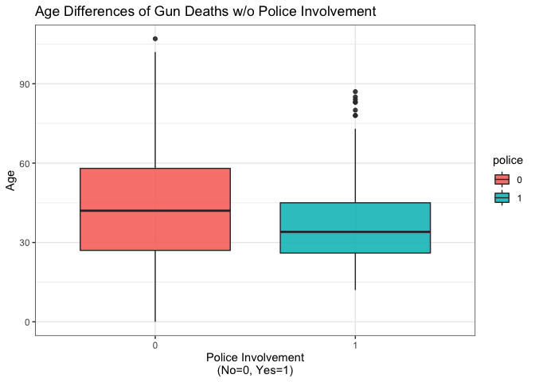
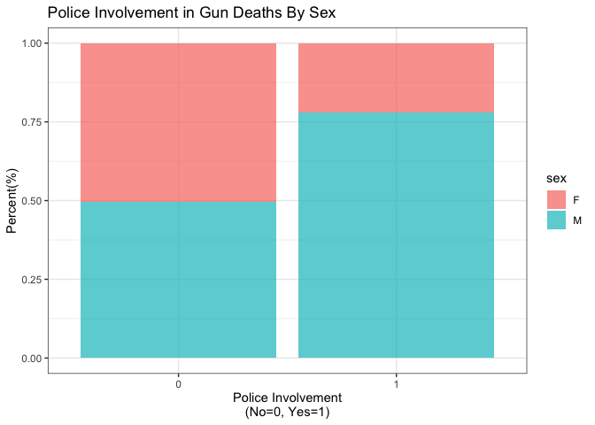

Exploring Gun Deaths in America
================

## Objectives

  - To explore gun death data curated by FiveThirtyEight [original data
    available here](https://github.com/fivethirtyeight/guns-data) by
      - Month
      - Intent
      - Age and sex
      - Education
      - Season
      - Intent by race
      - Police-relatedness

## Read in the data

The gun\_deaths.csv is provided in the repository.

``` r
library(tidyverse)    # load tidyverse packages, including ggplot2
library(dplyr)
library(magrittr)
library(knitr)

# read in the data
gun_death<- read_csv("gun_deaths.csv")
```

``` r
knitr::opts_chunk$set(echo = TRUE, error = TRUE)

#glimps
glimpse(gun_death)
```

    ## Rows: 100,798
    ## Columns: 10
    ## $ year      <dbl> 2012, 2012, 2012, 2012, 2012, 2012, 2012, 2012, 2012, 2012,…
    ## $ month     <dbl> 1, 1, 1, 2, 2, 2, 2, 3, 2, 2, 2, 1, 3, 3, 3, 3, 3, 3, 3, 4,…
    ## $ intent    <chr> "Suicide", "Suicide", "Suicide", "Suicide", "Suicide", "Sui…
    ## $ police    <dbl> 0, 0, 0, 0, 0, 0, 0, 0, 0, 0, 0, 0, 0, 0, 0, 0, 0, 0, 0, 0,…
    ## $ sex       <chr> "M", "F", "M", "M", "M", "M", "M", "M", "M", "M", "M", "M",…
    ## $ age       <chr> "34", "21", "60", "64", "31", "17", "48", "41", "50", "Not …
    ## $ race      <chr> "Asian/Pacific Islander", "White", "White", "White", "White…
    ## $ hispanic  <dbl> 100, 100, 100, 100, 100, 100, 100, 100, 100, 998, 100, 100,…
    ## $ place     <chr> "Home", "Street", "Other specified", "Home", "Other specifi…
    ## $ education <chr> "BA+", "Some college", "BA+", "BA+", "HS/GED", "Less than H…

## Generating a data frame that summarizes the number of gun deaths per month and printing using `kable()`.

Knitr is part of the knitr package. Allows you to change column names
and add captions and make pretty tables in your knitted document. Hint:
set the argument format = “markdown”

``` r
month_death<- gun_death %>%
    group_by(month) %>%
    count(month)

kable(month_death, format="markdown", row.names= NA, col.names= c("Month", "Number of Deaths"), caption= "Monthly gun-related deaths in 2012, data retrieved from https://github.com/fivethirtyeight/guns-data")
```

| Month | Number of Deaths |
| ----: | ---------------: |
|     1 |             8273 |
|     2 |             7093 |
|     3 |             8289 |
|     4 |             8455 |
|     5 |             8669 |
|     6 |             8677 |
|     7 |             8989 |
|     8 |             8783 |
|     9 |             8508 |
|    10 |             8406 |
|    11 |             8243 |
|    12 |             8413 |

Monthly gun-related deaths in 2012, data retrieved from
<https://github.com/fivethirtyeight/guns-data>

### Generating a bar chart with human-readable labels on the x-axis. That is, each month should be labeled “Jan”, “Feb”, “Mar” (full or abbreviated month names are fine), not `1`, `2`, `3`.

``` r
#change variable month to contain abbs of months
gun_death$month <- factor(gun_death$month, labels= c("Jan", "Feb", "Mar", "Apr", "May", "Jun", "Jul", "Aug", "Sep", "Oct", "Nov", "Dec"))

#create a data frame that has the count of death for each month 
monthly_death<- gun_death %>%
    group_by(month) %>%
    count()

#plot   
ggplot(monthly_death, aes(x=month, y=n))+
    geom_bar(stat="identity", fill="red", alpha=0.7)+
    scale_y_continuous(limit=c(0,12000))+
    labs(title="Montly Gun Deaths in 2012", x=element_blank(), y="Number of deaths")+
    theme_bw()
```

<!-- -->

## Generating a bar chart that identifies the number of gun deaths associated with each type of intent cause of death. The bars should be sorted from highest to lowest values.

``` r
#create a data frame with death number associated with intent type
gun_death_intent<- gun_death %>%
    group_by(intent) %>%
    count() 

#A way to level the intent variable in order to order the bins, not the best way if there are more variables
gun_death_intent$intent<- factor(gun_death_intent$intent, 
                                 levels=c("Suicide", "Homicide", "Accidental", "Undetermined", "Not Available"))     

#plot
ggplot(gun_death_intent, aes(x=intent, y=n, fill=intent))+
    geom_bar(stat="identity", alpha=0.9)+
    scale_y_continuous(limit=c(0,64000))+
    labs(title="Number of Gun Deaths by Different Intentions in 2012", x=element_blank(), y="Number of deaths", fill="Reported Intentions")+
    theme_bw()
```

<!-- -->

## Generating a boxplot visualizing the age of gun death victims, by sex. Print the average age of female gun death victims.

``` r
##make age variable numeric
gun_death$age<- as.numeric(gun_death$age)
```

    ## Warning: NAs introduced by coercion

``` r
#mean of female victims
female_age<- gun_death %>%
    select(age, sex) %>%
    filter(sex=="F") 

avg<- mean(female_age$age, na.rm=TRUE)  
avg<- round(avg, digits=2)

#plot
ggplot(gun_death, aes(x=sex, y=age, fill=sex))+
    geom_boxplot()+
    annotate("text", x=1, y=70, label=paste("The average age\n of female victim is", avg))+
    labs(title="Ages of Gun Violence Victims in 2012, By Gender", x=element_blank(), y="Age", fill="Gender")+
    theme_bw()
```

    ## Warning: Removed 18 rows containing non-finite values (stat_boxplot).

<!-- -->

## How many white males with at least a high school education were killed by guns in 2012?

\-The answer is 46227

``` r
answer<- gun_death %>%
    select(education, race, sex) %>%
    filter(education %in% c("HS/GED", "Some college", "BA+"), race== "White", sex=="M") %>%
    count()
answer
```

    ## # A tibble: 1 x 1
    ##       n
    ##   <int>
    ## 1 46227

## Which season of the year has the most gun deaths?

Assume that:

  - Winter = January-March
  - Spring = April-June
  - Summer = July-September
  - Fall = October-December

\-Summer has the most gun deaths.

``` r
#calculate death count in each season
winter<- gun_death %>%
    select(month) %>%
    filter(month %in% c("Jan", "Feb", "Mar")) %>%
    count() 

spring<- gun_death %>%
    select(month) %>%
    filter(month %in% c("Apr", "May", "Jun")) %>%
    count() 

summer<- gun_death %>%
    select(month) %>%
    filter(month %in% c("Jul", "Aug", "Sep")) %>%
    count() 

fall<- gun_death %>%
    select(month) %>%
    filter(month %in% c("Oct", "Nov", "Dec")) %>%
    count() 

max(winter, spring, summer, fall)
```

    ## [1] 26280

# These are more open ended questions from here on out, you could look at making multiple summaries or types of plots.

### Are whites who are killed by guns more likely to die because of suicide or homicide? How does this compare to blacks and hispanics?

``` r
#data frame of gun deaths intent 
gun_death_race3<- gun_death %>%
    filter(race %in% c("White", "Black", "Hispanic"), intent %in% c("Suicide", "Homicide")) 

#order race
gun_death_race3$race<- factor(gun_death_race3$race, 
                                 levels=c("White", "Black", "Hispanic")) 

#plot
ggplot(gun_death_race3, aes(x=race, fill=intent))+
    geom_bar(position="stack", alpha=0.9)+
    labs(title="Gun Death Intentions Comparisons Among Three Populations", x="Race", y="Number of deaths", fill="Reported Intentions")+
    theme_bw()
```

<!-- -->

(hint maybe looking at percentages would be good)

``` r
#add a percent column summarizing the info
gun_death_percent<- gun_death_race3 %>%
    group_by(race, intent) %>%
    count() %>%
    rename(death=n) %>%
    group_by(race) %>%
    mutate(total=sum(death), percent=death/total*100)

#plot
ggplot(gun_death_percent, aes(x=race, y=percent, fill=intent))+
    geom_bar(stat="identity", position="stack", alpha=0.9)+
    labs(title="Proportions of Reported Intentions of Gun Deaths Among Three Populations", x="Race", y="Percentage(%)", fill="Reported Intentions")+
    theme_bw()
```

<!-- -->

### Are police-involved gun deaths significantly different from other gun deaths? Assess the relationship between police involvement and age, police involvement and race, and the intersection of all three variables.

``` r
#data frame
gun_death_police<- gun_death %>%
    select(sex, age, police) 

#make police variable factor
gun_death_police$police<- factor(gun_death_police$police)

#Are police-involved gun deaths significantly different from other gun deaths?
gun_death_police %>%
    group_by(police) %>%
    count()
```

    ## # A tibble: 2 x 2
    ## # Groups:   police [2]
    ##   police     n
    ##   <fct>  <int>
    ## 1 0      99396
    ## 2 1       1402

``` r
#plot
ggplot(gun_death_police, aes(x=police))+
    geom_bar(fill="blue", alpha=0.7)+
    labs(title="The Majority of Gun Deaths in 2012 Did Not Involve A Police", x="Police Involvement\n(No=0, Yes=1)", y="Number of deaths")+
    theme_bw()
```

<!-- -->

## Comparing the mean ages of gun death victims with or without police involvement, which is younger?

  - A t test comparing the means of age among gun deaths w/o police
    involvement shows that there is a statistically significant
    difference the age means.
  - A boxplot below to visualize that the average age of the vicimts of
    police-involved gun deaths is younger.

<!-- end list -->

``` r
#make age variable numeric
gun_death_police$age<- as.numeric(gun_death_police$age)

#t test
t.test(gun_death_police$age ~ gun_death_police$police)
```

    ## 
    ##  Welch Two Sample t-test
    ## 
    ## data:  gun_death_police$age by gun_death_police$police
    ## t = 22.449, df = 1491.8, p-value < 2.2e-16
    ## alternative hypothesis: true difference in means is not equal to 0
    ## 95 percent confidence interval:
    ##  7.224642 8.608106
    ## sample estimates:
    ## mean in group 0 mean in group 1 
    ##        43.96773        36.05136

``` r
#plot
ggplot(gun_death_police, aes(x=police, y=age, fill=police))+
    geom_boxplot(alpha=0.9)+
    labs(title="Age Differences of Gun Deaths w/o Police Involvement", x="Police Involvement\n(No=0, Yes=1)", y="Age")+
    theme_bw()
```

    ## Warning: Removed 18 rows containing non-finite values (stat_boxplot).

<!-- -->

## Are victims of police-involved gun death more likely to be male or female?

  - The visualization shows a greater proportion of police-involved
    victims are male compared to gun death that did not invovle a
    police.
  - A Chi-square test shows statistical sigficance of this comparison.

<!-- end list -->

``` r
police_sex_percent<- gun_death_police %>%
    group_by(sex, police) %>%
    count() %>%
    group_by(sex) %>%
    mutate(total=sum(n), percent=n/total)

ggplot(police_sex_percent, aes(x=police, y=percent, fill=sex))+
    geom_bar(stat="identity", position="fill", alpha=0.7)+
    labs(title="Police Involvement in Gun Deaths By Sex", x="Police Involvement\n(No=0, Yes=1)", y="Percent(%)")+
    theme_bw()
```

<!-- -->

``` r
chisq.test(gun_death_police$police, gun_death_police$sex, correct=FALSE)
```

    ## 
    ##  Pearson's Chi-squared test
    ## 
    ## data:  gun_death_police$police and gun_death_police$sex
    ## X-squared = 112.13, df = 1, p-value < 2.2e-16

## Age, gender, and police involvement of gun deaths in 2012

``` r
ggplot(gun_death_police, aes(x=police, y=age, fill=sex))+
    geom_boxplot(alpha=0.9)+
    labs(title="Age Differences of Gun Deaths w/o Police Involvement By Gender", x="Police Involvement\n(No=0, Yes=1)", y="Age")+
    theme_bw()
```

    ## Warning: Removed 18 rows containing non-finite values (stat_boxplot).

<!-- -->

## Session info

``` r
# always good to have this for reproducibility purposes
devtools::session_info()
```

    ## ─ Session info ───────────────────────────────────────────────────────────────
    ##  setting  value                       
    ##  version  R version 4.0.2 (2020-06-22)
    ##  os       macOS Mojave 10.14.6        
    ##  system   x86_64, darwin17.0          
    ##  ui       X11                         
    ##  language (EN)                        
    ##  collate  en_US.UTF-8                 
    ##  ctype    en_US.UTF-8                 
    ##  tz       America/New_York            
    ##  date     2020-07-29                  
    ## 
    ## ─ Packages ───────────────────────────────────────────────────────────────────
    ##  package     * version date       lib source        
    ##  assertthat    0.2.1   2019-03-21 [1] CRAN (R 4.0.2)
    ##  backports     1.1.8   2020-06-17 [1] CRAN (R 4.0.2)
    ##  blob          1.2.1   2020-01-20 [1] CRAN (R 4.0.2)
    ##  broom         0.7.0   2020-07-09 [1] CRAN (R 4.0.2)
    ##  callr         3.4.3   2020-03-28 [1] CRAN (R 4.0.2)
    ##  cellranger    1.1.0   2016-07-27 [1] CRAN (R 4.0.2)
    ##  cli           2.0.2   2020-02-28 [1] CRAN (R 4.0.2)
    ##  colorspace    1.4-1   2019-03-18 [1] CRAN (R 4.0.2)
    ##  crayon        1.3.4   2017-09-16 [1] CRAN (R 4.0.2)
    ##  DBI           1.1.0   2019-12-15 [1] CRAN (R 4.0.2)
    ##  dbplyr        1.4.4   2020-05-27 [1] CRAN (R 4.0.2)
    ##  desc          1.2.0   2018-05-01 [1] CRAN (R 4.0.2)
    ##  devtools      2.3.1   2020-07-21 [1] CRAN (R 4.0.2)
    ##  digest        0.6.25  2020-02-23 [1] CRAN (R 4.0.2)
    ##  dplyr       * 1.0.0   2020-05-29 [1] CRAN (R 4.0.2)
    ##  ellipsis      0.3.1   2020-05-15 [1] CRAN (R 4.0.2)
    ##  evaluate      0.14    2019-05-28 [1] CRAN (R 4.0.1)
    ##  fansi         0.4.1   2020-01-08 [1] CRAN (R 4.0.2)
    ##  farver        2.0.3   2020-01-16 [1] CRAN (R 4.0.2)
    ##  forcats     * 0.5.0   2020-03-01 [1] CRAN (R 4.0.2)
    ##  fs            1.4.2   2020-06-30 [1] CRAN (R 4.0.2)
    ##  generics      0.0.2   2018-11-29 [1] CRAN (R 4.0.2)
    ##  ggplot2     * 3.3.2   2020-06-19 [1] CRAN (R 4.0.2)
    ##  glue          1.4.1   2020-05-13 [1] CRAN (R 4.0.2)
    ##  gtable        0.3.0   2019-03-25 [1] CRAN (R 4.0.2)
    ##  haven         2.3.1   2020-06-01 [1] CRAN (R 4.0.2)
    ##  highr         0.8     2019-03-20 [1] CRAN (R 4.0.2)
    ##  hms           0.5.3   2020-01-08 [1] CRAN (R 4.0.2)
    ##  htmltools     0.5.0   2020-06-16 [1] CRAN (R 4.0.2)
    ##  httr          1.4.2   2020-07-20 [1] CRAN (R 4.0.2)
    ##  jsonlite      1.7.0   2020-06-25 [1] CRAN (R 4.0.2)
    ##  knitr       * 1.29    2020-06-23 [1] CRAN (R 4.0.2)
    ##  labeling      0.3     2014-08-23 [1] CRAN (R 4.0.2)
    ##  lifecycle     0.2.0   2020-03-06 [1] CRAN (R 4.0.2)
    ##  lubridate     1.7.9   2020-06-08 [1] CRAN (R 4.0.2)
    ##  magrittr    * 1.5     2014-11-22 [1] CRAN (R 4.0.2)
    ##  memoise       1.1.0   2017-04-21 [1] CRAN (R 4.0.2)
    ##  modelr        0.1.8   2020-05-19 [1] CRAN (R 4.0.2)
    ##  munsell       0.5.0   2018-06-12 [1] CRAN (R 4.0.2)
    ##  pillar        1.4.6   2020-07-10 [1] CRAN (R 4.0.2)
    ##  pkgbuild      1.1.0   2020-07-13 [1] CRAN (R 4.0.2)
    ##  pkgconfig     2.0.3   2019-09-22 [1] CRAN (R 4.0.2)
    ##  pkgload       1.1.0   2020-05-29 [1] CRAN (R 4.0.2)
    ##  prettyunits   1.1.1   2020-01-24 [1] CRAN (R 4.0.2)
    ##  processx      3.4.3   2020-07-05 [1] CRAN (R 4.0.2)
    ##  ps            1.3.3   2020-05-08 [1] CRAN (R 4.0.2)
    ##  purrr       * 0.3.4   2020-04-17 [1] CRAN (R 4.0.2)
    ##  R6            2.4.1   2019-11-12 [1] CRAN (R 4.0.2)
    ##  Rcpp          1.0.5   2020-07-06 [1] CRAN (R 4.0.2)
    ##  readr       * 1.3.1   2018-12-21 [1] CRAN (R 4.0.2)
    ##  readxl        1.3.1   2019-03-13 [1] CRAN (R 4.0.2)
    ##  remotes       2.2.0   2020-07-21 [1] CRAN (R 4.0.2)
    ##  reprex        0.3.0   2019-05-16 [1] CRAN (R 4.0.2)
    ##  rlang         0.4.7   2020-07-09 [1] CRAN (R 4.0.2)
    ##  rmarkdown     2.3     2020-06-18 [1] CRAN (R 4.0.2)
    ##  rprojroot     1.3-2   2018-01-03 [1] CRAN (R 4.0.2)
    ##  rstudioapi    0.11    2020-02-07 [1] CRAN (R 4.0.2)
    ##  rvest         0.3.6   2020-07-25 [1] CRAN (R 4.0.2)
    ##  scales        1.1.1   2020-05-11 [1] CRAN (R 4.0.2)
    ##  sessioninfo   1.1.1   2018-11-05 [1] CRAN (R 4.0.2)
    ##  stringi       1.4.6   2020-02-17 [1] CRAN (R 4.0.2)
    ##  stringr     * 1.4.0   2019-02-10 [1] CRAN (R 4.0.2)
    ##  testthat      2.3.2   2020-03-02 [1] CRAN (R 4.0.2)
    ##  tibble      * 3.0.3   2020-07-10 [1] CRAN (R 4.0.2)
    ##  tidyr       * 1.1.0   2020-05-20 [1] CRAN (R 4.0.2)
    ##  tidyselect    1.1.0   2020-05-11 [1] CRAN (R 4.0.2)
    ##  tidyverse   * 1.3.0   2019-11-21 [1] CRAN (R 4.0.2)
    ##  usethis       1.6.1   2020-04-29 [1] CRAN (R 4.0.2)
    ##  utf8          1.1.4   2018-05-24 [1] CRAN (R 4.0.2)
    ##  vctrs         0.3.2   2020-07-15 [1] CRAN (R 4.0.2)
    ##  withr         2.2.0   2020-04-20 [1] CRAN (R 4.0.2)
    ##  xfun          0.16    2020-07-24 [1] CRAN (R 4.0.2)
    ##  xml2          1.3.2   2020-04-23 [1] CRAN (R 4.0.2)
    ##  yaml          2.2.1   2020-02-01 [1] CRAN (R 4.0.2)
    ## 
    ## [1] /Library/Frameworks/R.framework/Versions/4.0/Resources/library
