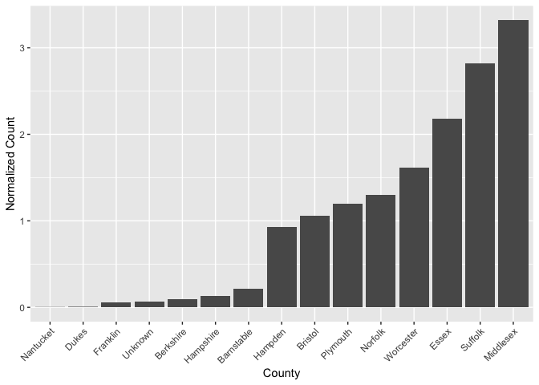

Exploring Gun Deaths in America
================

### Option 1

Explore a dataset. That’s right, like last week find some data online or
use your own data and manipulate it and explore it to create some data
summaries. You can look at that homework for a list of datasets. Make
use of the major dplyr functions select(), mutate(), arrange(),
group\_by(), summarize(), count() or baseR equivalents (there isn’t a
good baseR equivalent for many of these functions though). If you are
using a Rmd, think about making your table summaries and printing them
nicely with knitr::kable() and still think about plotting some
data.

#### For this homework, I chose to do option 1 and applied the above mentioned functions to the dataset I analysed in HW03.

## Read in the data

``` r
# load tidyverse packages, including ggplot2
library(tidyverse)
library(knitr)

# read in the data
counties <- read.csv(url("https://raw.githubusercontent.com/nytimes/covid-19-data/master/us-counties.csv"))

# I used to live in Boston, so I decided to investigate the data for Massachusetts
MA <- filter(counties, state == "Massachusetts")
dropped <- select(MA, -contains("fips"))
number_of_counties <- 
# I couldn't think of another thing to apply count() so I check the number of counties here, any suggestions will be welcomed

#Calculate for the total cases in each county and sort the counties based on the number of cases
grouped <- group_by(MA, county)
total_case <- summarise(grouped, total = sum(cases))

#Arrangement based on the normalized data and bar plotting
normalized <- mutate(total_case, case_norm = total/mean(total, na.rm =TRUE))
arranged <- arrange(normalized, desc(case_norm))
ggplot(arranged, aes(x = reorder(county,case_norm), y = case_norm))+
    geom_bar(stat = "identity")+
    xlab("County")+
    ylab("Normalized Count")+
    theme(axis.text.x = element_text(angle = 45, vjust = 1, hjust = 1))
```

<!-- -->
