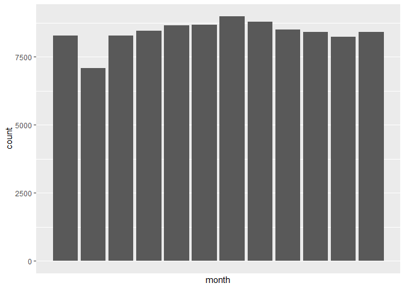

Exploring Gun Deaths in America
================
Laura Cespedes

## Objectives

  - To explore gun death data curated by FiveThirtyEight [original data
    available here](https://github.com/fivethirtyeight/guns-data) by
      - Month
      - Intent
      - Age and sex
      - Education
      - Season
      - Intent by race
      - Police-relatedness

## Read in the data

The gun\_deaths.csv is provided in the repository.

``` r
#I also needed a couple of additional packages
library(tidyverse)    # load tidyverse packages, including ggplot2
library(knitr)
library(forcats)

# read in the data
gun_deaths <- read.csv("gun_deaths.csv",h=T)
```

## Generating a data frame that summarizes the number of gun deaths per month and printing using `kable()`.

Knitr is part of the knitr package. Allows you to change column names
and add captions and make pretty tables in your knitted document. Hint:
set the argument format = “markdown”

``` r
#Gun deaths per month
knitr::kable(gun_deaths %>% count(month), format="markdown",
             col.names=c("Month","Numer of gun deaths"))
```

| Month | Numer of gun deaths |
| ----: | ------------------: |
|     1 |                8273 |
|     2 |                7093 |
|     3 |                8289 |
|     4 |                8455 |
|     5 |                8669 |
|     6 |                8677 |
|     7 |                8989 |
|     8 |                8783 |
|     9 |                8508 |
|    10 |                8406 |
|    11 |                8243 |
|    12 |                8413 |

### Generating a bar chart with human-readable labels on the x-axis. That is, each month should be labeled “Jan”, “Feb”, “Mar” (full or abbreviated month names are fine), not `1`, `2`, `3`.

``` r
#Originally variable was read as an integer, so I changed its class to be read as a factor
gun_deaths$month <- as.factor(gun_deaths$month)

#Simple barplot with the number of deaths per month
ggplot(gun_deaths,mapping = aes(x = month)) +
  geom_bar() +   
  scale_x_discrete(labels=c("Jan","Feb","Mar","Apr","May","Jun","Jul",
                            "Aug","Sep","Oct","Nov","Dec"))+
  theme_bw()
```

<!-- -->

## Generating a bar chart that identifies the number of gun deaths associated with each type of intent cause of death. The bars should be sorted from highest to lowest values.

``` r
#Barplot with number of deaths by intent (sorted from highest to lowest values)
#Sorted using the function fct_infreq from the forcats package
ggplot(gun_deaths,mapping = aes(x = forcats::fct_infreq(intent))) +
  geom_bar(col="gray30",fill="gray70")+
  theme_bw()+
  theme(axis.title = element_text(color="black", size=12))
```

<!-- -->

## Generating a boxplot visualizing the age of gun death victims, by sex. Print the average age of female gun death victims.

``` r
#I want the age to be read as a numeric variable.
gun_deaths$age <- as.numeric(gun_deaths$age)

#Boxplot showing the age of gun death victims by sex:
ggplot(gun_deaths,mapping = aes(x = sex, y= age)) +
  geom_boxplot(fill="gray90",width=0.7)+
  theme_bw()+
  theme(axis.title = element_text(color="black", size=12))
```

<!-- -->

``` r
#This is the mean of the age of female gun death victims:
F_data <- gun_deaths %>% filter(sex=="F")
mean(F_data$age)
```

    ## [1] 44.15911

## How many white males with at least a high school education were killed by guns in 2012?

``` r
#The answer is:
kable(gun_deaths %>% filter(sex=="M") %>% filter(race=="White") %>% filter(year=="2012") %>% count(),format="markdown")
```

|     n |
| ----: |
| 18342 |

## Which season of the year has the most gun deaths?

Assume that:

  - Winter = January-March
  - Spring = April-June
  - Summer = July-September
  - Fall =
October-December

<!-- end list -->

``` r
#First, I created an additional column (variable) that specifies the season:
gun_deaths$season[gun_deaths$month %in% c("1","2","3")] <- "winter"
gun_deaths$season[gun_deaths$month %in% c("4","5","6")] <- "spring"
gun_deaths$season[gun_deaths$month %in% c("7","8","9")] <- "summer"
gun_deaths$season[gun_deaths$month %in% c("10","11","12")] <- "fall"

#Then, I created a summary table counting the number of deaths per season. The season with the highest numer of deaths due tu gun violence is summer:
kable(gun_deaths %>% count(season, sort=TRUE),format="markdown",
      col.names=c("Season","Numer of gun deaths"))
```

| Season | Numer of gun deaths |
| :----- | ------------------: |
| summer |               26280 |
| spring |               25801 |
| fall   |               25062 |
| winter |               23655 |

# These are more open ended questions from here on out, you could look at making multiple summaries or types of plots.

### Are whites who are killed by guns more likely to die because of suicide or homicide? How does this compare to blacks and hispanics?

Whites that are killed by guns are more likely to die because of
suicide. In contrast, black and hispanics who are killed by guns are
more likely to die because of homicide. See tables below, with the
percentage of total deaths by intent for each
race:

``` r
#Below, I created summary tables with the number of deaths by intent for each race. I also calculated the percentage for each intent. I realize that my strategy here is a bit convoluted, so I very much appreacite any suggestions here!

# Whites
white_intent_count <- gun_deaths %>% group_by(race, intent) %>% summarise(count=n()) %>% filter(race %in% c("White")) %>% mutate(percentage = (count / sum(count))*100) %>% arrange(desc(percentage))
kable(white_intent_count,format="markdown")
```

| race  | intent        | count | percentage |
| :---- | :------------ | ----: | ---------: |
| White | Suicide       | 55372 | 83.5967813 |
| White | Homicide      |  9147 | 13.8095022 |
| White | Accidental    |  1132 |  1.7090146 |
| White | Undetermined  |   585 |  0.8831922 |
| White | Not Available |     1 |  0.0015097 |

``` r
# Blacks
black_intent_count <- gun_deaths %>% group_by(race, intent) %>% summarise(count=n()) %>% filter(race %in% c("Black")) %>% mutate(percentage = (count / sum(count))*100) %>% arrange(desc(percentage))
kable(black_intent_count,format="markdown")
```

| race  | intent       | count | percentage |
| :---- | :----------- | ----: | ---------: |
| Black | Homicide     | 19510 | 83.7482830 |
| Black | Suicide      |  3332 | 14.3028846 |
| Black | Accidental   |   328 |  1.4079670 |
| Black | Undetermined |   126 |  0.5408654 |

``` r
# Hispanics
hispanic_intent_count <- gun_deaths %>% group_by(race, intent) %>% summarise(count=n()) %>% filter(race %in% c("Hispanic")) %>% mutate(percentage = (count / sum(count))*100) %>% arrange(desc(percentage))
kable(hispanic_intent_count,format="markdown")
```

| race     | intent       | count | percentage |
| :------- | :----------- | ----: | ---------: |
| Hispanic | Homicide     |  5634 | 62.4473509 |
| Hispanic | Suicide      |  3171 | 35.1474174 |
| Hispanic | Accidental   |   145 |  1.6071824 |
| Hispanic | Undetermined |    72 |  0.7980492 |

### Are police-involved gun deaths significantly different from other gun deaths? Assess the relationship between police involvement and age, police involvement and race, and the intersection of all three variables.

Think about performing stats such as a t.test to see if differences you
are plotting are statistically significant

(I changed the order a little here. I performed statistical test after
the corresponding figure instead of doing it at the
end)

#### Are there differences in age depending on wether police was involved or not?

``` r
gun_deaths$police <- as.factor(gun_deaths$police)

#Boxplots showing age in cases were police was involved and was not involved
#Age seems to be a little bit higher for cases in which the police was not involved (0)
ggplot(gun_deaths,mapping = aes(x = police, y= age)) +
  geom_boxplot(,fill="gray80")+
  theme_bw()+
  theme(axis.title = element_text(color="black", size=12))+
  xlab("Police involvement?")
```

<!-- -->

``` r
#And based on a t-test the difference appears to be statistically significant. Gun death victims are statistically older in cases in which the police was not involved.
t.test(gun_deaths$age~gun_deaths$police)
```

    ## 
    ##  Welch Two Sample t-test
    ## 
    ## data:  gun_deaths$age by gun_deaths$police
    ## t = 22.955, df = 1490.9, p-value < 2.2e-16
    ## alternative hypothesis: true difference in means is not equal to 0
    ## 95 percent confidence interval:
    ##  8.146936 9.669382
    ## sample estimates:
    ## mean in group 0 mean in group 1 
    ##        44.12285        35.21469

#### Number of deaths per race depending on wether police was involved or not

``` r
#Barplots showing the number of gun deaths depending on wether police was involved or not, for each race:
ggplot(gun_deaths, aes(x=police)) +
    geom_bar()+
    facet_wrap(~race,scales = "free")+
    xlab("Police involvement?") +
    theme_bw()
```

<!-- -->

``` r
#Did not really know what statistical test would be useful here!
```

#### Number of deaths per race depending on wether police was involved or not

``` r
#Age by race and police involment
ggplot(gun_deaths, aes(x=police,fill=race,y=age)) +
    geom_boxplot()+
    xlab("Police involvement?") +
    theme_bw()
```

<!-- -->

``` r
#It appears to be an effect of age and police involvement (and its interaction) on the age of gun death victims:
aov <- aov(gun_deaths$age ~ gun_deaths$police * gun_deaths$race)
summary(aov)
```

    ##                                       Df   Sum Sq Mean Sq F value Pr(>F)    
    ## gun_deaths$police                      1   109709  109709  298.88 <2e-16 ***
    ## gun_deaths$race                        4  8806660 2201665 5998.08 <2e-16 ***
    ## gun_deaths$police:gun_deaths$race      4    46145   11536   31.43 <2e-16 ***
    ## Residuals                         100788 36995397     367                   
    ## ---
    ## Signif. codes:  0 '***' 0.001 '**' 0.01 '*' 0.05 '.' 0.1 ' ' 1

## Session info

``` r
# always good to have this for reproducibility purposes
devtools::session_info()
```

    ## ─ Session info ───────────────────────────────────────────────────────────────
    ##  setting  value                       
    ##  version  R version 3.6.1 (2019-07-05)
    ##  os       macOS High Sierra 10.13.6   
    ##  system   x86_64, darwin15.6.0        
    ##  ui       X11                         
    ##  language (EN)                        
    ##  collate  en_US.UTF-8                 
    ##  ctype    en_US.UTF-8                 
    ##  tz       America/Bogota              
    ##  date     2020-07-27                  
    ## 
    ## ─ Packages ───────────────────────────────────────────────────────────────────
    ##  package     * version date       lib source        
    ##  assertthat    0.2.1   2019-03-21 [1] CRAN (R 3.6.0)
    ##  backports     1.1.6   2020-04-05 [1] CRAN (R 3.6.2)
    ##  broom         0.5.3   2019-12-14 [1] CRAN (R 3.6.0)
    ##  callr         3.4.3   2020-03-28 [1] CRAN (R 3.6.2)
    ##  cellranger    1.1.0   2016-07-27 [1] CRAN (R 3.6.0)
    ##  cli           2.0.2   2020-02-28 [1] CRAN (R 3.6.0)
    ##  colorspace    1.4-1   2019-03-18 [1] CRAN (R 3.6.0)
    ##  crayon        1.3.4   2017-09-16 [1] CRAN (R 3.6.0)
    ##  DBI           1.0.0   2018-05-02 [1] CRAN (R 3.6.0)
    ##  dbplyr        1.4.2   2019-06-17 [1] CRAN (R 3.6.0)
    ##  desc          1.2.0   2018-05-01 [1] CRAN (R 3.6.0)
    ##  devtools      2.3.0   2020-04-10 [1] CRAN (R 3.6.1)
    ##  digest        0.6.25  2020-02-23 [1] CRAN (R 3.6.0)
    ##  dplyr       * 0.8.5   2020-03-07 [1] CRAN (R 3.6.0)
    ##  ellipsis      0.3.0   2019-09-20 [1] CRAN (R 3.6.0)
    ##  evaluate      0.14    2019-05-28 [1] CRAN (R 3.6.0)
    ##  fansi         0.4.1   2020-01-08 [1] CRAN (R 3.6.0)
    ##  farver        2.0.3   2020-01-16 [1] CRAN (R 3.6.0)
    ##  forcats     * 0.4.0   2019-02-17 [1] CRAN (R 3.6.0)
    ##  fs            1.3.1   2019-05-06 [1] CRAN (R 3.6.0)
    ##  generics      0.0.2   2018-11-29 [1] CRAN (R 3.6.0)
    ##  ggplot2     * 3.3.0   2020-03-05 [1] CRAN (R 3.6.0)
    ##  glue          1.4.0   2020-04-03 [1] CRAN (R 3.6.2)
    ##  gtable        0.3.0   2019-03-25 [1] CRAN (R 3.6.0)
    ##  haven         2.2.0   2019-11-08 [1] CRAN (R 3.6.0)
    ##  highr         0.8     2019-03-20 [1] CRAN (R 3.6.0)
    ##  hms           0.5.2   2019-10-30 [1] CRAN (R 3.6.0)
    ##  htmltools     0.4.0   2019-10-04 [1] CRAN (R 3.6.0)
    ##  httr          1.4.1   2019-08-05 [1] CRAN (R 3.6.0)
    ##  jsonlite      1.6.1   2020-02-02 [1] CRAN (R 3.6.0)
    ##  knitr       * 1.26    2019-11-12 [1] CRAN (R 3.6.0)
    ##  labeling      0.3     2014-08-23 [1] CRAN (R 3.6.0)
    ##  lattice       0.20-38 2018-11-04 [1] CRAN (R 3.6.1)
    ##  lifecycle     0.2.0   2020-03-06 [1] CRAN (R 3.6.0)
    ##  lubridate     1.7.4   2018-04-11 [1] CRAN (R 3.6.0)
    ##  magrittr      1.5     2014-11-22 [1] CRAN (R 3.6.0)
    ##  memoise       1.1.0   2017-04-21 [1] CRAN (R 3.6.0)
    ##  modelr        0.1.5   2019-08-08 [1] CRAN (R 3.6.0)
    ##  munsell       0.5.0   2018-06-12 [1] CRAN (R 3.6.0)
    ##  nlme          3.1-140 2019-05-12 [1] CRAN (R 3.6.1)
    ##  pillar        1.4.3   2019-12-20 [1] CRAN (R 3.6.0)
    ##  pkgbuild      1.0.7   2020-04-25 [1] CRAN (R 3.6.2)
    ##  pkgconfig     2.0.3   2019-09-22 [1] CRAN (R 3.6.0)
    ##  pkgload       1.0.2   2018-10-29 [1] CRAN (R 3.6.0)
    ##  prettyunits   1.1.1   2020-01-24 [1] CRAN (R 3.6.0)
    ##  processx      3.4.2   2020-02-09 [1] CRAN (R 3.6.0)
    ##  ps            1.3.2   2020-02-13 [1] CRAN (R 3.6.0)
    ##  purrr       * 0.3.4   2020-04-17 [1] CRAN (R 3.6.2)
    ##  R6            2.4.1   2019-11-12 [1] CRAN (R 3.6.0)
    ##  Rcpp          1.0.4.6 2020-04-09 [1] CRAN (R 3.6.1)
    ##  readr       * 1.3.1   2018-12-21 [1] CRAN (R 3.6.0)
    ##  readxl        1.3.1   2019-03-13 [1] CRAN (R 3.6.0)
    ##  remotes       2.1.1   2020-02-15 [1] CRAN (R 3.6.0)
    ##  reprex        0.3.0   2019-05-16 [1] CRAN (R 3.6.0)
    ##  rlang         0.4.5   2020-03-01 [1] CRAN (R 3.6.0)
    ##  rmarkdown     2.0     2019-12-12 [1] CRAN (R 3.6.0)
    ##  rprojroot     1.3-2   2018-01-03 [1] CRAN (R 3.6.0)
    ##  rstudioapi    0.11    2020-02-07 [1] CRAN (R 3.6.0)
    ##  rvest         0.3.5   2019-11-08 [1] CRAN (R 3.6.0)
    ##  scales        1.1.0   2019-11-18 [1] CRAN (R 3.6.0)
    ##  sessioninfo   1.1.1   2018-11-05 [1] CRAN (R 3.6.0)
    ##  stringi       1.4.6   2020-02-17 [1] CRAN (R 3.6.0)
    ##  stringr     * 1.4.0   2019-02-10 [1] CRAN (R 3.6.0)
    ##  testthat      2.3.2   2020-03-02 [1] CRAN (R 3.6.0)
    ##  tibble      * 3.0.1   2020-04-20 [1] CRAN (R 3.6.2)
    ##  tidyr       * 1.0.2   2020-01-24 [1] CRAN (R 3.6.0)
    ##  tidyselect    1.0.0   2020-01-27 [1] CRAN (R 3.6.0)
    ##  tidyverse   * 1.3.0   2019-11-21 [1] CRAN (R 3.6.0)
    ##  usethis       1.6.0   2020-04-09 [1] CRAN (R 3.6.1)
    ##  vctrs         0.2.4   2020-03-10 [1] CRAN (R 3.6.0)
    ##  withr         2.2.0   2020-04-20 [1] CRAN (R 3.6.2)
    ##  xfun          0.11    2019-11-12 [1] CRAN (R 3.6.0)
    ##  xml2          1.2.2   2019-08-09 [1] CRAN (R 3.6.0)
    ##  yaml          2.2.0   2018-07-25 [1] CRAN (R 3.6.0)
    ## 
    ## [1] /Library/Frameworks/R.framework/Versions/3.6/Resources/library
