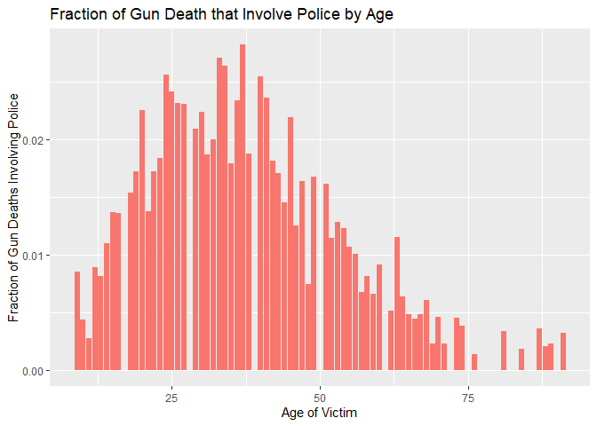

Exploring Gun Deaths in America
================

## Objectives

  - To explore gun death data curated by FiveThirtyEight [original data
    available here](https://github.com/fivethirtyeight/guns-data) by
      - Month
      - Intent
      - Age and sex
      - Education
      - Season
      - Intent by race
      - Police-relatedness

## Read in the data

The gun\_deaths.csv is provided in the repository.

``` r
library(tidyverse)    # load tidyverse packages, including ggplot2
library(ggplot2)
# read in the data
gun_deaths <- read.csv("gun_deaths.csv")
```

## Generating a data frame that summarizes the number of gun deaths per month and printing using `kable()`.

Knitr is part of the knitr package. Allows you to change column names
and add captions and make pretty tables in your knitted document. Hint:
set the argument format = “markdown”

``` r
number_per_month <- gun_deaths %>% 
    select(year, month) %>% 
    group_by(year) %>%
    count(month) #select and count number of deaths per month

number_per_month$month <- factor(number_per_month$month) 
levels(number_per_month$month) <- c("Jan", "Feb", "Mar", "Apr", "May", "Jun", "Jul", "Aug", "Sep", "Oct", "Nov", "Dec") #convert month to abbreviation
    knitr::kable(x = number_per_month, format = "markdown", col.names = c("Year", "Month", "Number of Deaths"), align = "ccc", caption = "Number of Gun Deaths Per Month (2012-2014)")
```

| Year | Month | Number of Deaths |
| :--: | :---: | :--------------: |
| 2012 |  Jan  |       2758       |
| 2012 |  Feb  |       2357       |
| 2012 |  Mar  |       2743       |
| 2012 |  Apr  |       2795       |
| 2012 |  May  |       2999       |
| 2012 |  Jun  |       2826       |
| 2012 |  Jul  |       3026       |
| 2012 |  Aug  |       2954       |
| 2012 |  Sep  |       2852       |
| 2012 |  Oct  |       2733       |
| 2012 |  Nov  |       2729       |
| 2012 |  Dec  |       2791       |
| 2013 |  Jan  |       2864       |
| 2013 |  Feb  |       2375       |
| 2013 |  Mar  |       2862       |
| 2013 |  Apr  |       2798       |
| 2013 |  May  |       2806       |
| 2013 |  Jun  |       2920       |
| 2013 |  Jul  |       3079       |
| 2013 |  Aug  |       2859       |
| 2013 |  Sep  |       2742       |
| 2013 |  Oct  |       2808       |
| 2013 |  Nov  |       2758       |
| 2013 |  Dec  |       2765       |
| 2014 |  Jan  |       2651       |
| 2014 |  Feb  |       2361       |
| 2014 |  Mar  |       2684       |
| 2014 |  Apr  |       2862       |
| 2014 |  May  |       2864       |
| 2014 |  Jun  |       2931       |
| 2014 |  Jul  |       2884       |
| 2014 |  Aug  |       2970       |
| 2014 |  Sep  |       2914       |
| 2014 |  Oct  |       2865       |
| 2014 |  Nov  |       2756       |
| 2014 |  Dec  |       2857       |

Number of Gun Deaths Per Month (2012-2014)

### Generating a bar chart with human-readable labels on the x-axis. That is, each month should be labeled “Jan”, “Feb”, “Mar” (full or abbreviated month names are fine), not `1`, `2`, `3`.

``` r
number_per_month %>% 
    ggplot(aes(x = month, y = n)) +
    geom_col(fill = "#00CDFF") +
    labs(title = "Number of Gun Deaths by Month (2012-2014)",
         x = "Month", 
         y = "Number of Deaths",
         caption = "Source: FiveThirtyEight") +
    theme_classic() +
    theme(plot.title = element_text(hjust = 0.5))
```

<!-- -->

## Generating a bar chart that identifies the number of gun deaths associated with each type of intent cause of death. The bars should be sorted from highest to lowest values.

``` r
gun_deaths %>% 
    select(intent) %>% 
    count(intent) %>% #select and count by intent
    arrange(desc(n)) %>% #arrange by number of deaths in descending order
    mutate(intent = factor(intent, levels = intent)) %>% #make sure that the bars are sorted in descending order of n
    ggplot(aes(x = intent, y = n)) +
      geom_col(fill = "#00CDFF") +
    geom_text(aes(label = n), vjust = -0.5) +
      labs(title = "Number of Gun Deaths by Intent",
           x = "Intent",
           y = "Number of Deaths", 
           caption = "Source: FiveThirtyEight") +
      theme_classic() +
      theme(plot.title = element_text(hjust = 0.5))
```

<!-- -->

## Generating a boxplot visualizing the age of gun death victims, by sex. Print the average age of female gun death victims.

``` r
number_sex_age <- gun_deaths %>% 
    select(sex, age) %>% 
    filter(age != "Not Available") %>% 
    type.convert() 
levels(number_sex_age$sex) <- c("Female", "Male")
#convert age to numeric and sex to factor
#plot
ggplot(number_sex_age, aes(x = sex, y = age)) +
    geom_boxplot(outlier.alpha = 0, fill = "#00CDFF") +
    labs(title = "Age Distribution of Gun Death Victims by Sex (2012-2014)",
         x = "Sex",
         y = "Age",
         caption = "Source: FiveThirtyEight") +
    theme_classic() +
    theme(plot.title = element_text(hjust = 0.5))
```

<!-- -->

``` r
#print average age of female gun death victims
average_age <- number_sex_age %>% 
    filter(sex == 'F') %>% 
    summarize(mean(age))
x <- format(average_age, digits = 2)
print(paste("The average age of female gun death victims is ", x, sep = ""))
```

    ## [1] "The average age of female gun death victims is NaN"

## How many white males with at least a high school education were killed by guns in 2012?

``` r
y <- gun_deaths %>% 
    select(year, sex, race, education) %>% 
    filter(year == 2012, 
           sex == "M", 
           race == "White", 
           education != "Less than HS") %>% 
    filter(education != "Not Available") %>% 
    count()
print(paste(y, "white males with at least a high school education were killed by guns in 2012."))
```

    ## [1] "15199 white males with at least a high school education were killed by guns in 2012."

## Which season of the year has the most gun deaths?

Assume that:

  - Winter = January-March
  - Spring = April-June
  - Summer = July-September
  - Fall = October-December

<!-- end list -->

``` r
total_month <- gun_deaths %>% 
    select(month) %>%
    group_by(month) %>% 
    count()
season <- factor(c("Winter", "Winter", "Winter", 
                   "Spring", "Spring", "Spring",
                   "Summer", "Summer", "Summer",
                   "Fall", "Fall", "Fall"))
number_season <- cbind(total_month, season)
```

    ## New names:
    ## * NA -> ...3

``` r
colnames(number_season) <- c("month", "n", "season")
max_season <- number_season %>% 
    group_by(season) %>% 
    summarize(total_season = sum(n)) %>% 
    arrange(desc(total_season))
```

    ## `summarise()` ungrouping output (override with `.groups` argument)

``` r
print(paste(max_season$season[1], "has the most gun deaths."))
```

    ## [1] "Summer has the most gun deaths."

# These are more open ended questions from here on out, you could look at making multiple summaries or types of plots.

### Are whites who are killed by guns more likely to die because of suicide or homicide? How does this compare to blacks and hispanics?

``` r
#select data and count
race_intent <- gun_deaths %>% 
    select(intent, race) %>% 
    filter(intent %in% c("Suicide", "Homicide"), race %in% c("White", "Black", "Hispanic")) %>% 
    group_by(race, intent) %>% 
    count() %>% 
    ungroup() %>% 
    group_by(race) %>% 
    mutate(total_race = sum(n)) %>% 
    mutate(percentage = round(n / total_race * 100, digits = 2)) %>% 
    select(-total_race)
```

(hint maybe looking at percentages would be good)

``` r
#plot the data and set position to "fill" to show ratio
ggplot(race_intent, aes(x = race, y = n, fill = intent)) +
    geom_col(position = "fill") +
    labs(title = "Homicide and Suicide Gun Deaths by Race",
         x = "Race",
         y = "Ratio of Intent",
         caption = "Source: FiveThirtyEight",
         fill = "Intend") +
    theme_classic() +
    theme(plot.title = element_text(hjust = 0.5))
```

<!-- -->

``` r
knitr::kable(x = race_intent, format = "markdown", col.names = c("Race", "Intent", "Number of Deaths", "Percentage per Race"), align = "ccc", caption= "Homicide and Suicide Gun Deaths by Race")
```

|   Race   |  Intent  | Number of Deaths | Percentage per Race |
| :------: | :------: | :--------------: | :-----------------: |
|  Black   | Homicide |      19510       |        85.41        |
|  Black   | Suicide  |       3332       |        14.59        |
| Hispanic | Homicide |       5634       |        63.99        |
| Hispanic | Suicide  |       3171       |        36.01        |
|  White   | Homicide |       9147       |        14.18        |
|  White   | Suicide  |      55372       |        85.82        |

Homicide and Suicide Gun Deaths by Race

From the figure and table, whites who are killed by guns are more likely
to die because of suicide, while blacks and hispanics are more likely to
die because of homicide.

### Are police-involved gun deaths significantly different from other gun deaths? Assess the relationship between police involvement and age, police involvement and race, and the intersection of all three variables.

``` r
police_age <- gun_deaths %>% 
#select and filter data, and convert to easily manipulated type 
  select(police, age) %>% 
  filter(age != "Not Available") %>% 
  mutate(police = as.factor(police), age = as.numeric(age))
levels(police_age$police) <- c("Not Involved", "Involved")
#plot data
ggplot(police_age, 
       aes(x = police, y = age, color = police)) +
       geom_boxplot(outlier.alpha = 0) +
       labs(title = "Relationship Between Victim Ages and Police Involvement",
           x = "Police Involvement",
           y = "Victim Age",
           caption = "Source: FiveThirtyEight",
           color = "Police") +
       theme_classic() 
```

<!-- -->

Think about performing stats such as a t.test to see if differences you
are plotting are statistically significant

``` r
t.test(police_age$age[police_age$police == 'Not Involved'], police_age$age[police_age$police == 'Involved'])
```

    ## 
    ##  Welch Two Sample t-test
    ## 
    ## data:  police_age$age[police_age$police == "Not Involved"] and police_age$age[police_age$police == "Involved"]
    ## t = 22.449, df = 1491.8, p-value < 2.2e-16
    ## alternative hypothesis: true difference in means is not equal to 0
    ## 95 percent confidence interval:
    ##  7.224642 8.608106
    ## sample estimates:
    ## mean of x mean of y 
    ##  43.96773  36.05136

According to the analysis, the victims’ age is statistically higher when
police is involved.

``` r
police_race <- gun_deaths %>% 
  select(police, race) %>% 
  group_by(race, police) %>% 
  count() %>% 
  mutate(police = as.factor(police), 
         race = as.factor(race)) %>% 
  ungroup() %>% 
  group_by(race) %>% 
  mutate(total_race = sum(n)) %>% 
  mutate(Percentage = round(n / total_race * 100, digits = 2)) %>% 
  select(-total_race)
levels(police_race$police) <- c("Not Involved", "Involved")
ggplot(police_race, aes(x = race, y = n, fill = police)) +
  geom_col(position = "fill") +
  labs(title = "Relationship Between Victim Races and Police Involvement",
       x = "Victim Race",
       y = "Number of Deaths",
       caption = "Source: FiveThirtyEight",
       fill = "Police") +
  theme_classic()+
  theme(axis.text.x = element_text(angle = 15, hjust = 1),
        plot.title = element_text(hjust = 0.5)) 
```

<!-- -->

``` r
knitr::kable(x = police_race, 
             align = "ccc",
             format = "markdown",
             caption = "Relationship Between Victim Races and Police Involvement", 
             col.names = c("Race", "Police", "Number of Deaths", "Percentage"))
```

|                         Race                         |    Police    | Number of Deaths | Percentage |
| :--------------------------------------------------: | :----------: | :--------------: | :--------: |
|                Asian/Pacific Islander                | Not Involved |       1296       |   97.74    |
|                Asian/Pacific Islander                |   Involved   |        30        |    2.26    |
|                        Black                         | Not Involved |      22940       |   98.47    |
|                        Black                         |   Involved   |       356        |    1.53    |
|                       Hispanic                       | Not Involved |       8740       |   96.87    |
|                       Hispanic                       |   Involved   |       282        |    3.13    |
| Not Availabletive American/Not Availabletive Alaskan | Not Involved |       892        |   97.27    |
| Not Availabletive American/Not Availabletive Alaskan |   Involved   |        25        |    2.73    |
|                        White                         | Not Involved |      65528       |   98.93    |
|                        White                         |   Involved   |       709        |    1.07    |

Relationship Between Victim Races and Police Involvement

Finally, all together now:

``` r
police_age_race <- gun_deaths %>% 
  select(police, age, race) %>%
  filter(age != "Not Available") %>% 
  type.convert() %>% 
  mutate(police = as.factor(police))
levels(police_age_race$police) <- c("Not Involved", "Involved")
ggplot(police_age_race, aes(x = race, y = age, fill = police)) +
  geom_boxplot(outlier.alpha = 0) +
  labs(title = "Relationship Between Victim Races, Ages and Police Involvement", 
       x = "Race",
       y = "Age",
       fill = "Police",
       caption = "Source: FiveThirtyEight") +
  theme_classic()+
  theme(plot.title = element_text(hjust = 0.5), 
        axis.text.x = element_text(hjust = 1, angle = 15))
```

<!-- -->

## Session info

``` r
# always good to have this for reproducibility purposes
devtools::session_info()
```

    ## - Session info ---------------------------------------------------------------
    ##  setting  value                         
    ##  version  R version 4.0.2 (2020-06-22)  
    ##  os       Windows 10 x64                
    ##  system   x86_64, mingw32               
    ##  ui       RTerm                         
    ##  language (EN)                          
    ##  collate  Chinese (Simplified)_China.936
    ##  ctype    Chinese (Simplified)_China.936
    ##  tz       Asia/Taipei                   
    ##  date     2020-07-27                    
    ## 
    ## - Packages -------------------------------------------------------------------
    ##  package     * version date       lib source        
    ##  assertthat    0.2.1   2019-03-21 [1] CRAN (R 4.0.2)
    ##  backports     1.1.7   2020-05-13 [1] CRAN (R 4.0.0)
    ##  blob          1.2.1   2020-01-20 [1] CRAN (R 4.0.2)
    ##  broom         0.5.6   2020-04-20 [1] CRAN (R 4.0.2)
    ##  callr         3.4.3   2020-03-28 [1] CRAN (R 4.0.2)
    ##  cellranger    1.1.0   2016-07-27 [1] CRAN (R 4.0.2)
    ##  cli           2.0.2   2020-02-28 [1] CRAN (R 4.0.2)
    ##  colorspace    1.4-1   2019-03-18 [1] CRAN (R 4.0.2)
    ##  crayon        1.3.4   2017-09-16 [1] CRAN (R 4.0.2)
    ##  DBI           1.1.0   2019-12-15 [1] CRAN (R 4.0.2)
    ##  dbplyr        1.4.4   2020-05-27 [1] CRAN (R 4.0.2)
    ##  desc          1.2.0   2018-05-01 [1] CRAN (R 4.0.2)
    ##  devtools      2.3.1   2020-07-21 [1] CRAN (R 4.0.2)
    ##  digest        0.6.25  2020-02-23 [1] CRAN (R 4.0.2)
    ##  dplyr       * 1.0.0   2020-05-29 [1] CRAN (R 4.0.2)
    ##  ellipsis      0.3.1   2020-05-15 [1] CRAN (R 4.0.2)
    ##  evaluate      0.14    2019-05-28 [1] CRAN (R 4.0.2)
    ##  fansi         0.4.1   2020-01-08 [1] CRAN (R 4.0.2)
    ##  farver        2.0.3   2020-01-16 [1] CRAN (R 4.0.2)
    ##  forcats     * 0.5.0   2020-03-01 [1] CRAN (R 4.0.2)
    ##  fs            1.4.1   2020-04-04 [1] CRAN (R 4.0.2)
    ##  generics      0.0.2   2018-11-29 [1] CRAN (R 4.0.2)
    ##  ggplot2     * 3.3.2   2020-06-19 [1] CRAN (R 4.0.2)
    ##  glue          1.4.1   2020-05-13 [1] CRAN (R 4.0.2)
    ##  gtable        0.3.0   2019-03-25 [1] CRAN (R 4.0.2)
    ##  haven         2.3.1   2020-06-01 [1] CRAN (R 4.0.2)
    ##  highr         0.8     2019-03-20 [1] CRAN (R 4.0.2)
    ##  hms           0.5.3   2020-01-08 [1] CRAN (R 4.0.2)
    ##  htmltools     0.5.0   2020-06-16 [1] CRAN (R 4.0.2)
    ##  httr          1.4.1   2019-08-05 [1] CRAN (R 4.0.0)
    ##  jsonlite      1.7.0   2020-06-25 [1] CRAN (R 4.0.2)
    ##  knitr         1.29    2020-06-23 [1] CRAN (R 4.0.2)
    ##  labeling      0.3     2014-08-23 [1] CRAN (R 4.0.0)
    ##  lattice       0.20-41 2020-04-02 [1] CRAN (R 4.0.2)
    ##  lifecycle     0.2.0   2020-03-06 [1] CRAN (R 4.0.2)
    ##  lubridate     1.7.9   2020-06-08 [1] CRAN (R 4.0.2)
    ##  magrittr      1.5     2014-11-22 [1] CRAN (R 4.0.2)
    ##  memoise       1.1.0   2017-04-21 [1] CRAN (R 4.0.2)
    ##  modelr        0.1.8   2020-05-19 [1] CRAN (R 4.0.2)
    ##  munsell       0.5.0   2018-06-12 [1] CRAN (R 4.0.2)
    ##  nlme          3.1-148 2020-05-24 [1] CRAN (R 4.0.2)
    ##  pillar        1.4.4   2020-05-05 [1] CRAN (R 4.0.2)
    ##  pkgbuild      1.0.8   2020-05-07 [1] CRAN (R 4.0.2)
    ##  pkgconfig     2.0.3   2019-09-22 [1] CRAN (R 4.0.2)
    ##  pkgload       1.1.0   2020-05-29 [1] CRAN (R 4.0.2)
    ##  prettyunits   1.1.1   2020-01-24 [1] CRAN (R 4.0.2)
    ##  processx      3.4.2   2020-02-09 [1] CRAN (R 4.0.2)
    ##  ps            1.3.3   2020-05-08 [1] CRAN (R 4.0.2)
    ##  purrr       * 0.3.4   2020-04-17 [1] CRAN (R 4.0.2)
    ##  R6            2.4.1   2019-11-12 [1] CRAN (R 4.0.2)
    ##  Rcpp          1.0.4.6 2020-04-09 [1] CRAN (R 4.0.2)
    ##  readr       * 1.3.1   2018-12-21 [1] CRAN (R 4.0.2)
    ##  readxl        1.3.1   2019-03-13 [1] CRAN (R 4.0.2)
    ##  remotes       2.2.0   2020-07-21 [1] CRAN (R 4.0.2)
    ##  reprex        0.3.0   2019-05-16 [1] CRAN (R 4.0.2)
    ##  rlang         0.4.6   2020-05-02 [1] CRAN (R 4.0.2)
    ##  rmarkdown     2.3     2020-06-18 [1] CRAN (R 4.0.2)
    ##  rprojroot     1.3-2   2018-01-03 [1] CRAN (R 4.0.2)
    ##  rstudioapi    0.11    2020-02-07 [1] CRAN (R 4.0.2)
    ##  rvest         0.3.5   2019-11-08 [1] CRAN (R 4.0.0)
    ##  scales        1.1.1   2020-05-11 [1] CRAN (R 4.0.2)
    ##  sessioninfo   1.1.1   2018-11-05 [1] CRAN (R 4.0.2)
    ##  stringi       1.4.6   2020-02-17 [1] CRAN (R 4.0.0)
    ##  stringr     * 1.4.0   2019-02-10 [1] CRAN (R 4.0.2)
    ##  testthat      2.3.2   2020-03-02 [1] CRAN (R 4.0.2)
    ##  tibble      * 3.0.1   2020-04-20 [1] CRAN (R 4.0.2)
    ##  tidyr       * 1.1.0   2020-05-20 [1] CRAN (R 4.0.2)
    ##  tidyselect    1.1.0   2020-05-11 [1] CRAN (R 4.0.2)
    ##  tidyverse   * 1.3.0   2019-11-21 [1] CRAN (R 4.0.2)
    ##  usethis       1.6.1   2020-04-29 [1] CRAN (R 4.0.2)
    ##  vctrs         0.3.1   2020-06-05 [1] CRAN (R 4.0.2)
    ##  withr         2.2.0   2020-04-20 [1] CRAN (R 4.0.2)
    ##  xfun          0.15    2020-06-21 [1] CRAN (R 4.0.2)
    ##  xml2          1.3.2   2020-04-23 [1] CRAN (R 4.0.2)
    ##  yaml          2.2.1   2020-02-01 [1] CRAN (R 4.0.0)
    ## 
    ## [1] D:/Program/R-4.0.2/library
