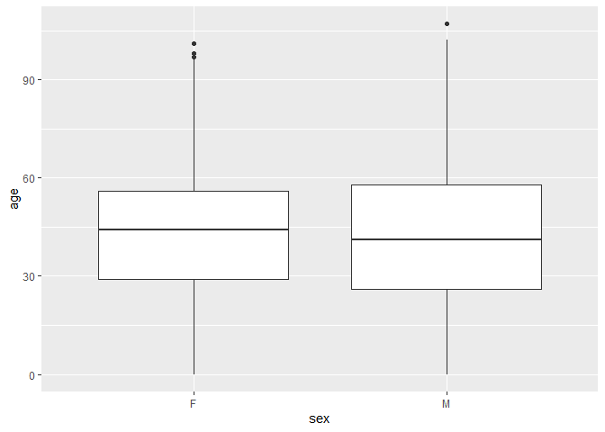

Exploring Gun Deaths in America
================

## Objectives

  - To explore gun death data curated by FiveThirtyEight [original data
    available here](https://github.com/fivethirtyeight/guns-data) by
      - Month
      - Intent
      - Age and sex
      - Education
      - Season
      - Intent by race
      - Police-relatedness

## Read in the data

The gun\_deaths.csv is provided in the repository.

``` r
library(tidyverse)    # load tidyverse packages, including ggplot2
library(viridis)      # color scheme
library(scales)       # required for overlaying percentages over bar plots

# set theme
theme_set(theme_bw())

my_colors <- c("#2a9d8f", "#E76F51", "#E9C46A", "#3a6b7e", "#F4A261")

# read in the data
gun_deaths <- read.csv('gun_deaths.csv', 
                       na.strings=c("NotAvailable"), 
                       colClasses = c("integer", "integer",  
                                      "factor", "factor",  
                                      "factor",  "integer",  
                                      "factor", "integer",  
                                      "factor",  "factor"))

# I thought the following would work, and I can't figure out why it doesn't.
# gun_deaths <- gun_deaths %>% mutate(race = replace(race, race == "Not Availabletive American/Not Availabletive Alaskan", "Native AmericaNative"))
# It just replaces my string with NA, not the new string. :(

# So I did this instead:
gun_deaths <- gun_deaths %>% mutate(race = gsub("Not Availabletive American/Not Availabletive Alaskan", "Native American/Native Alaskan", race))
gun_deaths <- gun_deaths %>% mutate(race = gsub("/", "/\n", race))
```

## Generating a data frame that summarizes the number of gun deaths per month and printing using `kable()`.

kable is part of the knitr package. Allows you to change column names
and add captions and make pretty tables in your knitted document. Hint:
set the argument format = “markdown”

``` r
deaths_per_month <- gun_deaths %>% count(month)

knitr::kable(deaths_per_month, format = "markdown")
```

| month |    n |
| ----: | ---: |
|     1 | 8273 |
|     2 | 7093 |
|     3 | 8289 |
|     4 | 8455 |
|     5 | 8669 |
|     6 | 8677 |
|     7 | 8989 |
|     8 | 8783 |
|     9 | 8508 |
|    10 | 8406 |
|    11 | 8243 |
|    12 | 8413 |

### Generating a bar chart with human-readable labels on the x-axis. That is, each month should be labeled “Jan”, “Feb”, “Mar” (full or abbreviated month names are fine), not `1`, `2`, `3`.

``` r
ggplot(deaths_per_month, aes(month.abb[month], n)) +
  geom_bar(stat = "identity") +
  xlab("Month") +
  ylab("Gun Deaths") +
  scale_x_discrete(limits = month.abb)
```

<!-- -->

## Generating a bar chart that identifies the number of gun deaths associated with each type of intent cause of death. The bars should be sorted from highest to lowest values.

``` r
deaths_per_intent <- gun_deaths %>% count(intent)

ggplot(deaths_per_intent, aes(reorder(intent, -n), n)) +
  geom_bar(stat = "identity") +
  xlab("Intent") +
  ylab("Gun Deaths")
```

<!-- -->

## Generating a boxplot visualizing the age of gun death victims, by sex. Print the average age of female gun death victims.

``` r
ggplot(gun_deaths, aes(sex, age)) +
  geom_boxplot()
```

<!-- -->

``` r
avg_age_f <- gun_deaths %>% 
  group_by(sex) %>% 
  summarize(average_age = mean(age, na.rm=TRUE)) %>%
  filter(sex == "F")

paste("Average age of female gun death victims:", avg_age_f[[2]])
```

    ## [1] "Average age of female gun death victims: 43.6950713000138"

## How many white males with at least a high school education were killed by guns in 2012?

``` r
count_m_white_hs <- gun_deaths %>%
  filter(race == "White" & 
           sex == "M" & 
           education != "Less than HS" & 
           year == 2012) %>%
  count()

paste("Number of white males with at least a HS education killed by guns in 2012:", 
      count_m_white_hs[[1]])
```

    ## [1] "Number of white males with at least a HS education killed by guns in 2012: 15484"

## Which season of the year has the most gun deaths?

Assume that:

  - Winter = January-March
  - Spring = April-June
  - Summer = July-September
  - Fall = October-December

<!-- end list -->

``` r
gun_deaths_top_season <- fct_collapse(month.abb[gun_deaths$month],
  Winter = c("Jan", "Feb", "Mar"),
  Spring = c("Apr", "May", "Jun"),
  Summer = c("Jul", "Aug", "Sep"),
  Fall = c("Oct", "Nov", "Dec")) %>%
  fct_count() %>%
  top_n(1, n)

paste("Season with the most gun deaths:", gun_deaths_top_season[[1]])
```

    ## [1] "Season with the most gun deaths: Summer"

# These are more open ended questions from here on out, you could look at making multiple summaries or types of plots.

### Are whites who are killed by guns more likely to die because of suicide or homicide? How does this compare to blacks and hispanics?

``` r
# Would nont have been able to figure out how to put percentages on the graphs without this tutorial:
# https://rkabacoff.github.io/datavis/Bivariate.html

gun_deaths_by_intent_and_race <- gun_deaths %>%
  group_by(race, intent) %>%
  summarize(n = n()) %>% 
  mutate(pct = n/sum(n),
         lbl = scales::percent(pct))
gun_deaths_by_intent_and_race
```

    ## # A tibble: 21 x 5
    ## # Groups:   race [5]
    ##    race                       intent           n     pct lbl   
    ##    <chr>                      <fct>        <int>   <dbl> <chr> 
    ##  1 "Asian/\nPacific Islander" Accidental      12 0.00905 0.90% 
    ##  2 "Asian/\nPacific Islander" Homicide       559 0.422   42.16%
    ##  3 "Asian/\nPacific Islander" Suicide        745 0.562   56.18%
    ##  4 "Asian/\nPacific Islander" Undetermined    10 0.00754 0.75% 
    ##  5 "Black"                    Accidental     328 0.0141  1.41% 
    ##  6 "Black"                    Homicide     19510 0.837   83.75%
    ##  7 "Black"                    Suicide       3332 0.143   14.30%
    ##  8 "Black"                    Undetermined   126 0.00541 0.54% 
    ##  9 "Hispanic"                 Accidental     145 0.0161  1.61% 
    ## 10 "Hispanic"                 Homicide      5634 0.624   62.45%
    ## # … with 11 more rows

``` r
ggplot(gun_deaths_by_intent_and_race, aes(race, y = pct, fill = intent)) +
  geom_bar(stat = "identity", position = "fill") +
  geom_text(aes(label = lbl), size = 3, position = position_stack(vjust = 0.5)) +
  theme(axis.text.x = element_text(vjust = 0.5, hjust=0.5)) +
  scale_y_continuous(breaks = seq(0, 1, .2), label = percent) +
  scale_fill_brewer(palette = "Set3", direction=1) +
  xlab("Race") +
  ylab("Percent of Deaths") +
  labs(fill = "Intent")
```

<!-- -->

(hint maybe looking at percentages would be good)

Answer: Whites who are killed by guns are more likely to die of suicide
than homicide. Black and hispanic people killed by guns are more likely
to die of homicide.

### Are police-involved gun deaths significantly different from other gun deaths? Assess the relationship between police involvement and age, police involvement and race, and the intersection of all three variables.

``` r
ggplot(gun_deaths, aes(factor(police, levels = c(0, 1), labels = c("No", "Yes")), age)) +
  geom_boxplot() +
  xlab("Police Involvement") +
  ylab("Age") +
  coord_flip()
```

<!-- -->

``` r
gun_deaths_by_police_and_race <- gun_deaths %>%
  group_by(race, police) %>%
  summarize(n = n()) %>% 
  mutate(pct = n/sum(n),
         lbl = scales::percent(pct))

ggplot(gun_deaths_by_police_and_race, 
       aes(race, y = pct, fill = factor(police, levels = c(0, 1), labels = c("No", "Yes")))) +
  geom_bar(stat = "identity", position = "fill") +
  geom_text(aes(label = lbl), size = 3, position = position_stack(vjust = 0.5)) +
  theme(axis.text.x = element_text(vjust = 0.5, hjust=0.5)) +
  scale_y_continuous(breaks = seq(0, 1, .2), label = percent) +
  scale_fill_brewer(palette = "Set2") +
  xlab("Race") +
  ylab("Percent of Deaths") +
  labs(fill = "Police\nInvolvement")
```

<!-- -->

Think about performing stats such as a t.test to see if differences you
are plotting are statistically significant

### Is police involvement correlated with age?

``` r
# Is age (independent variable) correlated with police involvement (dependent variable)?
# Test with logistic regression

mylogit <- glm(police ~ age, data = gun_deaths, family = "binomial")
summary(mylogit)
```

    ## 
    ## Call:
    ## glm(formula = police ~ age, family = "binomial", data = gun_deaths)
    ## 
    ## Deviance Residuals: 
    ##     Min       1Q   Median       3Q      Max  
    ## -0.2658  -0.1944  -0.1613  -0.1338   3.2783  
    ## 
    ## Coefficients:
    ##             Estimate Std. Error z value Pr(>|z|)    
    ## (Intercept) -3.32544    0.06313  -52.68   <2e-16 ***
    ## age         -0.02349    0.00158  -14.87   <2e-16 ***
    ## ---
    ## Signif. codes:  0 '***' 0.001 '**' 0.01 '*' 0.05 '.' 0.1 ' ' 1
    ## 
    ## (Dispersion parameter for binomial family taken to be 1)
    ## 
    ##     Null deviance: 14772  on 100779  degrees of freedom
    ## Residual deviance: 14526  on 100778  degrees of freedom
    ##   (18 observations deleted due to missingness)
    ## AIC: 14530
    ## 
    ## Number of Fisher Scoring iterations: 7

``` r
# p-value <2e-16 ***
# For every unit increase in age, the log odds of police involvement decrease by 0.02349.
```

Age has a significant negative correlation with police involvement.

### Is police involvement correlated with race?

``` r
# Is race (independent variable) correlated with police involvement (dependent variable)?
# Test with two-way chi squared

chisq <- chisq.test(x = table(gun_deaths$police, gun_deaths$race))


chisq$p.value
```

    ## [1] 3.131938e-57

``` r
chisq$residuals
```

    ##    
    ##     Asian/\nPacific Islander      Black   Hispanic
    ##   0               -0.3195965 -0.2109707 -1.6593590
    ##   1                2.6909922  1.7763666 13.9717500
    ##    
    ##     Native American/\nNative Alaskan      White
    ##   0                       -0.4072220  0.8306583
    ##   1                        3.4287966 -6.9941167

``` r
# p-value <2e-16 ***
# Race is significantly correlated with police involvement.
# There is a positive association between all races and police involvement, except for whites. 
# There is a negative association between being white and police involvement.
```

Race has a significant correlation with police involvement.

## Session info

``` r
# always good to have this for reproducibility purposes
devtools::session_info()
```

    ## ─ Session info ───────────────────────────────────────────────────────────────
    ##  setting  value                       
    ##  version  R version 3.5.3 (2019-03-11)
    ##  os       macOS  10.15.5              
    ##  system   x86_64, darwin15.6.0        
    ##  ui       X11                         
    ##  language (EN)                        
    ##  collate  en_US.UTF-8                 
    ##  ctype    en_US.UTF-8                 
    ##  tz       America/Chicago             
    ##  date     2020-07-27                  
    ## 
    ## ─ Packages ───────────────────────────────────────────────────────────────────
    ##  package      * version date       lib source        
    ##  assertthat     0.2.1   2019-03-21 [1] CRAN (R 3.5.3)
    ##  backports      1.1.8   2020-06-17 [1] CRAN (R 3.5.3)
    ##  blob           1.2.1   2020-01-20 [1] CRAN (R 3.5.2)
    ##  broom          0.7.0   2020-07-09 [1] CRAN (R 3.5.3)
    ##  callr          3.4.3   2020-03-28 [1] CRAN (R 3.5.3)
    ##  cellranger     1.1.0   2016-07-27 [1] CRAN (R 3.5.0)
    ##  cli            2.0.2   2020-02-28 [1] CRAN (R 3.5.2)
    ##  colorspace     1.4-1   2019-03-18 [1] CRAN (R 3.5.2)
    ##  crayon         1.3.4   2017-09-16 [1] CRAN (R 3.5.0)
    ##  DBI            1.1.0   2019-12-15 [1] CRAN (R 3.5.2)
    ##  dbplyr         1.4.4   2020-05-27 [1] CRAN (R 3.5.3)
    ##  desc           1.2.0   2018-05-01 [1] CRAN (R 3.5.0)
    ##  devtools       2.3.1   2020-07-21 [1] CRAN (R 3.5.3)
    ##  digest         0.6.25  2020-02-23 [1] CRAN (R 3.5.2)
    ##  dplyr        * 1.0.0   2020-05-29 [1] CRAN (R 3.5.3)
    ##  ellipsis       0.3.1   2020-05-15 [1] CRAN (R 3.5.3)
    ##  evaluate       0.14    2019-05-28 [1] CRAN (R 3.5.2)
    ##  fansi          0.4.1   2020-01-08 [1] CRAN (R 3.5.2)
    ##  farver         2.0.3   2020-01-16 [1] CRAN (R 3.5.2)
    ##  forcats      * 0.5.0   2020-03-01 [1] CRAN (R 3.5.2)
    ##  fs             1.4.2   2020-06-30 [1] CRAN (R 3.5.3)
    ##  generics       0.0.2   2018-11-29 [1] CRAN (R 3.5.0)
    ##  ggplot2      * 3.3.2   2020-06-19 [1] CRAN (R 3.5.3)
    ##  glue           1.4.1   2020-05-13 [1] CRAN (R 3.5.3)
    ##  gridExtra      2.3     2017-09-09 [1] CRAN (R 3.5.0)
    ##  gtable         0.3.0   2019-03-25 [1] CRAN (R 3.5.3)
    ##  haven          2.3.1   2020-06-01 [1] CRAN (R 3.5.3)
    ##  highr          0.8     2019-03-20 [1] CRAN (R 3.5.3)
    ##  hms            0.5.3   2020-01-08 [1] CRAN (R 3.5.2)
    ##  htmltools      0.5.0   2020-06-16 [1] CRAN (R 3.5.3)
    ##  httr           1.4.2   2020-07-20 [1] CRAN (R 3.5.3)
    ##  jsonlite       1.7.0   2020-06-25 [1] CRAN (R 3.5.3)
    ##  knitr          1.29    2020-06-23 [1] CRAN (R 3.5.3)
    ##  labeling       0.3     2014-08-23 [1] CRAN (R 3.5.0)
    ##  lifecycle      0.2.0   2020-03-06 [1] CRAN (R 3.5.2)
    ##  lubridate      1.7.9   2020-06-08 [1] CRAN (R 3.5.3)
    ##  magrittr       1.5     2014-11-22 [1] CRAN (R 3.5.0)
    ##  memoise        1.1.0   2017-04-21 [1] CRAN (R 3.5.0)
    ##  modelr         0.1.8   2020-05-19 [1] CRAN (R 3.5.3)
    ##  munsell        0.5.0   2018-06-12 [1] CRAN (R 3.5.0)
    ##  pillar         1.4.6   2020-07-10 [1] CRAN (R 3.5.3)
    ##  pkgbuild       1.1.0   2020-07-13 [1] CRAN (R 3.5.3)
    ##  pkgconfig      2.0.3   2019-09-22 [1] CRAN (R 3.5.2)
    ##  pkgload        1.1.0   2020-05-29 [1] CRAN (R 3.5.3)
    ##  prettyunits    1.1.1   2020-01-24 [1] CRAN (R 3.5.2)
    ##  processx       3.4.3   2020-07-05 [1] CRAN (R 3.5.3)
    ##  ps             1.3.3   2020-05-08 [1] CRAN (R 3.5.3)
    ##  purrr        * 0.3.4   2020-04-17 [1] CRAN (R 3.5.3)
    ##  R6             2.4.1   2019-11-12 [1] CRAN (R 3.5.2)
    ##  RColorBrewer   1.1-2   2014-12-07 [1] CRAN (R 3.5.0)
    ##  Rcpp           1.0.5   2020-07-06 [1] CRAN (R 3.5.3)
    ##  readr        * 1.3.1   2018-12-21 [1] CRAN (R 3.5.0)
    ##  readxl         1.3.1   2019-03-13 [1] CRAN (R 3.5.2)
    ##  remotes        2.2.0   2020-07-21 [1] CRAN (R 3.5.3)
    ##  reprex         0.3.0   2019-05-16 [1] CRAN (R 3.5.2)
    ##  rlang          0.4.7   2020-07-09 [1] CRAN (R 3.5.3)
    ##  rmarkdown      2.3     2020-06-18 [1] CRAN (R 3.5.3)
    ##  rprojroot      1.3-2   2018-01-03 [1] CRAN (R 3.5.0)
    ##  rstudioapi     0.11    2020-02-07 [1] CRAN (R 3.5.2)
    ##  rvest          0.3.6   2020-07-25 [1] CRAN (R 3.5.3)
    ##  scales       * 1.1.1   2020-05-11 [1] CRAN (R 3.5.3)
    ##  sessioninfo    1.1.1   2018-11-05 [1] CRAN (R 3.5.0)
    ##  stringi        1.4.6   2020-02-17 [1] CRAN (R 3.5.2)
    ##  stringr      * 1.4.0   2019-02-10 [1] CRAN (R 3.5.2)
    ##  testthat       2.3.2   2020-03-02 [1] CRAN (R 3.5.2)
    ##  tibble       * 3.0.3   2020-07-10 [1] CRAN (R 3.5.3)
    ##  tidyr        * 1.1.0   2020-05-20 [1] CRAN (R 3.5.3)
    ##  tidyselect     1.1.0   2020-05-11 [1] CRAN (R 3.5.3)
    ##  tidyverse    * 1.3.0   2019-11-21 [1] CRAN (R 3.5.2)
    ##  usethis        1.6.1   2020-04-29 [1] CRAN (R 3.5.3)
    ##  utf8           1.1.4   2018-05-24 [1] CRAN (R 3.5.0)
    ##  vctrs          0.3.2   2020-07-15 [1] CRAN (R 3.5.3)
    ##  viridis      * 0.5.1   2018-03-29 [1] CRAN (R 3.5.0)
    ##  viridisLite  * 0.3.0   2018-02-01 [1] CRAN (R 3.5.0)
    ##  withr          2.2.0   2020-04-20 [1] CRAN (R 3.5.3)
    ##  xfun           0.16    2020-07-24 [1] CRAN (R 3.5.3)
    ##  xml2           1.3.2   2020-04-23 [1] CRAN (R 3.5.3)
    ##  yaml           2.2.1   2020-02-01 [1] CRAN (R 3.5.2)
    ## 
    ## [1] /Library/Frameworks/R.framework/Versions/3.5/Resources/library
