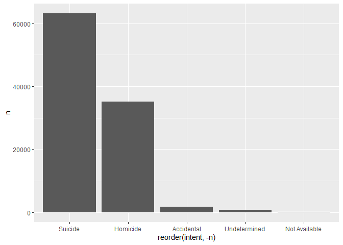
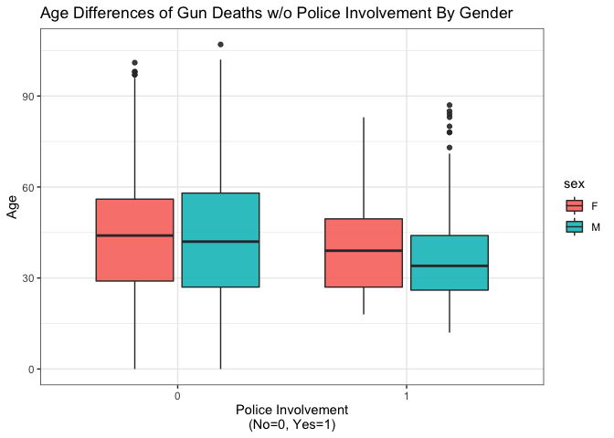

Exploring Gun Deaths in America
================
Mingyu Qi
07/27/2020

## Objectives

  - To explore gun death data curated by FiveThirtyEight [original data
    available here](https://github.com/fivethirtyeight/guns-data) by
      - Month
      - Intent
      - Age and sex
      - Education
      - Season
      - Intent by race
      - Police-relatedness

## Read in the data

The gun\_deaths.csv is provided in the repository.

``` r
library(tidyverse)    # load tidyverse packages, including ggplot2
library(knitr)
library(ggrepel)

# read in the data
gun_deaths <- read.csv("gun_deaths.csv")

# check variables in the data
glimpse(gun_deaths)
```

    ## Rows: 100,798
    ## Columns: 10
    ## $ year      <int> 2012, 2012, 2012, 2012, 2012, 2012, 2012, 2012, 2012, 201...
    ## $ month     <int> 1, 1, 1, 2, 2, 2, 2, 3, 2, 2, 2, 1, 3, 3, 3, 3, 3, 3, 3, ...
    ## $ intent    <chr> "Suicide", "Suicide", "Suicide", "Suicide", "Suicide", "S...
    ## $ police    <int> 0, 0, 0, 0, 0, 0, 0, 0, 0, 0, 0, 0, 0, 0, 0, 0, 0, 0, 0, ...
    ## $ sex       <chr> "M", "F", "M", "M", "M", "M", "M", "M", "M", "M", "M", "M...
    ## $ age       <chr> "34", "21", "60", "64", "31", "17", "48", "41", "50", "No...
    ## $ race      <chr> "Asian/Pacific Islander", "White", "White", "White", "Whi...
    ## $ hispanic  <int> 100, 100, 100, 100, 100, 100, 100, 100, 100, 998, 100, 10...
    ## $ place     <chr> "Home", "Street", "Other specified", "Home", "Other speci...
    ## $ education <chr> "BA+", "Some college", "BA+", "BA+", "HS/GED", "Less than...

``` r
# convert age from character to numeric 
gun_deaths$age <- as.numeric(gun_deaths$age)

# clean up the labels of race
gun_deaths$race <- gsub(pattern = "Not Availabletive American/Not Availabletive Alaskan", 
     replacement = "Native American / Native Alaskan",
     x = gun_deaths$race)

# convert race from character to factor
gun_deaths$race <- factor(gun_deaths$race)
summary(gun_deaths$race)
```

    ##           Asian/Pacific Islander                            Black 
    ##                             1326                            23296 
    ##                         Hispanic Native American / Native Alaskan 
    ##                             9022                              917 
    ##                            White 
    ##                            66237

## Generating a data frame that summarizes the number of gun deaths per month and printing using `kable()`.

Knitr is part of the knitr package. Allows you to change column names
and add captions and make pretty tables in your knitted document. Hint:
set the argument format = “markdown”

``` r
gun_deaths_month <- gun_deaths %>%
    group_by(month) %>%
    count(month) %>%
    rename(number = n)

kable(gun_deaths_month, format = "markdown")
```

| month | number |
| ----: | -----: |
|     1 |   8273 |
|     2 |   7093 |
|     3 |   8289 |
|     4 |   8455 |
|     5 |   8669 |
|     6 |   8677 |
|     7 |   8989 |
|     8 |   8783 |
|     9 |   8508 |
|    10 |   8406 |
|    11 |   8243 |
|    12 |   8413 |

### Generating a bar chart with human-readable labels on the x-axis. That is, each month should be labeled “Jan”, “Feb”, “Mar” (full or abbreviated month names are fine), not `1`, `2`, `3`.

``` r
# create human-readable label for each month
gun_deaths$month <- factor(gun_deaths$month, labels = c("Jan", "Feb", "Mar", "Apr", "May", "Jun", "Jul", "Aug", "Sep", "Oct", "Nov", "Dec"))

# Draw the bar chart
ggplot(gun_deaths, aes(x = month, fill = month)) +
    geom_bar() + 
    xlab("\nMonth") + 
    ylab("Number of Death\n") +
    scale_y_continuous(breaks=seq(0, 9000, by = 1000))
```

<!-- -->

## Generating a bar chart that identifies the number of gun deaths associated with each type of intent cause of death. The bars should be sorted from highest to lowest values.

``` r
ggplot(gun_deaths, aes(x=fct_infreq(intent), fill=intent)) +
    geom_bar() +
    xlab("\nType of Intent") + 
    ylab("Number of Death\n") +
    scale_y_continuous(breaks=seq(0, 70000, by = 10000))
```

<!-- -->

## Generating a boxplot visualizing the age of gun death victims, by sex. Print the average age of female gun death victims.

``` r
# calculate average age by sex
avg_age <- gun_deaths %>%
    group_by(sex) %>%
    summarize(mean_age=mean(age, na.rm = TRUE)) 
```

    ## `summarise()` ungrouping output (override with `.groups` argument)

``` r
# round to the nearest tenth
avg_age$mean_age <- round(avg_age$mean_age, digits = 2)

# draw boxplot by sex and print average age
ggplot(gun_deaths, aes(x = age, y = sex)) +
    geom_boxplot() +
    xlab("\nAge") + 
    ylab("Sex\n") +
    scale_x_continuous(breaks=seq(0, 100, by = 10)) + 
    stat_summary(fun = mean, colour = "red", geom = "point", shape = 18, size = 2) +
    geom_text_repel(avg_age, mapping = aes(x = mean_age, y = sex, label = mean_age), inherit.aes = FALSE)
```

    ## Warning: Removed 18 rows containing non-finite values (stat_boxplot).

    ## Warning: Removed 18 rows containing non-finite values (stat_summary).

<!-- -->

## How many white males with at least a high school education were killed by guns in 2012?

``` r
# convert education to a factor 
gun_deaths$education <- factor(gun_deaths$education)

# get a summary of education 
summary(gun_deaths$education)
```

    ##           BA+        HS/GED  Less than HS Not Available  Some college 
    ##         12946         42927         21823          1422         21680

``` r
# use filter to select the records we are interested in
gun_deaths %>%
    filter(race == "White" & education == c("HS/GED", "Some college", "BA+") & year == 2012) %>%
    count()
```

    ## Warning in `==.default`(education, c("HS/GED", "Some college", "BA+")): longer
    ## object length is not a multiple of shorter object length

    ## Warning in is.na(e1) | is.na(e2): longer object length is not a multiple of
    ## shorter object length

    ##      n
    ## 1 6062

\*\* 6,062 white males with at least a high school education were killed
by guns in 2012

## Which season of the year has the most gun deaths?

Assume that:

  - Winter = January-March
  - Spring = April-June
  - Summer = July-September
  - Fall = October-December

<!-- end list -->

``` r
# create factor "season" in a new data frame
gun_deaths_2 <- gun_deaths %>%
    mutate(season = case_when( (month %in% c("Jan", "Feb", "Mar")) ~ "Winter",
                               (month %in% c("Apr", "May", "Jun")) ~ "Spring",
                               (month %in% c("Jul", "Aug", "Sep")) ~ "Summer",
                               (month %in% c("Oct", "Nov", "Dec")) ~ "Fall"))

# print out the season with most gun deaths
gun_deaths_2 %>%
    group_by(season) %>%
    count() %>%
    arrange(desc(n)) %>%
    ungroup() %>%
    top_n(1, n)
```

    ## # A tibble: 1 x 2
    ##   season     n
    ##   <chr>  <int>
    ## 1 Summer 26280

\*\* Summer is the season with most most gun deaths

# These are more open ended questions from here on out, you could look at making multiple summaries or types of plots.

### Are whites who are killed by guns more likely to die because of suicide or homicide? How does this compare to blacks and hispanics?

``` r
gun_deaths_3 <- gun_deaths %>%
    filter(intent %in% c("Suicide", "Homicide") & race %in% c("White", "Black", "Hispanic")) 

ggplot(gun_deaths_3, aes(x = race, fill = intent)) + 
    geom_bar(position = "dodge") + 
    xlab("\nRace") +
    ylab("Number of Death\n") + 
    scale_y_continuous(breaks=seq(0, 60000, by = 10000)) + 
    theme(axis.text.x = element_text(angle = 45, hjust = 1))
```

<!-- -->

(hint maybe looking at percentages would be good)

``` r
# summarize percentage of intent within each race group, limit race groups to White, Black, and Hispanic
gun_deaths %>%
    group_by(race, intent) %>%
    count() %>%
    group_by(race) %>%
    mutate(percent = n / sum(n) ) %>%
    select(race, intent, percent) %>%
    filter(intent %in% c("Suicide", "Homicide") & race %in% c("White", "Black", "Hispanic")) 
```

    ## # A tibble: 6 x 3
    ## # Groups:   race [3]
    ##   race     intent   percent
    ##   <fct>    <chr>      <dbl>
    ## 1 Black    Homicide   0.837
    ## 2 Black    Suicide    0.143
    ## 3 Hispanic Homicide   0.624
    ## 4 Hispanic Suicide    0.351
    ## 5 White    Homicide   0.138
    ## 6 White    Suicide    0.836

### Are police-involved gun deaths significantly different from other gun deaths? Assess the relationship between police involvement and age, police involvement and race, and the intersection of all three variables.

``` r
# convert police-involved from numeric to factor
gun_deaths$police <- factor(as.character(gun_deaths$police))
summary(gun_deaths$police)
```

    ##     0     1 
    ## 99396  1402

``` r
# select variables needed for analysis and remove missng values
police <- gun_deaths %>%
    select(police, age, race) %>%
    filter(is.na(age) == FALSE) 

# calculate average age by police-involved
avg_age_police <- police %>%
    group_by(police) %>%
    summarize(mean_age=mean(age, na.rm = TRUE)) 
```

    ## `summarise()` ungrouping output (override with `.groups` argument)

``` r
# round to the nearest tenth
avg_age_police$mean_age <- round(avg_age_police$mean_age, digits = 2)

# draw box plot of age by police-involved
ggplot(police, aes(police, age)) +
    geom_boxplot(color="blue") +
    xlab("\nPolice-involved") + 
    ylab("Age\n") +
    scale_y_continuous(breaks=seq(0, 100, by = 10)) + 
    stat_summary(fun = mean, colour = "red", geom = "point", shape = 18, size = 2) +
    geom_text_repel(avg_age_police, mapping = aes(x = police, y = mean_age, label = mean_age), inherit.aes = FALSE) + 
    scale_x_discrete(breaks=c("0", "1"), labels=c("Uninvolved", "Involved"))
```

<!-- -->

Think about performing stats such as a t.test to see if differences you
are plotting are statistically significant

``` r
# use t-test to check if the differences between two means are statistically significant
t.test(police$age ~ police$police)
```

    ## 
    ##  Welch Two Sample t-test
    ## 
    ## data:  police$age by police$police
    ## t = 22.449, df = 1491.8, p-value < 2.2e-16
    ## alternative hypothesis: true difference in means is not equal to 0
    ## 95 percent confidence interval:
    ##  7.224642 8.608106
    ## sample estimates:
    ## mean in group 0 mean in group 1 
    ##        43.96773        36.05136

\*\*The results of t-test suggest that the differences are statistically
significant

``` r
# create a new data set with percentage of police-involved death within each race group
police_2 <- police %>%
    group_by(race, police) %>%
    count() %>%
    ungroup() %>%
    group_by(race) %>%
    mutate(percent = n / sum(n) * 100) %>%
    ungroup()

# round percent to the tenth
police_2$percent = round(police_2$percent, digit = 2)

# draw a bar chart to visualize the differences across race groups
ggplot(police_2, aes(race, percent, fill = police)) + 
    geom_col(position = "dodge") + 
    xlab("\nRace") +
    ylab("Percent of Police-involved Death\n") + 
    scale_y_continuous(breaks=seq(0, 100, by = 10)) + 
    theme(axis.text.x = element_text(angle = 45, hjust = 1))
```

<!-- -->

``` r
# use ANOVA to check if the differences across groups are statistically significant
police$police <- as.numeric(police$police)
res.aov <- aov((police ~ race), data = police)
summary(res.aov)
```

    ##                 Df Sum Sq Mean Sq F value Pr(>F)    
    ## race             4    3.7  0.9260   67.68 <2e-16 ***
    ## Residuals   100775 1378.8  0.0137                   
    ## ---
    ## Signif. codes:  0 '***' 0.001 '**' 0.01 '*' 0.05 '.' 0.1 ' ' 1

Finally, all together now:

``` r
#convert police to factor
gun_deaths$police <- factor(as.character(gun_deaths$police))
summary(gun_deaths$police)
```

    ##     0     1 
    ## 99396  1402

``` r
# calculate average age by police-involved
avg_age_police <- police %>%
    group_by(race, police) %>%
    summarize(mean_age=mean(age)) 
```

    ## `summarise()` regrouping output by 'race' (override with `.groups` argument)

``` r
# round to the nearest tenth
avg_age_police$mean_age <- round(avg_age_police$mean_age, digits = 2)

ggplot(police, aes(factor(police), age)) +
    geom_boxplot(color="orange") +
    facet_wrap(~race, nrow=1) + 
    xlab("\nPolice-involved") + 
    ylab("Age\n") +
    scale_y_continuous(breaks=seq(0, 100, by = 10)) + 
    stat_summary(fun = mean, colour = "red", geom = "point", shape = 18, size = 2) +
    geom_text_repel(avg_age_police, mapping = aes(x = police, y = mean_age, label = mean_age), inherit.aes = FALSE) + 
    scale_x_discrete(breaks=c("0", "1"), labels=c("Uninvolved", "Involved"))
```

<!-- -->

## Session info

``` r
# always good to have this for reproducibility purposes
devtools::session_info()
```

    ## - Session info ---------------------------------------------------------------
    ##  setting  value                       
    ##  version  R version 4.0.2 (2020-06-22)
    ##  os       Windows 8.1 x64             
    ##  system   x86_64, mingw32             
    ##  ui       RTerm                       
    ##  language (EN)                        
    ##  collate  English_United States.1252  
    ##  ctype    English_United States.1252  
    ##  tz       America/New_York            
    ##  date     2020-07-27                  
    ## 
    ## - Packages -------------------------------------------------------------------
    ##  package     * version date       lib source        
    ##  assertthat    0.2.1   2019-03-21 [1] CRAN (R 4.0.2)
    ##  backports     1.1.7   2020-05-13 [1] CRAN (R 4.0.0)
    ##  blob          1.2.1   2020-01-20 [1] CRAN (R 4.0.2)
    ##  broom         0.7.0   2020-07-09 [1] CRAN (R 4.0.2)
    ##  callr         3.4.3   2020-03-28 [1] CRAN (R 4.0.2)
    ##  cellranger    1.1.0   2016-07-27 [1] CRAN (R 4.0.2)
    ##  cli           2.0.2   2020-02-28 [1] CRAN (R 4.0.2)
    ##  colorspace    1.4-1   2019-03-18 [1] CRAN (R 4.0.2)
    ##  crayon        1.3.4   2017-09-16 [1] CRAN (R 4.0.2)
    ##  DBI           1.1.0   2019-12-15 [1] CRAN (R 4.0.2)
    ##  dbplyr        1.4.4   2020-05-27 [1] CRAN (R 4.0.2)
    ##  desc          1.2.0   2018-05-01 [1] CRAN (R 4.0.2)
    ##  devtools      2.3.1   2020-07-21 [1] CRAN (R 4.0.2)
    ##  digest        0.6.25  2020-02-23 [1] CRAN (R 4.0.2)
    ##  dplyr       * 1.0.0   2020-05-29 [1] CRAN (R 4.0.2)
    ##  ellipsis      0.3.1   2020-05-15 [1] CRAN (R 4.0.2)
    ##  evaluate      0.14    2019-05-28 [1] CRAN (R 4.0.2)
    ##  fansi         0.4.1   2020-01-08 [1] CRAN (R 4.0.2)
    ##  farver        2.0.3   2020-01-16 [1] CRAN (R 4.0.2)
    ##  forcats     * 0.5.0   2020-03-01 [1] CRAN (R 4.0.2)
    ##  fs            1.4.2   2020-06-30 [1] CRAN (R 4.0.2)
    ##  generics      0.0.2   2018-11-29 [1] CRAN (R 4.0.2)
    ##  ggplot2     * 3.3.2   2020-06-19 [1] CRAN (R 4.0.2)
    ##  ggrepel     * 0.8.2   2020-03-08 [1] CRAN (R 4.0.2)
    ##  glue          1.4.1   2020-05-13 [1] CRAN (R 4.0.2)
    ##  gtable        0.3.0   2019-03-25 [1] CRAN (R 4.0.2)
    ##  haven         2.3.1   2020-06-01 [1] CRAN (R 4.0.2)
    ##  highr         0.8     2019-03-20 [1] CRAN (R 4.0.2)
    ##  hms           0.5.3   2020-01-08 [1] CRAN (R 4.0.2)
    ##  htmltools     0.5.0   2020-06-16 [1] CRAN (R 4.0.2)
    ##  httr          1.4.2   2020-07-20 [1] CRAN (R 4.0.2)
    ##  jsonlite      1.7.0   2020-06-25 [1] CRAN (R 4.0.2)
    ##  knitr       * 1.29    2020-06-23 [1] CRAN (R 4.0.2)
    ##  lifecycle     0.2.0   2020-03-06 [1] CRAN (R 4.0.2)
    ##  lubridate     1.7.9   2020-06-08 [1] CRAN (R 4.0.2)
    ##  magrittr      1.5     2014-11-22 [1] CRAN (R 4.0.2)
    ##  memoise       1.1.0   2017-04-21 [1] CRAN (R 4.0.2)
    ##  modelr        0.1.8   2020-05-19 [1] CRAN (R 4.0.2)
    ##  munsell       0.5.0   2018-06-12 [1] CRAN (R 4.0.2)
    ##  pillar        1.4.4   2020-05-05 [1] CRAN (R 4.0.2)
    ##  pkgbuild      1.0.8   2020-05-07 [1] CRAN (R 4.0.2)
    ##  pkgconfig     2.0.3   2019-09-22 [1] CRAN (R 4.0.2)
    ##  pkgload       1.1.0   2020-05-29 [1] CRAN (R 4.0.2)
    ##  prettyunits   1.1.1   2020-01-24 [1] CRAN (R 4.0.2)
    ##  processx      3.4.2   2020-02-09 [1] CRAN (R 4.0.2)
    ##  ps            1.3.3   2020-05-08 [1] CRAN (R 4.0.2)
    ##  purrr       * 0.3.4   2020-04-17 [1] CRAN (R 4.0.2)
    ##  R6            2.4.1   2019-11-12 [1] CRAN (R 4.0.2)
    ##  Rcpp          1.0.4.6 2020-04-09 [1] CRAN (R 4.0.2)
    ##  readr       * 1.3.1   2018-12-21 [1] CRAN (R 4.0.2)
    ##  readxl        1.3.1   2019-03-13 [1] CRAN (R 4.0.2)
    ##  remotes       2.2.0   2020-07-21 [1] CRAN (R 4.0.2)
    ##  reprex        0.3.0   2019-05-16 [1] CRAN (R 4.0.2)
    ##  rlang         0.4.6   2020-05-02 [1] CRAN (R 4.0.2)
    ##  rmarkdown     2.3     2020-06-18 [1] CRAN (R 4.0.2)
    ##  rprojroot     1.3-2   2018-01-03 [1] CRAN (R 4.0.2)
    ##  rstudioapi    0.11    2020-02-07 [1] CRAN (R 4.0.2)
    ##  rvest         0.3.6   2020-07-25 [1] CRAN (R 4.0.2)
    ##  scales        1.1.1   2020-05-11 [1] CRAN (R 4.0.2)
    ##  sessioninfo   1.1.1   2018-11-05 [1] CRAN (R 4.0.2)
    ##  stringi       1.4.6   2020-02-17 [1] CRAN (R 4.0.0)
    ##  stringr     * 1.4.0   2019-02-10 [1] CRAN (R 4.0.2)
    ##  testthat      2.3.2   2020-03-02 [1] CRAN (R 4.0.2)
    ##  tibble      * 3.0.1   2020-04-20 [1] CRAN (R 4.0.2)
    ##  tidyr       * 1.1.0   2020-05-20 [1] CRAN (R 4.0.2)
    ##  tidyselect    1.1.0   2020-05-11 [1] CRAN (R 4.0.2)
    ##  tidyverse   * 1.3.0   2019-11-21 [1] CRAN (R 4.0.2)
    ##  usethis       1.6.1   2020-04-29 [1] CRAN (R 4.0.2)
    ##  utf8          1.1.4   2018-05-24 [1] CRAN (R 4.0.2)
    ##  vctrs         0.3.1   2020-06-05 [1] CRAN (R 4.0.2)
    ##  withr         2.2.0   2020-04-20 [1] CRAN (R 4.0.2)
    ##  xfun          0.15    2020-06-21 [1] CRAN (R 4.0.2)
    ##  xml2          1.3.2   2020-04-23 [1] CRAN (R 4.0.2)
    ##  yaml          2.2.1   2020-02-01 [1] CRAN (R 4.0.0)
    ## 
    ## [1] C:/Users/lenovo/Documents/R/win-library/4.0
    ## [2] C:/Program Files/R/R-4.0.2/library
