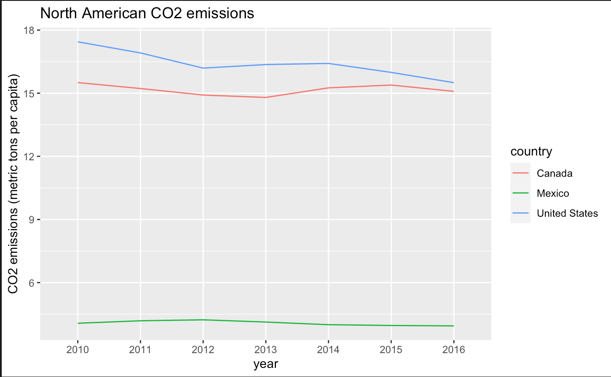

HW04
================
Honorine Destain
7/26/2020

Data
----

I found a data set from The World Bank <https://databank.worldbank.org/reports.aspx?source=2&type=metadata&series=EN.ATM.CO2E.PC#> on country CO2 emissions over time. Emissions are measured in metric ton per capita.

To learn more about climate change trends and what goals are and aren't being met, visit <https://climateactiontracker.org/>.

The raw data appeared like this:

``` r
kable(CO2[1:5, ], caption = "Raw data")
```

<table style="width:100%;">
<caption>Raw data</caption>
<colgroup>
<col width="14%" />
<col width="5%" />
<col width="5%" />
<col width="5%" />
<col width="5%" />
<col width="5%" />
<col width="5%" />
<col width="5%" />
<col width="5%" />
<col width="5%" />
<col width="5%" />
<col width="5%" />
<col width="5%" />
<col width="5%" />
<col width="5%" />
<col width="5%" />
</colgroup>
<thead>
<tr class="header">
<th align="left">Series.Name</th>
<th align="left">Series.Code</th>
<th align="left">Country.Name</th>
<th align="left">Country.Code</th>
<th align="left">X1990..YR1990.</th>
<th align="left">X2000..YR2000.</th>
<th align="left">X2010..YR2010.</th>
<th align="left">X2011..YR2011.</th>
<th align="left">X2012..YR2012.</th>
<th align="left">X2013..YR2013.</th>
<th align="left">X2014..YR2014.</th>
<th align="left">X2015..YR2015.</th>
<th align="left">X2016..YR2016.</th>
<th align="left">X2017..YR2017.</th>
<th align="left">X2018..YR2018.</th>
<th align="left">X2019..YR2019.</th>
</tr>
</thead>
<tbody>
<tr class="odd">
<td align="left">CO2 emissions (metric tons per capita)</td>
<td align="left">EN.ATM.CO2E.PC</td>
<td align="left">Afghanistan</td>
<td align="left">AFG</td>
<td align="left">0.210643419</td>
<td align="left">0.037234781</td>
<td align="left">0.28998763</td>
<td align="left">0.406424217</td>
<td align="left">0.345148783</td>
<td align="left">0.280454641</td>
<td align="left">0.253727945</td>
<td align="left">0.262555711</td>
<td align="left">0.245101422</td>
<td align="left">..</td>
<td align="left">..</td>
<td align="left">..</td>
</tr>
<tr class="even">
<td align="left">CO2 emissions (metric tons per capita)</td>
<td align="left">EN.ATM.CO2E.PC</td>
<td align="left">Albania</td>
<td align="left">ALB</td>
<td align="left">1.678106654</td>
<td align="left">0.978174681</td>
<td align="left">1.578573584</td>
<td align="left">1.803714725</td>
<td align="left">1.697965557</td>
<td align="left">1.697279396</td>
<td align="left">1.90006971</td>
<td align="left">1.602648034</td>
<td align="left">1.577162624</td>
<td align="left">..</td>
<td align="left">..</td>
<td align="left">..</td>
</tr>
<tr class="odd">
<td align="left">CO2 emissions (metric tons per capita)</td>
<td align="left">EN.ATM.CO2E.PC</td>
<td align="left">Algeria</td>
<td align="left">DZA</td>
<td align="left">2.988109843</td>
<td align="left">2.830379965</td>
<td align="left">3.312560602</td>
<td align="left">3.30557127</td>
<td align="left">3.477108092</td>
<td align="left">3.525557358</td>
<td align="left">3.735802777</td>
<td align="left">3.854556576</td>
<td align="left">3.69915599</td>
<td align="left">..</td>
<td align="left">..</td>
<td align="left">..</td>
</tr>
<tr class="even">
<td align="left">CO2 emissions (metric tons per capita)</td>
<td align="left">EN.ATM.CO2E.PC</td>
<td align="left">American Samoa</td>
<td align="left">ASM</td>
<td align="left">..</td>
<td align="left">..</td>
<td align="left">..</td>
<td align="left">..</td>
<td align="left">..</td>
<td align="left">..</td>
<td align="left">..</td>
<td align="left">..</td>
<td align="left">..</td>
<td align="left">..</td>
<td align="left">..</td>
<td align="left">..</td>
</tr>
<tr class="odd">
<td align="left">CO2 emissions (metric tons per capita)</td>
<td align="left">EN.ATM.CO2E.PC</td>
<td align="left">Andorra</td>
<td align="left">AND</td>
<td align="left">7.467335669</td>
<td align="left">8.019284294</td>
<td align="left">6.122594702</td>
<td align="left">5.867410176</td>
<td align="left">5.916884031</td>
<td align="left">5.901775324</td>
<td align="left">5.832906215</td>
<td align="left">5.969786312</td>
<td align="left">6.072370208</td>
<td align="left">..</td>
<td align="left">..</td>
<td align="left">..</td>
</tr>
</tbody>
</table>

Cleaning the Data Set
---------------------

The data was cleaned to look like this: (for code, see .Rmd document)

``` r
kable(CO2_tidied[1:5, ], caption = "Refined data")
```

<table style="width:100%;">
<caption>Refined data</caption>
<colgroup>
<col width="13%" />
<col width="9%" />
<col width="9%" />
<col width="9%" />
<col width="9%" />
<col width="9%" />
<col width="9%" />
<col width="9%" />
<col width="9%" />
<col width="9%" />
</colgroup>
<thead>
<tr class="header">
<th align="left">country</th>
<th align="right">1990</th>
<th align="right">2000</th>
<th align="right">2010</th>
<th align="right">2011</th>
<th align="right">2012</th>
<th align="right">2013</th>
<th align="right">2014</th>
<th align="right">2015</th>
<th align="right">2016</th>
</tr>
</thead>
<tbody>
<tr class="odd">
<td align="left">Afghanistan</td>
<td align="right">0.2106434</td>
<td align="right">0.0372348</td>
<td align="right">0.2899876</td>
<td align="right">0.4064242</td>
<td align="right">0.3451488</td>
<td align="right">0.2804546</td>
<td align="right">0.2537279</td>
<td align="right">0.2625557</td>
<td align="right">0.2451014</td>
</tr>
<tr class="even">
<td align="left">Albania</td>
<td align="right">1.6781067</td>
<td align="right">0.9781747</td>
<td align="right">1.5785736</td>
<td align="right">1.8037147</td>
<td align="right">1.6979656</td>
<td align="right">1.6972794</td>
<td align="right">1.9000697</td>
<td align="right">1.6026480</td>
<td align="right">1.5771626</td>
</tr>
<tr class="odd">
<td align="left">Algeria</td>
<td align="right">2.9881098</td>
<td align="right">2.8303800</td>
<td align="right">3.3125606</td>
<td align="right">3.3055713</td>
<td align="right">3.4771081</td>
<td align="right">3.5255574</td>
<td align="right">3.7358028</td>
<td align="right">3.8545566</td>
<td align="right">3.6991560</td>
</tr>
<tr class="even">
<td align="left">American Samoa</td>
<td align="right">NA</td>
<td align="right">NA</td>
<td align="right">NA</td>
<td align="right">NA</td>
<td align="right">NA</td>
<td align="right">NA</td>
<td align="right">NA</td>
<td align="right">NA</td>
<td align="right">NA</td>
</tr>
<tr class="odd">
<td align="left">Andorra</td>
<td align="right">7.4673357</td>
<td align="right">8.0192843</td>
<td align="right">6.1225947</td>
<td align="right">5.8674102</td>
<td align="right">5.9168840</td>
<td align="right">5.9017753</td>
<td align="right">5.8329062</td>
<td align="right">5.9697863</td>
<td align="right">6.0723702</td>
</tr>
</tbody>
</table>

Net CO2 Change over Time
------------------------

After adding a "net\_change" variable to quantify the difference in production between the years 1990 and 2016, I found that the countries with the greatest drop in production were Russia, Luxembourg, and Nauru.

``` r
kable(decrease[1:6, ], caption = "Countries with greatest net decrease")
```

<table style="width:100%;">
<caption>Countries with greatest net decrease</caption>
<colgroup>
<col width="29%" />
<col width="6%" />
<col width="7%" />
<col width="7%" />
<col width="7%" />
<col width="7%" />
<col width="7%" />
<col width="7%" />
<col width="7%" />
<col width="7%" />
<col width="7%" />
</colgroup>
<thead>
<tr class="header">
<th align="left">country</th>
<th align="right">1990</th>
<th align="right">2000</th>
<th align="right">2010</th>
<th align="right">2011</th>
<th align="right">2012</th>
<th align="right">2013</th>
<th align="right">2014</th>
<th align="right">2015</th>
<th align="right">2016</th>
<th align="right">net_change</th>
</tr>
</thead>
<tbody>
<tr class="odd">
<td align="left">Russian Federation</td>
<td align="right">24.39835</td>
<td align="right">10.627098</td>
<td align="right">11.694347</td>
<td align="right">12.334878</td>
<td align="right">12.620269</td>
<td align="right">12.120850</td>
<td align="right">12.077518</td>
<td align="right">11.785220</td>
<td align="right">11.999432</td>
<td align="right">-12.398917</td>
</tr>
<tr class="even">
<td align="left">Luxembourg</td>
<td align="right">26.19766</td>
<td align="right">18.885512</td>
<td align="right">21.635136</td>
<td align="right">21.018077</td>
<td align="right">19.952995</td>
<td align="right">18.498320</td>
<td align="right">17.368713</td>
<td align="right">16.242584</td>
<td align="right">15.442613</td>
<td align="right">-10.755046</td>
</tr>
<tr class="odd">
<td align="left">Nauru</td>
<td align="right">13.11710</td>
<td align="right">8.159137</td>
<td align="right">4.398201</td>
<td align="right">4.010838</td>
<td align="right">3.924214</td>
<td align="right">4.066537</td>
<td align="right">4.021851</td>
<td align="right">3.821323</td>
<td align="right">3.653230</td>
<td align="right">-9.463866</td>
</tr>
<tr class="even">
<td align="left">Europe &amp; Central Asia (excluding high income)</td>
<td align="right">16.91290</td>
<td align="right">7.070264</td>
<td align="right">7.767355</td>
<td align="right">8.098979</td>
<td align="right">8.155190</td>
<td align="right">7.865178</td>
<td align="right">7.711468</td>
<td align="right">7.484061</td>
<td align="right">7.583597</td>
<td align="right">-9.329302</td>
</tr>
<tr class="odd">
<td align="left">Europe &amp; Central Asia (IDA &amp; IBRD countries)</td>
<td align="right">15.31620</td>
<td align="right">6.952326</td>
<td align="right">7.607799</td>
<td align="right">7.909454</td>
<td align="right">7.909957</td>
<td align="right">7.643998</td>
<td align="right">7.473583</td>
<td align="right">7.286477</td>
<td align="right">7.400544</td>
<td align="right">-7.915660</td>
</tr>
<tr class="even">
<td align="left">Singapore</td>
<td align="right">14.60238</td>
<td align="right">12.166624</td>
<td align="right">11.487699</td>
<td align="right">9.020910</td>
<td align="right">9.410410</td>
<td align="right">10.392804</td>
<td align="right">10.355943</td>
<td align="right">11.102360</td>
<td align="right">6.694046</td>
<td align="right">-7.908333</td>
</tr>
</tbody>
</table>

The countries with the greatest increase in production in that time period were Trinidad and Tobago, Qatar, and Gibraltar.

``` r
kable(increase[1:6, ], caption = "Countries with least net decrease")
```

<table style="width:100%;">
<caption>Countries with least net decrease</caption>
<colgroup>
<col width="16%" />
<col width="8%" />
<col width="8%" />
<col width="8%" />
<col width="8%" />
<col width="8%" />
<col width="8%" />
<col width="8%" />
<col width="8%" />
<col width="8%" />
<col width="9%" />
</colgroup>
<thead>
<tr class="header">
<th align="left">country</th>
<th align="right">1990</th>
<th align="right">2000</th>
<th align="right">2010</th>
<th align="right">2011</th>
<th align="right">2012</th>
<th align="right">2013</th>
<th align="right">2014</th>
<th align="right">2015</th>
<th align="right">2016</th>
<th align="right">net_change</th>
</tr>
</thead>
<tbody>
<tr class="odd">
<td align="left">Trinidad and Tobago</td>
<td align="right">13.942886</td>
<td align="right">18.81317</td>
<td align="right">36.08889</td>
<td align="right">35.12551</td>
<td align="right">33.77371</td>
<td align="right">34.37829</td>
<td align="right">33.96103</td>
<td align="right">33.75508</td>
<td align="right">31.84485</td>
<td align="right">17.901966</td>
</tr>
<tr class="even">
<td align="left">Qatar</td>
<td align="right">24.722404</td>
<td align="right">58.61946</td>
<td align="right">39.05971</td>
<td align="right">39.50921</td>
<td align="right">42.86038</td>
<td align="right">36.38792</td>
<td align="right">43.52329</td>
<td align="right">41.64216</td>
<td align="right">38.90147</td>
<td align="right">14.179067</td>
</tr>
<tr class="odd">
<td align="left">Gibraltar</td>
<td align="right">4.906611</td>
<td align="right">10.73775</td>
<td align="right">13.86658</td>
<td align="right">13.41905</td>
<td align="right">13.73245</td>
<td align="right">14.58441</td>
<td align="right">15.65746</td>
<td align="right">17.17412</td>
<td align="right">18.80401</td>
<td align="right">13.897402</td>
</tr>
<tr class="even">
<td align="left">New Caledonia</td>
<td align="right">9.269475</td>
<td align="right">10.47321</td>
<td align="right">14.33030</td>
<td align="right">13.99904</td>
<td align="right">14.11583</td>
<td align="right">14.64575</td>
<td align="right">18.23582</td>
<td align="right">17.44652</td>
<td align="right">19.26650</td>
<td align="right">9.997027</td>
</tr>
<tr class="odd">
<td align="left">Oman</td>
<td align="right">6.242655</td>
<td align="right">9.56374</td>
<td align="right">15.59066</td>
<td align="right">16.61882</td>
<td align="right">17.05487</td>
<td align="right">16.47947</td>
<td align="right">15.20154</td>
<td align="right">15.32246</td>
<td align="right">14.16708</td>
<td align="right">7.924421</td>
</tr>
<tr class="even">
<td align="left">Kuwait</td>
<td align="right">18.092230</td>
<td align="right">26.18923</td>
<td align="right">29.95609</td>
<td align="right">27.35382</td>
<td align="right">30.01509</td>
<td align="right">26.88916</td>
<td align="right">23.94268</td>
<td align="right">24.24245</td>
<td align="right">24.95251</td>
<td align="right">6.860283</td>
</tr>
</tbody>
</table>

North American CO2 Production
-----------------------------

The U.S. and Canada have much greater overall production of CO2 per capita than Mexico. All North American countries have shown a slight decrease in CO2 output over time.



Production in Western Europe
----------------------------

A few western European countries were selected at random to visualize trends from the region. Luxembourg shows the greatest decrease, but remains the greatest CO2 producer; Switzerland appears to have the lowest production total.


