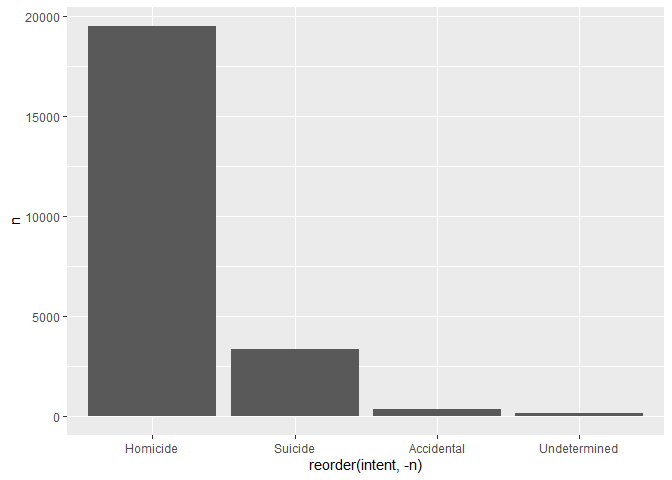
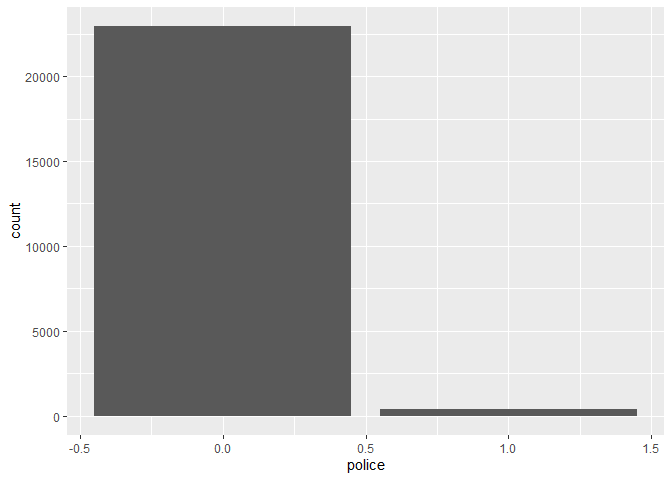

Exploring Gun Deaths in America
================

## Objectives

  - To explore gun death data curated by FiveThirtyEight [original data
    available here](https://github.com/fivethirtyeight/guns-data) by
      - Month
      - Intent
      - Age and sex
      - Education
      - Season
      - Intent by race
      - Police-relatedness

## Read in the data

The gun\_deaths.csv is provided in the repository.

``` r
library(tidyverse)    # load tidyverse packages, including ggplot2
library(knitr) # load knitr package so that I can use kable() function

# read in data and define as gun_deaths
gun_deaths <- read.csv("gun_deaths.csv")
```

## Generating a data frame that summarizes the number of gun deaths per month and printing using `kable()`.

Knitr is part of the knitr package. Allows you to change column names
and add captions and make pretty tables in your knitted document. Hint:
set the argument format = “markdown”

``` r
# generate new dataframe for this task
gun_deaths_summary1 <- gun_deaths %>%
    select(month) %>%
    group_by(month) %>%
    count(month) %>%
    rename(deaths_per_month = n)

# print results as a table using kable()
kable(gun_deaths_summary1, format = "markdown", align = 'c', col.names = c("Month", "Deaths per Month"))
```

| Month | Deaths per Month |
| :---: | :--------------: |
|   1   |       8273       |
|   2   |       7093       |
|   3   |       8289       |
|   4   |       8455       |
|   5   |       8669       |
|   6   |       8677       |
|   7   |       8989       |
|   8   |       8783       |
|   9   |       8508       |
|  10   |       8406       |
|  11   |       8243       |
|  12   |       8413       |

**If we further want to divide the number of gun deaths per month for
each given
year:**

``` r
# generate new dataframe, almost the same as above but also selecting and grouping by year
gun_deaths_summary2 <- gun_deaths %>%
    select(year, month) %>%
    group_by(year, month) %>%
    count(month) %>%
    rename(deaths_per_month = n)

# print results as a table using kable()
kable(gun_deaths_summary2, format = "markdown", align = 'c', col.names = c("Year", "Month", "Deaths per Month"))
```

| Year | Month | Deaths per Month |
| :--: | :---: | :--------------: |
| 2012 |   1   |       2758       |
| 2012 |   2   |       2357       |
| 2012 |   3   |       2743       |
| 2012 |   4   |       2795       |
| 2012 |   5   |       2999       |
| 2012 |   6   |       2826       |
| 2012 |   7   |       3026       |
| 2012 |   8   |       2954       |
| 2012 |   9   |       2852       |
| 2012 |  10   |       2733       |
| 2012 |  11   |       2729       |
| 2012 |  12   |       2791       |
| 2013 |   1   |       2864       |
| 2013 |   2   |       2375       |
| 2013 |   3   |       2862       |
| 2013 |   4   |       2798       |
| 2013 |   5   |       2806       |
| 2013 |   6   |       2920       |
| 2013 |   7   |       3079       |
| 2013 |   8   |       2859       |
| 2013 |   9   |       2742       |
| 2013 |  10   |       2808       |
| 2013 |  11   |       2758       |
| 2013 |  12   |       2765       |
| 2014 |   1   |       2651       |
| 2014 |   2   |       2361       |
| 2014 |   3   |       2684       |
| 2014 |   4   |       2862       |
| 2014 |   5   |       2864       |
| 2014 |   6   |       2931       |
| 2014 |   7   |       2884       |
| 2014 |   8   |       2970       |
| 2014 |   9   |       2914       |
| 2014 |  10   |       2865       |
| 2014 |  11   |       2756       |
| 2014 |  12   |       2857       |

### Generating a bar chart with human-readable labels on the x-axis. That is, each month should be labeled “Jan”, “Feb”, “Mar” (full or abbreviated month names are fine), not `1`, `2`, `3`.

``` r
# generate bar graph using the dataframe generated above
ggplot(data = gun_deaths_summary1, aes(x = factor(month), y = deaths_per_month)) + # make sure month is plotted as factor so that we can convert to abbreviated month name
    geom_col() +
    scale_x_discrete(labels=month.abb) + # change x-axis labels to abbreviated month names instead of numbers
    labs(title = "Number of Gun Deaths for each Month of the Year", subtitle = "Based on Data from 2012 - 2014", x = "Month", y = "Number of Deaths") + # adjust labels
    theme_classic()   # add a theme (I like to use the pre-set theme theme_classic())
```

<!-- -->

## Generating a bar chart that identifies the number of gun deaths associated with each type of intent cause of death. The bars should be sorted from highest to lowest values.

``` r
# generate new dataframe looking at the number of gun deaths associated with ech type of intent
gun_deaths_intent <- gun_deaths %>%
    select(year, month, intent) %>%
    group_by(intent) %>%
    count() %>%
    rename(number_of_deaths = n)

# print results as a table using kable()
kable(gun_deaths_intent, format = "markdown", align = 'c', col.names = c("Intent", "Number of Deaths"))
```

|    Intent     | Number of Deaths |
| :-----------: | :--------------: |
|  Accidental   |       1639       |
|   Homicide    |      35176       |
| Not Available |        1         |
|    Suicide    |      63175       |
| Undetermined  |       807        |

**We can use this output to sort the x-axis accordingly:**

``` r
# sort the x-axis based on table above
gun_deaths_intent$intent <- factor(gun_deaths_intent$intent, levels = c("Suicide", "Homicide", "Accidental", "Undetermined", "Not Available"))

# generate bar graph showing the number of gun deaths associated with each type of intent from highest to lowest value
ggplot(gun_deaths_intent, aes(x = intent, y = number_of_deaths, color = intent, fill = intent)) +
    geom_col() +
    labs(title = "Number of Gun Deaths based on Intent", subtitle = "Based on Data from 2012 - 2014", x = "Intent", y = "Number of Deaths") + #adjust labels
    theme_classic() + # set theme
    theme(legend.position = "none") # remove legend
```

<!-- -->

## Generating a boxplot visualizing the age of gun death victims, by sex. Print the average age of female gun death victims.

``` r
# generate new dataframe looking at the age of gun death victims by sex
gun_deaths_sex <- gun_deaths %>%
    select(sex, age) %>%
    group_by(sex) 

# change data type of age column to integer
gun_deaths_sex$age <- as.integer(gun_deaths_sex$age)
```

    ## Warning: NAs introduced by coercion

``` r
# generate boxplot 
ggplot(gun_deaths_sex) +
    geom_boxplot(aes(sex, age, fill = sex)) +
    labs(title = "Age of Gun Death Victims by Sex", x = "Sex", y = "Age") + # adjust labels
    theme_bw() + # set theme
    theme(legend.position = "none") # remove legend
```

    ## Warning: Removed 18 rows containing non-finite values (stat_boxplot).

<!-- -->

``` r
# find the average age of female gun death victims
gun_deaths_average_female <- gun_deaths_sex %>%
    filter(sex == "F") %>%
    summarize(average_age = mean(age, na.rm = TRUE)) # na.rm allows to 'remove' NA values
```

    ## `summarise()` ungrouping output (override with `.groups` argument)

``` r
head(gun_deaths_average_female)
```

    ## # A tibble: 1 x 2
    ##   sex   average_age
    ##   <chr>       <dbl>
    ## 1 F            43.7

**The average female gun death victim age was ~43.7
years.**

## How many white males with at least a high school education were killed by guns in 2012?

``` r
# generate new dataframe looking at how many white males with at least a high school education were killed by guns in 2012
gun_deaths_education <- gun_deaths %>%
    select(sex, education, year, race) %>%
    filter(sex == "M", year == 2012, race == "White", education %in% c('HS/GED', 'Some college', 'BA+')) %>% # I believe that this should include all education levels with at least a high school education
    count()

# print the number of white males killed as kable() output
kable(gun_deaths_education, format = "markdown", align = 'c', col.names = c("Number of White Males killed"))
```

| Number of White Males killed |
| :--------------------------: |
|            15199             |

## Which season of the year has the most gun deaths?

Assume that:

  - Winter = January-March
  - Spring = April-June
  - Summer = July-September
  - Fall =
October-December

<!-- end list -->

``` r
# generate new dataframe to look at the season of the year with the most gun deaths
gun_deaths_season <- gun_deaths %>%
    select(month) 

# convert the 'month' variable to a factor
gun_deaths_season$month <- as.factor(gun_deaths_season$month)

# convert from months to season
gun_deaths_season%>%
    mutate(season = fct_collapse(.f = month,
      Spring = c("4", "5", "6"),
      Summer = c("7", "8", "9"),
      Autumn = c("10", "11", "12"),
      Winter = c("1", "2", "3"))) %>%
    count(season) %>% # count number of deaths per season
    arrange(desc(n)) # arrange in descending order so we can see which season has the most deaths
```

    ##   season     n
    ## 1 Summer 26280
    ## 2 Spring 25801
    ## 3 Autumn 25062
    ## 4 Winter 23655

**As seen by the table above, the season with the most gun deaths is
summer**

# These are more open ended questions from here on out, you could look at making multiple summaries or types of plots.

### Are whites who are killed by guns more likely to die because of suicide or homicide? How does this compare to blacks and hispanics?

``` r
# generate new dataframe looking at number of gun deaths based on race and intent
gun_deaths_race <- gun_deaths %>%
    select(intent, race) %>%
    filter(intent %in% c('Suicide', 'Homicide')) %>%
    filter(race %in% c('White', 'Black', 'Hispanic')) %>%
    group_by(race, intent) %>%
    count(race)

# generate bar chart to visualize the dataframe generated above
ggplot(gun_deaths_race, aes(x = gun_deaths_race$race, y = n, fill = intent)) +
    geom_col(position = "dodge", color = "black") +
    labs(title = "Number of Gun Deaths by Race and Intent", x = "Race", y = "Number of Deaths") +
    scale_fill_discrete(name = "Intent") + # adjust labels
    theme_classic() # set theme
```

<!-- -->

(hint maybe looking at percentages would be
good)

``` r
# generate new dataframe to calculate the percentage of deaths based on race and intent
gun_deaths_race_2 <- gun_deaths_race %>%
    ungroup() %>%
    group_by(race) %>%
    mutate(percentage = 100*n / sum(n)) # generate new variable that shows the percentage

# print the new dataframe as kable() output
kable(gun_deaths_race_2, format = "markdown", align = 'c', col.names = c("Race", "Intent", "Number of Deaths", "Percentage (by Race)"))
```

|   Race   |  Intent  | Number of Deaths | Percentage (by Race) |
| :------: | :------: | :--------------: | :------------------: |
|  Black   | Homicide |      19510       |       85.41284       |
|  Black   | Suicide  |       3332       |       14.58716       |
| Hispanic | Homicide |       5634       |       63.98637       |
| Hispanic | Suicide  |       3171       |       36.01363       |
|  White   | Homicide |       9147       |       14.17722       |
|  White   | Suicide  |      55372       |       85.82278       |

``` r
# generate bar chart to visualize the percentage of deaths based on race and intent
ggplot(gun_deaths_race_2, aes(x = gun_deaths_race$race, y = percentage, fill = intent)) +
    geom_col(position = "dodge", color = "black") +
    labs(title = "Percentage of Gun Deaths by Intent", x = "Race", y = "Percentage of Deaths by Intent") + # adjust labels
    scale_fill_discrete(name = "Intent") + # this allows to rename the legend title
    theme_classic() # set theme
```

<!-- -->

**Looking at the percentage of gun deaths by intent, we find that for
Black and Hispanic, the majority of gun death victims died as a result
of homicide (85% and 64% respectively), whereas for white people, the
majority of gun death victims died as a result of suicide
(86%).**

### Are police-involved gun deaths significantly different from other gun deaths? Assess the relationship between police involvement and age, police involvement and race, and the intersection of all three variables.

``` r
# change the format of the age and police variables of the gun_deaths dataframe
gun_deaths$age <- as.integer(gun_deaths$age)
```

    ## Warning: NAs introduced by coercion

``` r
gun_deaths$police <- as.factor(gun_deaths$police)

# generate new dataframe looking at number of gun deaths based on police involvement and age
gun_deaths_police_age <- gun_deaths %>%
    select(police, age) %>%
    group_by(police) %>%
    count(age)
    
# generate boxplot visualizing the number of gun deaths based on police involvement and age
ggplot(gun_deaths_police_age, aes(x = police, y = age, fill = police)) +
    geom_boxplot() +
    scale_x_discrete(breaks = c("0", "1"), labels = c("No Police Involvement", "Police Involvement")) + # rename x-axis labels
    labs(title = "Age of Gun Death Victims based on Police Involvement", x = "", y = "Age") + # adjust labels
    theme_classic() + # set theme 
    theme(legend.position = "none") # remove legend
```

    ## Warning: Removed 1 rows containing non-finite values (stat_boxplot).

<!-- -->

Think about performing stats such as a t.test to see if differences you
are plotting are statistically significant

``` r
# I want to test for significance by doing a t-test

# generate new variables that can be used in t.test(x,y) function
police_not_involved_age <- gun_deaths %>%
    select(police, age) %>%
    filter(police == 0)

police_involved_age <- gun_deaths %>%
    select(police, age) %>%
    filter(police == 1)

# do t-test using the newly generated variables
t.test(police_not_involved_age$age, police_involved_age$age)
```

    ## 
    ##  Welch Two Sample t-test
    ## 
    ## data:  police_not_involved_age$age and police_involved_age$age
    ## t = 22.449, df = 1491.8, p-value < 2.2e-16
    ## alternative hypothesis: true difference in means is not equal to 0
    ## 95 percent confidence interval:
    ##  7.224642 8.608106
    ## sample estimates:
    ## mean of x mean of y 
    ##  43.96773  36.05136

#### The t-test suggests that there is a significant difference in the age of gun death victims based on whether police was involved or not.

``` r
# generate new dataframe looking at number of gun deaths based on police involvement and race
gun_deaths_police_race <- gun_deaths %>%
    select(police, race) %>%
    group_by(race, police) %>%
    count(race) %>%
    arrange(race)

# generate bar graph visualizing number of gun deaths based on police involvement and race
ggplot(gun_deaths_police_race, aes(x = race, y = n, fill = police)) +
    geom_col(position = "dodge", color = "black") +
    scale_x_discrete(breaks = c("Asian/Pacific Islander", "Black", "Hispanic", "Not Availabletive American/Not Availabletive Alaskan", "White"), labels = c("Asian/Pacific Islander", "Black", "Hispanic", "NA", "White")) + # adjust labels on x-axis
    labs(title = "Number of Deaths based on Police Involvement by Race", x = "Race", y = "Number of Deaths") + # adjust other labels 
    scale_fill_discrete(labels = c("No Police Involvement", "Police Involvement")) + # adjust legend text
    theme_classic() + # set theme
    theme(legend.title = element_blank()) # remove legend title
```

<!-- -->

Finally, all together
now:

``` r
# generating a new dataframe, looking at age of gun death victims based on race and police involvement
gun_deaths_police_age_race <- gun_deaths %>%
    select(police, age, race) %>%
    group_by(race, police) 
    
# generate boxplot visualizing age of gun death victims based on race and police involvement
ggplot(gun_deaths_police_age_race, aes(x = race, y = age, fill = police)) +
    geom_boxplot(outlier.shape = NA) +
    scale_x_discrete(breaks = c("Asian/Pacific Islander", "Black", "Hispanic", "Not Availabletive American/Not Availabletive Alaskan", "White"), labels = c("Asian/Pacific Islander", "Black", "Hispanic", "NA", "White")) + # adjust labels on x-axis
    labs(title = "Age of Gun Death Victims based on Race and Police Involvement", x = "Race", y = "Age") + #adjust other labels
    scale_fill_discrete(labels = c("No Police Involvement", "Police Involvement")) + # adjust legend text
    theme_classic() + # set theme
    theme(legend.title = element_blank()) # remove legend title
```

    ## Warning: Removed 18 rows containing non-finite values (stat_boxplot).

<!-- -->

## Session info

``` r
# always good to have this for reproducibility purposes
devtools::session_info()
```

    ## ─ Session info ───────────────────────────────────────────────────────────────
    ##  setting  value                       
    ##  version  R version 4.0.1 (2020-06-06)
    ##  os       macOS Catalina 10.15.6      
    ##  system   x86_64, darwin17.0          
    ##  ui       X11                         
    ##  language (EN)                        
    ##  collate  en_US.UTF-8                 
    ##  ctype    en_US.UTF-8                 
    ##  tz       America/Chicago             
    ##  date     2020-07-27                  
    ## 
    ## ─ Packages ───────────────────────────────────────────────────────────────────
    ##  package     * version date       lib source        
    ##  assertthat    0.2.1   2019-03-21 [1] CRAN (R 4.0.0)
    ##  backports     1.1.8   2020-06-17 [1] CRAN (R 4.0.0)
    ##  blob          1.2.1   2020-01-20 [1] CRAN (R 4.0.0)
    ##  broom         0.5.6   2020-04-20 [1] CRAN (R 4.0.0)
    ##  callr         3.4.3   2020-03-28 [1] CRAN (R 4.0.0)
    ##  cellranger    1.1.0   2016-07-27 [1] CRAN (R 4.0.0)
    ##  cli           2.0.2   2020-02-28 [1] CRAN (R 4.0.0)
    ##  colorspace    1.4-1   2019-03-18 [1] CRAN (R 4.0.0)
    ##  crayon        1.3.4   2017-09-16 [1] CRAN (R 4.0.0)
    ##  DBI           1.1.0   2019-12-15 [1] CRAN (R 4.0.0)
    ##  dbplyr        1.4.4   2020-05-27 [1] CRAN (R 4.0.0)
    ##  desc          1.2.0   2018-05-01 [1] CRAN (R 4.0.0)
    ##  devtools      2.3.1   2020-07-21 [1] CRAN (R 4.0.2)
    ##  digest        0.6.25  2020-02-23 [1] CRAN (R 4.0.0)
    ##  dplyr       * 1.0.0   2020-05-29 [1] CRAN (R 4.0.0)
    ##  ellipsis      0.3.1   2020-05-15 [1] CRAN (R 4.0.0)
    ##  evaluate      0.14    2019-05-28 [1] CRAN (R 4.0.0)
    ##  fansi         0.4.1   2020-01-08 [1] CRAN (R 4.0.0)
    ##  farver        2.0.3   2020-01-16 [1] CRAN (R 4.0.0)
    ##  forcats     * 0.5.0   2020-03-01 [1] CRAN (R 4.0.0)
    ##  fs            1.4.2   2020-06-30 [1] CRAN (R 4.0.1)
    ##  generics      0.0.2   2018-11-29 [1] CRAN (R 4.0.0)
    ##  ggplot2     * 3.3.2   2020-06-19 [1] CRAN (R 4.0.0)
    ##  glue          1.4.1   2020-05-13 [1] CRAN (R 4.0.0)
    ##  gtable        0.3.0   2019-03-25 [1] CRAN (R 4.0.0)
    ##  haven         2.3.1   2020-06-01 [1] CRAN (R 4.0.0)
    ##  highr         0.8     2019-03-20 [1] CRAN (R 4.0.0)
    ##  hms           0.5.3   2020-01-08 [1] CRAN (R 4.0.0)
    ##  htmltools     0.5.0   2020-06-16 [1] CRAN (R 4.0.0)
    ##  httr          1.4.1   2019-08-05 [1] CRAN (R 4.0.0)
    ##  jsonlite      1.7.0   2020-06-25 [1] CRAN (R 4.0.0)
    ##  knitr       * 1.29    2020-06-23 [1] CRAN (R 4.0.0)
    ##  labeling      0.3     2014-08-23 [1] CRAN (R 4.0.0)
    ##  lattice       0.20-41 2020-04-02 [1] CRAN (R 4.0.1)
    ##  lifecycle     0.2.0   2020-03-06 [1] CRAN (R 4.0.0)
    ##  lubridate     1.7.9   2020-06-08 [1] CRAN (R 4.0.0)
    ##  magrittr      1.5     2014-11-22 [1] CRAN (R 4.0.0)
    ##  memoise       1.1.0   2017-04-21 [1] CRAN (R 4.0.2)
    ##  modelr        0.1.8   2020-05-19 [1] CRAN (R 4.0.0)
    ##  munsell       0.5.0   2018-06-12 [1] CRAN (R 4.0.0)
    ##  nlme          3.1-148 2020-05-24 [1] CRAN (R 4.0.1)
    ##  pillar        1.4.4   2020-05-05 [1] CRAN (R 4.0.0)
    ##  pkgbuild      1.0.8   2020-05-07 [1] CRAN (R 4.0.0)
    ##  pkgconfig     2.0.3   2019-09-22 [1] CRAN (R 4.0.0)
    ##  pkgload       1.1.0   2020-05-29 [1] CRAN (R 4.0.0)
    ##  prettyunits   1.1.1   2020-01-24 [1] CRAN (R 4.0.0)
    ##  processx      3.4.2   2020-02-09 [1] CRAN (R 4.0.0)
    ##  ps            1.3.3   2020-05-08 [1] CRAN (R 4.0.0)
    ##  purrr       * 0.3.4   2020-04-17 [1] CRAN (R 4.0.0)
    ##  R6            2.4.1   2019-11-12 [1] CRAN (R 4.0.0)
    ##  Rcpp          1.0.4.6 2020-04-09 [1] CRAN (R 4.0.0)
    ##  readr       * 1.3.1   2018-12-21 [1] CRAN (R 4.0.0)
    ##  readxl        1.3.1   2019-03-13 [1] CRAN (R 4.0.0)
    ##  remotes       2.2.0   2020-07-21 [1] CRAN (R 4.0.2)
    ##  reprex        0.3.0   2019-05-16 [1] CRAN (R 4.0.0)
    ##  rlang         0.4.6   2020-05-02 [1] CRAN (R 4.0.0)
    ##  rmarkdown     2.3     2020-06-18 [1] CRAN (R 4.0.0)
    ##  rprojroot     1.3-2   2018-01-03 [1] CRAN (R 4.0.0)
    ##  rstudioapi    0.11    2020-02-07 [1] CRAN (R 4.0.0)
    ##  rvest         0.3.5   2019-11-08 [1] CRAN (R 4.0.0)
    ##  scales        1.1.1   2020-05-11 [1] CRAN (R 4.0.0)
    ##  sessioninfo   1.1.1   2018-11-05 [1] CRAN (R 4.0.2)
    ##  stringi       1.4.6   2020-02-17 [1] CRAN (R 4.0.0)
    ##  stringr     * 1.4.0   2019-02-10 [1] CRAN (R 4.0.0)
    ##  testthat      2.3.2   2020-03-02 [1] CRAN (R 4.0.0)
    ##  tibble      * 3.0.1   2020-04-20 [1] CRAN (R 4.0.0)
    ##  tidyr       * 1.1.0   2020-05-20 [1] CRAN (R 4.0.0)
    ##  tidyselect    1.1.0   2020-05-11 [1] CRAN (R 4.0.0)
    ##  tidyverse   * 1.3.0   2019-11-21 [1] CRAN (R 4.0.0)
    ##  usethis       1.6.1   2020-04-29 [1] CRAN (R 4.0.2)
    ##  utf8          1.1.4   2018-05-24 [1] CRAN (R 4.0.0)
    ##  vctrs         0.3.1   2020-06-05 [1] CRAN (R 4.0.0)
    ##  withr         2.2.0   2020-04-20 [1] CRAN (R 4.0.0)
    ##  xfun          0.15    2020-06-21 [1] CRAN (R 4.0.0)
    ##  xml2          1.3.2   2020-04-23 [1] CRAN (R 4.0.0)
    ##  yaml          2.2.1   2020-02-01 [1] CRAN (R 4.0.0)
    ## 
    ## [1] /Library/Frameworks/R.framework/Versions/4.0/Resources/library
