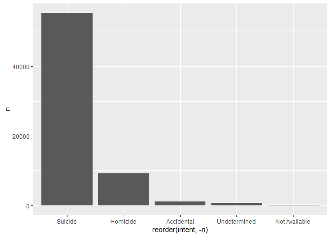

Exploring Gun Deaths in America
================
Ariana Tortolani
07/27/2020

## Objectives

  - To explore gun death data curated by FiveThirtyEight [original data
    available here](https://github.com/fivethirtyeight/guns-data) by
      - Month
      - Intent
      - Age and sex
      - Education
      - Season
      - Intent by race
      - Police-relatedness

## Read in the data

The gun\_deaths.csv is provided in the repository.

``` r
library(tidyverse)    # load tidyverse packages, including ggplot2
library(ggplot2)
library(knitr)

# read in the data
gun_deaths <- read.csv("gun_deaths.csv")

#initial look at data
glimpse(gun_deaths)
```

    ## Rows: 100,798
    ## Columns: 10
    ## $ year      <int> 2012, 2012, 2012, 2012, 2012, 2012, 2012, 2012, 2012, 2012,…
    ## $ month     <int> 1, 1, 1, 2, 2, 2, 2, 3, 2, 2, 2, 1, 3, 3, 3, 3, 3, 3, 3, 4,…
    ## $ intent    <chr> "Suicide", "Suicide", "Suicide", "Suicide", "Suicide", "Sui…
    ## $ police    <int> 0, 0, 0, 0, 0, 0, 0, 0, 0, 0, 0, 0, 0, 0, 0, 0, 0, 0, 0, 0,…
    ## $ sex       <chr> "M", "F", "M", "M", "M", "M", "M", "M", "M", "M", "M", "M",…
    ## $ age       <chr> "34", "21", "60", "64", "31", "17", "48", "41", "50", "Not …
    ## $ race      <chr> "Asian/Pacific Islander", "White", "White", "White", "White…
    ## $ hispanic  <int> 100, 100, 100, 100, 100, 100, 100, 100, 100, 998, 100, 100,…
    ## $ place     <chr> "Home", "Street", "Other specified", "Home", "Other specifi…
    ## $ education <chr> "BA+", "Some college", "BA+", "BA+", "HS/GED", "Less than H…

``` r
#change month col (numbers) to month names
gun_deaths$month <- factor(gun_deaths$month, labels = c("Jan", "Feb", "Mar", "Apr", "May", "Jun", "Jul", "Aug", "Sep", "Oct", "Nov", "Dec"))
```

## Generating a data frame that summarizes the number of gun deaths per month and printing using `kable()`.

Knitr is part of the knitr package. Allows you to change column names
and add captions and make pretty tables in your knitted document. Hint:
set the argument format = “markdown”

``` r
deaths_per_month <- gun_deaths %>%
    group_by(month) %>%
    count()

kable(deaths_per_month, format = "markdown",
      col.names = c("Month", "Number of Deaths"),
      caption = "Number of gun related deaths per month.")
```

| Month | Number of Deaths |
| :---- | ---------------: |
| Jan   |             8273 |
| Feb   |             7093 |
| Mar   |             8289 |
| Apr   |             8455 |
| May   |             8669 |
| Jun   |             8677 |
| Jul   |             8989 |
| Aug   |             8783 |
| Sep   |             8508 |
| Oct   |             8406 |
| Nov   |             8243 |
| Dec   |             8413 |

Number of gun related deaths per month.

### Generating a bar chart with human-readable labels on the x-axis. That is, each month should be labeled “Jan”, “Feb”, “Mar” (full or abbreviated month names are fine), not `1`, `2`, `3`.

``` r
#create plot
ggplot(gun_deaths, aes(month)) +
    geom_bar(fill = "cornflowerblue") +
    scale_y_continuous(breaks = seq(0, 9000, by = 1000)) +
    
#add labels
    labs(title = "Gun Deaths per Month from 2012-2014",
         x     = "Month",
         y     = "Number of Deaths") +
    
 #add theme   
    theme_classic()
```

<!-- -->

## Generating a bar chart that identifies the number of gun deaths associated with each type of intent cause of death. The bars should be sorted from highest to lowest values.

``` r
#create plot
    #fct_infreq(): orders by number of observations with each level (largest first)
ggplot(gun_deaths, aes(fct_infreq(intent))) +
    geom_bar(fill = "cornflowerblue") +
    scale_y_continuous(breaks = seq(0, 60000, by = 10000)) +
    
#add labels
    labs(title = "Intent of Gun Related Deaths from 2012-2014",
         x     = "Intent",
         y     = "Number of Deaths") +
    
 #add theme   
    theme_classic()
```

<!-- -->

## Generating a boxplot visualizing the age of gun death victims, by sex. Print the average age of female gun death victims.

``` r
#create new data frame to remove NA age
gun_deaths_by_sex <- gun_deaths %>%
    filter(age != "Not Available") %>%
    mutate(age = as.numeric(age))

# generating a boxplot visualizing the data
ggplot(gun_deaths_by_sex, aes(sex, age)) +
    geom_boxplot(fill = "cornflowerblue") +
    scale_y_continuous(breaks = seq(0, 100, by = 10)) +

#add labels
    labs(title = "Gun Related Deaths by Sex from 2012-2014",
         x     = "Sex",
         y     = "Age (years)") +
    
 #add theme   
    theme_classic()
```

<!-- -->

``` r
#find average age of female gun death victims and create a new data frame
female_avg_age <- gun_deaths %>%
    group_by(sex) %>%
    filter(sex == 'F') %>%
    mutate(age = as.numeric(age)) %>%
    summarize(average_age_female = mean(age, na.rm = TRUE)) # na.rm removes NA values
```

    ## Warning in mask$eval_all_mutate(dots[[i]]): NAs introduced by coercion

    ## `summarise()` ungrouping output (override with `.groups` argument)

``` r
#print out using kable()
kable(female_avg_age, format = "markdown",
      col.names = c("Sex", "Average age of Deaths"),
      caption = "Average age of all female gun related deaths from 2012-2014")
```

| Sex | Average age of Deaths |
| :-- | --------------------: |
| F   |              43.69507 |

Average age of all female gun related deaths from 2012-2014

## How many white males with at least a high school education were killed by guns in 2012?

``` r
#create new data frame
white_m_hs_ed <- gun_deaths %>%
    filter(sex == "M", 
           race == "White", 
           education %in% c('HS/GED', 'Some college', 'BA+'),
           year ==2012) %>%
    count()

#print out using kable()
kable(white_m_hs_ed, format = "markdown",
      col.names = "Number of Deaths",
      caption = "Total number of white male gun related deaths with at least a high school education in 2012 ")
```

| Number of Deaths |
| ---------------: |
|            15199 |

Total number of white male gun related deaths with at least a high
school education in 2012

## Which season of the year has the most gun deaths?

    ANSWER: From the table printed the season with the highest number of gun deaths is Summer.

Assume that:

  - Winter = January-March
  - Spring = April-June
  - Summer = July-September
  - Fall = October-December

<!-- end list -->

``` r
#create new data frame, 
    #fct_collapse: Collapse factor levels into manually defined groups
gun_deaths_season <- gun_deaths %>%
    mutate(season = fct_collapse(.f = month,
                                 Winter = c("Jan", "Feb", "Mar"),
                                 Spring = c("Apr", "May", "Jun"),
                                 Summer = c("Jul", "Aug", "Sep"),
                                 Autumn = c("Oct", "Nov", "Dec"))) %>%
    count(season) %>%  # count number of deaths per season
    arrange(desc(n))

#print out using kable()
kable(gun_deaths_season, format = "markdown",
      col.names = c("Season", "Number of Deaths"),
      caption = "Total number of gun related deaths per season")
```

| Season | Number of Deaths |
| :----- | ---------------: |
| Summer |            26280 |
| Spring |            25801 |
| Autumn |            25062 |
| Winter |            23655 |

Total number of gun related deaths per season

# These are more open ended questions from here on out, you could look at making multiple summaries or types of plots.

### Are whites who are killed by guns more likely to die because of suicide or homicide? How does this compare to blacks and hispanics?

``` r
#filter data
filter_race <- gun_deaths %>%
    filter(race %in% c("White", "Black", "Hispanic"),
           intent %in% c("Suicide", "Homicide"))

#create plot
ggplot(filter_race, aes(race, fill = intent)) +
    geom_bar(position = "dodge") +
    scale_y_continuous(breaks = seq(0, 60000, by = 10000)) +
    
#add labels
    labs(title = "Number of Gun Deaths by Race and Intent from 2012-2014",
         x     = "Race",
         y     = "Number of Deaths") 
```

<!-- -->

(hint maybe looking at percentages would be good)

``` r
#find percentage
new_filter_race<- filter_race %>%
    select(race, intent) %>%
    group_by(race, intent) %>%
    count(race) %>%
    group_by(race) %>%
    mutate(percent = 100*n / sum(n)) #new varaible to show the percentage of deaths within a race

kable(new_filter_race, format = "markdown",
      col.names = c("Race", "Intent", "Number of Deaths", "Percentage of Death (by race)"),
      caption = "Total number of gun related deaths by Race and Intent")
```

| Race     | Intent   | Number of Deaths | Percentage of Death (by race) |
| :------- | :------- | ---------------: | ----------------------------: |
| Black    | Homicide |            19510 |                      85.41284 |
| Black    | Suicide  |             3332 |                      14.58716 |
| Hispanic | Homicide |             5634 |                      63.98637 |
| Hispanic | Suicide  |             3171 |                      36.01363 |
| White    | Homicide |             9147 |                      14.17722 |
| White    | Suicide  |            55372 |                      85.82278 |

Total number of gun related deaths by Race and Intent

``` r
#create plot
ggplot(new_filter_race, aes(race, percent, fill = intent)) +
    geom_col(position = "fill") +
    
#add labels
    labs(title = "Percentage of Gun Deaths by Race from 2012-2014",
         x     = "Race",
         y     = "Percentage of Deaths") 
```

<!-- -->

### Are police-involved gun deaths significantly different from other gun deaths? Assess the relationship between police involvement and age, police involvement and race, and the intersection of all three variables.

``` r
#filter and clean data
gun_deaths_police <- gun_deaths %>%
    select(age, police, race) %>%
    filter(age != "Not Available") %>%
    mutate(age = as.numeric(age))

# generating a boxplot visualizing the data
ggplot(gun_deaths_police, aes(police, age, group = police)) +
    geom_boxplot(fill = "cornflowerblue") +
    scale_y_continuous(breaks = seq(0, 100, by = 10)) +
    scale_x_discrete(breaks = c("0.0", "1.0"), labels = c("Uninvolved", "Involved")) +
        #it does not seem to be labeling "Uninvolved vs Involved" on the x-axis and I am unsure why.
    
#add labels
    labs(title = "Gun Related Deaths Involving Police from 2012-2014",
         x     = "Police Involvement",
         y     = "Age (years)") +

 #add theme   
    theme_classic()
```

<!-- -->

Think about performing stats such as a t.test to see if differences you
are plotting are statistically significant

``` r
# create  variables for t.test(x,y) function
police_uninvolved_age <- gun_deaths %>%
    select(police, age) %>%
    mutate(age = as.numeric(age)) %>%
    filter(police == 0)
```

    ## Warning in mask$eval_all_mutate(dots[[i]]): NAs introduced by coercion

``` r
police_involved_age <- gun_deaths %>%
    select(police, age) %>%
    mutate(age = as.numeric(age)) %>%
    filter(police == 1)
```

    ## Warning in mask$eval_all_mutate(dots[[i]]): NAs introduced by coercion

``` r
# t-test 
t.test(police_uninvolved_age$age, police_involved_age$age)
```

    ## 
    ##  Welch Two Sample t-test
    ## 
    ## data:  police_uninvolved_age$age and police_involved_age$age
    ## t = 22.449, df = 1491.8, p-value < 2.2e-16
    ## alternative hypothesis: true difference in means is not equal to 0
    ## 95 percent confidence interval:
    ##  7.224642 8.608106
    ## sample estimates:
    ## mean of x mean of y 
    ##  43.96773  36.05136

Finally, all together now:

``` r
#filter data
gun_deaths_all_together <- gun_deaths %>%
    select(age, race, police) %>%
    mutate(age = as.numeric(age)) %>%
    group_by(race, police)
```

    ## Warning in mask$eval_all_mutate(dots[[i]]): NAs introduced by coercion

``` r
#create plot
ggplot(gun_deaths_all_together, aes(police, age, group = police, fill = police)) + 
            #i know the continuous scale of police on the side doesn't make much sense but I can't seem to label this how i want using scale_x_discrete
    geom_boxplot() +
    facet_wrap(~race, nrow = 1, labeller = label_wrap_gen(width = 20)) +

#add labels
    scale_y_continuous(breaks = seq(0, 100, by = 10)) +
    scale_x_discrete(breaks=c("0", "1"), labels=c("Uninvolved", "Involved")) + #still not showing labels when i run this

#add labels
    labs(title = "Gun Related Deaths from 2012-2014",
         x     = "Police Involvement",
         y     = "Age (years)") 
```

    ## Warning: Removed 18 rows containing non-finite values (stat_boxplot).

<!-- -->

## Session info

``` r
# always good to have this for reproducibility purposes
devtools::session_info()
```

    ## ─ Session info ───────────────────────────────────────────────────────────────
    ##  setting  value                       
    ##  version  R version 4.0.2 (2020-06-22)
    ##  os       macOS Mojave 10.14.2        
    ##  system   x86_64, darwin17.0          
    ##  ui       X11                         
    ##  language (EN)                        
    ##  collate  en_US.UTF-8                 
    ##  ctype    en_US.UTF-8                 
    ##  tz       America/New_York            
    ##  date     2020-07-27                  
    ## 
    ## ─ Packages ───────────────────────────────────────────────────────────────────
    ##  package     * version date       lib source        
    ##  assertthat    0.2.1   2019-03-21 [1] CRAN (R 4.0.0)
    ##  backports     1.1.8   2020-06-17 [1] CRAN (R 4.0.0)
    ##  blob          1.2.1   2020-01-20 [1] CRAN (R 4.0.0)
    ##  broom         0.5.6   2020-04-20 [1] CRAN (R 4.0.0)
    ##  callr         3.4.3   2020-03-28 [1] CRAN (R 4.0.0)
    ##  cellranger    1.1.0   2016-07-27 [1] CRAN (R 4.0.0)
    ##  cli           2.0.2   2020-02-28 [1] CRAN (R 4.0.0)
    ##  colorspace    1.4-1   2019-03-18 [1] CRAN (R 4.0.0)
    ##  crayon        1.3.4   2017-09-16 [1] CRAN (R 4.0.0)
    ##  DBI           1.1.0   2019-12-15 [1] CRAN (R 4.0.0)
    ##  dbplyr        1.4.4   2020-05-27 [1] CRAN (R 4.0.0)
    ##  desc          1.2.0   2018-05-01 [1] CRAN (R 4.0.0)
    ##  devtools      2.3.1   2020-07-21 [1] CRAN (R 4.0.2)
    ##  digest        0.6.25  2020-02-23 [1] CRAN (R 4.0.0)
    ##  dplyr       * 1.0.0   2020-05-29 [1] CRAN (R 4.0.0)
    ##  ellipsis      0.3.1   2020-05-15 [1] CRAN (R 4.0.0)
    ##  evaluate      0.14    2019-05-28 [1] CRAN (R 4.0.0)
    ##  fansi         0.4.1   2020-01-08 [1] CRAN (R 4.0.0)
    ##  farver        2.0.3   2020-01-16 [1] CRAN (R 4.0.0)
    ##  forcats     * 0.5.0   2020-03-01 [1] CRAN (R 4.0.0)
    ##  fs            1.4.2   2020-06-30 [1] CRAN (R 4.0.2)
    ##  generics      0.0.2   2018-11-29 [1] CRAN (R 4.0.0)
    ##  ggplot2     * 3.3.2   2020-06-19 [1] CRAN (R 4.0.0)
    ##  glue          1.4.1   2020-05-13 [1] CRAN (R 4.0.0)
    ##  gtable        0.3.0   2019-03-25 [1] CRAN (R 4.0.0)
    ##  haven         2.3.1   2020-06-01 [1] CRAN (R 4.0.0)
    ##  highr         0.8     2019-03-20 [1] CRAN (R 4.0.0)
    ##  hms           0.5.3   2020-01-08 [1] CRAN (R 4.0.0)
    ##  htmltools     0.5.0   2020-06-16 [1] CRAN (R 4.0.0)
    ##  httr          1.4.1   2019-08-05 [1] CRAN (R 4.0.0)
    ##  jsonlite      1.7.0   2020-06-25 [1] CRAN (R 4.0.0)
    ##  knitr       * 1.29    2020-06-23 [1] CRAN (R 4.0.0)
    ##  labeling      0.3     2014-08-23 [1] CRAN (R 4.0.0)
    ##  lattice       0.20-41 2020-04-02 [1] CRAN (R 4.0.2)
    ##  lifecycle     0.2.0   2020-03-06 [1] CRAN (R 4.0.0)
    ##  lubridate     1.7.9   2020-06-08 [1] CRAN (R 4.0.0)
    ##  magrittr      1.5     2014-11-22 [1] CRAN (R 4.0.0)
    ##  memoise       1.1.0   2017-04-21 [1] CRAN (R 4.0.2)
    ##  modelr        0.1.8   2020-05-19 [1] CRAN (R 4.0.0)
    ##  munsell       0.5.0   2018-06-12 [1] CRAN (R 4.0.0)
    ##  nlme          3.1-148 2020-05-24 [1] CRAN (R 4.0.2)
    ##  pillar        1.4.4   2020-05-05 [1] CRAN (R 4.0.0)
    ##  pkgbuild      1.0.8   2020-05-07 [1] CRAN (R 4.0.0)
    ##  pkgconfig     2.0.3   2019-09-22 [1] CRAN (R 4.0.0)
    ##  pkgload       1.1.0   2020-05-29 [1] CRAN (R 4.0.0)
    ##  prettyunits   1.1.1   2020-01-24 [1] CRAN (R 4.0.0)
    ##  processx      3.4.2   2020-02-09 [1] CRAN (R 4.0.0)
    ##  ps            1.3.3   2020-05-08 [1] CRAN (R 4.0.0)
    ##  purrr       * 0.3.4   2020-04-17 [1] CRAN (R 4.0.0)
    ##  R6            2.4.1   2019-11-12 [1] CRAN (R 4.0.0)
    ##  Rcpp          1.0.4.6 2020-04-09 [1] CRAN (R 4.0.0)
    ##  readr       * 1.3.1   2018-12-21 [1] CRAN (R 4.0.0)
    ##  readxl        1.3.1   2019-03-13 [1] CRAN (R 4.0.0)
    ##  remotes       2.2.0   2020-07-21 [1] CRAN (R 4.0.2)
    ##  reprex        0.3.0   2019-05-16 [1] CRAN (R 4.0.0)
    ##  rlang         0.4.6   2020-05-02 [1] CRAN (R 4.0.0)
    ##  rmarkdown     2.3     2020-06-18 [1] CRAN (R 4.0.0)
    ##  rprojroot     1.3-2   2018-01-03 [1] CRAN (R 4.0.0)
    ##  rstudioapi    0.11    2020-02-07 [1] CRAN (R 4.0.0)
    ##  rvest         0.3.5   2019-11-08 [1] CRAN (R 4.0.0)
    ##  scales        1.1.1   2020-05-11 [1] CRAN (R 4.0.0)
    ##  sessioninfo   1.1.1   2018-11-05 [1] CRAN (R 4.0.2)
    ##  stringi       1.4.6   2020-02-17 [1] CRAN (R 4.0.0)
    ##  stringr     * 1.4.0   2019-02-10 [1] CRAN (R 4.0.0)
    ##  testthat      2.3.2   2020-03-02 [1] CRAN (R 4.0.0)
    ##  tibble      * 3.0.1   2020-04-20 [1] CRAN (R 4.0.0)
    ##  tidyr       * 1.1.0   2020-05-20 [1] CRAN (R 4.0.0)
    ##  tidyselect    1.1.0   2020-05-11 [1] CRAN (R 4.0.0)
    ##  tidyverse   * 1.3.0   2019-11-21 [1] CRAN (R 4.0.0)
    ##  usethis       1.6.1   2020-04-29 [1] CRAN (R 4.0.2)
    ##  utf8          1.1.4   2018-05-24 [1] CRAN (R 4.0.0)
    ##  vctrs         0.3.1   2020-06-05 [1] CRAN (R 4.0.0)
    ##  withr         2.2.0   2020-04-20 [1] CRAN (R 4.0.0)
    ##  xfun          0.15    2020-06-21 [1] CRAN (R 4.0.0)
    ##  xml2          1.3.2   2020-04-23 [1] CRAN (R 4.0.0)
    ##  yaml          2.2.1   2020-02-01 [1] CRAN (R 4.0.0)
    ## 
    ## [1] /Library/Frameworks/R.framework/Versions/4.0/Resources/library
