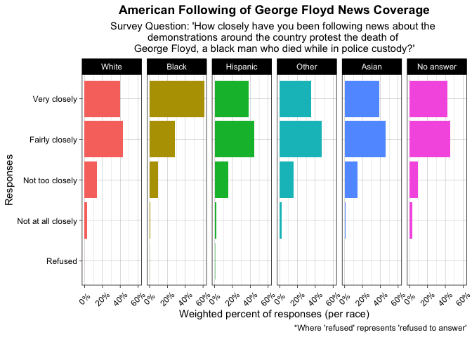
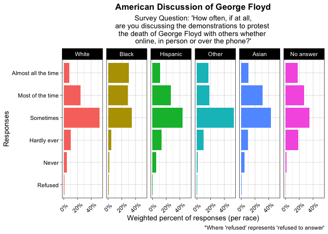
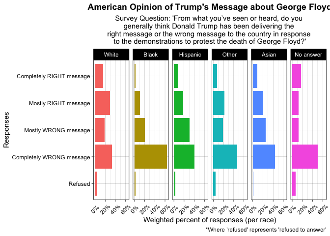

HW04\_Julia
================
Julia Shangguan
7/27/2020

``` r
knitr::opts_chunk$set(echo = TRUE, error = TRUE)
```

## HWO4: Looking at race and BLM news discussion

This week I am once again making use of the abundant data from the Pew
Research Center.
[Here](https://www.journalism.org/dataset/american-news-pathways-june-2020-survey/)
is where I downloaded the dataset for this assignment, but all necessary
files are included in my pull request. Note: you do need to make a Pew
Research account in order to download their datasets.

For context, I am working with a recent survey (taken June 4-10, 2020)
that surveyed American trends in relation to opinions/responses to news
regarding George Floyd, Covid-19, and the 2020 presidential election.

**Loading in necessary packages and installing packages:**

``` r
#install.packages('survey') #install this package for analysis of data analysis
library(survey)
```

    ## Loading required package: grid

    ## Loading required package: Matrix

    ## Loading required package: survival

    ## 
    ## Attaching package: 'survey'

    ## The following object is masked from 'package:graphics':
    ## 
    ##     dotchart

``` r
#install.packages('tidyverse')
library(tidyverse)
```

    ## ── Attaching packages ─────────────────────────────────────────────────────────── tidyverse 1.3.0 ──

    ## ✓ ggplot2 3.3.2.9000     ✓ purrr   0.3.4     
    ## ✓ tibble  3.0.3          ✓ dplyr   1.0.0     
    ## ✓ tidyr   1.1.0          ✓ stringr 1.4.0     
    ## ✓ readr   1.3.1          ✓ forcats 0.5.0

    ## ── Conflicts ────────────────────────────────────────────────────────────── tidyverse_conflicts() ──
    ## x tidyr::expand() masks Matrix::expand()
    ## x dplyr::filter() masks stats::filter()
    ## x dplyr::lag()    masks stats::lag()
    ## x tidyr::pack()   masks Matrix::pack()
    ## x tidyr::unpack() masks Matrix::unpack()

``` r
library("ggplot2")
library(foreign) #needed to import my dataset
library(scales) #needed to later convert my x-axis labels from decimal to percent
```

    ## 
    ## Attaching package: 'scales'

    ## The following object is masked from 'package:purrr':
    ## 
    ##     discard

    ## The following object is masked from 'package:readr':
    ## 
    ##     col_factor

**Importing my dataset as an R data.frame:**

``` r
News_data <- read.spss("Pathways_June 2020_ATP W68.sav", to.data.frame = TRUE) 
```

**The survey questions I will be examining are**:

  - How closely have you been following news about the demonstrations
    around the country protest the death of George Floyd, a black man
    who died while in police custody?
      - Very closely
      - Fairly closely
      - Not too closely
      - Not at all closely
      - No answer
  - How often, if at all, are you discussing the demonstrations to
    protest the death of George Floyd with others whether online, in
    person or over the phone?
      - Almost all the time
      - Most of the time
      - Sometimes
      - Hardly ever
      - Never
      - No answer
  - From what you’ve seen or heard, do you generally think Donald Trump
    has been delivering the right message or the wrong message to the
    country in response to the demonstrations to protest the death of
    George Floyd?
      - Completely RIGHT message
      - Mostly RIGHT message
      - Mostly WRONG message
      - Completely WRONG message
      - No answer

This
[document](https://www.pewresearch.org/wp-content/uploads/2018/05/Codebook-and-instructions-for-working-with-ATP-data.pdf)
explains the meaning of each demographic profile variable. The variables
corresponding to each survey question response are included in [this
document](Pathways%20June%202020%20\(ATP%20W68\)%20Topline.pdf); ideally
this links you to another document in the pull request.

``` r
#names(News_data) #examining all variables
#glimpse(News_data) 
```

I will be plotting weighted survey estimates based on the variable
WEIGHT\_W68 because “data for all Pew Research Center reports are
analyzed using this weight.”

First, I am going create a new dataframe for each survey
question/response with only the columns I’m interested in.

``` r
#creating new table with selected variables, also renaming columns

select_follow_data <- News_data %>%
  select(weight = WEIGHT_W68, floyd_follow = FLOYDFOL_W68, race = F_RACETHNMOD) 

select_discuss_data <- News_data %>%
  select(weight = WEIGHT_W68, floyd_discuss = FLOYDDISC_W68, race = F_RACETHNMOD) 

select_trump_data <- News_data %>%
  select(weight = WEIGHT_W68, floyd_trump = FLOYDTRUMPMSSG_W68, race = F_RACETHNMOD) 

#head(select_discuss_data) #checking that it worked
#head(select_follow_data)
#head(select_trump_data)
```

I can now get a weighted summary and add that as a column.

``` r
#Counting number of responses according to each race

#Question_follow
follow <- select_follow_data %>% group_by(race) %>% count(floyd_follow, wt = weight)
follow_data <- follow %>%
  group_by(race, floyd_follow) %>% 
  summarise(total_n = sum(n))  %>%  #get the total sums of weights n for each category 
  mutate(weighted_group_size = sum(total_n), #add columns to get proportion values
         weighted_percent_responders = total_n / weighted_group_size)
```

    ## `summarise()` regrouping output by 'race' (override with `.groups` argument)

``` r
#Question_discuss
discuss <- select_discuss_data %>% group_by(race) %>% count(floyd_discuss, wt = weight)
discussion_data <- discuss %>%
  group_by(race, floyd_discuss) %>% 
  summarise(total_n = sum(n))  %>%  #get the total sums of weights n for each category 
  mutate(weighted_group_size = sum(total_n), #add columns to get proportion values
         weighted_percent_responders = total_n / weighted_group_size)
```

    ## `summarise()` regrouping output by 'race' (override with `.groups` argument)

``` r
#Question_trump
trump <- select_trump_data %>% group_by(race) %>% count(floyd_trump, wt = weight)
trump_data <- trump %>%
  group_by(race, floyd_trump) %>% 
  summarise(total_n = sum(n))  %>%  #get the total sums of weights n for each category 
  mutate(weighted_group_size = sum(total_n), #add columns to get proportion values
         weighted_percent_responders = total_n / weighted_group_size)
```

    ## `summarise()` regrouping output by 'race' (override with `.groups` argument)

Here are graphs of the results:

``` r
#Question_follow
#renaming variables
follow_data$race <- 
 recode(follow_data$race, "White non-Hispanic" = "White", "Black non-Hispanic" = "Black", "Asian non-Hispanic" = "Asian", "Refused" = "No answer")

#reordering variables
follow_data$floyd_follow <- factor(x = follow_data$floyd_follow, levels=c("Refused","Not at all closely", "Not too closely","Fairly closely", "Very closely"))

follow_data %>%
 filter(!is.na(floyd_follow)) %>%
ggplot(aes(x = weighted_percent_responders, y = floyd_follow, fill = factor(race)))+
  geom_bar(stat='identity') +
   scale_x_continuous(name = "Weighted percent of responses (per race)", labels = percent) +
   scale_y_discrete(name = "Responses") +
  facet_grid(cols = vars(race),
                    scales = "free_y",
                    space = "free") +
         theme_linedraw() +
  labs(title = "American Following of George Floyd News Coverage", 
       subtitle = "Survey Question: 'How closely have you been following news about the \ndemonstrations around the country protest the death of \nGeorge Floyd, a black man who died while in police custody?'", 
       caption = "*Where 'refused' represents 'refused to answer'" ) +
   theme(plot.title = element_text(face = "bold", hjust = 0.5), 
         plot.subtitle = element_text(hjust = 0.5), 
         axis.text.x = element_text(angle = 45, vjust = 0.5), 
         legend.position = "None") 
```

<!-- -->

``` r
#Question_discuss
#renaming variables
discussion_data$race <- 
 recode(discussion_data$race, "White non-Hispanic" = "White", "Black non-Hispanic" = "Black", "Asian non-Hispanic" = "Asian", "Refused" = "No answer")

#reordering variables
discussion_data$floyd_discuss <- factor(x = discussion_data$floyd_discuss, levels=c("Refused", "Never", "Hardly ever", "Sometimes", "Most of the time", "Almost all the time"))

discussion_data %>%
 filter(!is.na(floyd_discuss)) %>%
ggplot(aes(x = weighted_percent_responders, y = floyd_discuss, fill = factor(race)))+
  geom_bar(stat='identity') +
   scale_x_continuous(name = "Weighted percent of responses (per race)", labels = percent) +
   scale_y_discrete(name = "Responses") +
  facet_grid(cols = vars(race),
                    scales = "free_y",
                    space = "free") +
         theme_linedraw() +
  labs(title = "American Discussion of George Floyd", 
       subtitle = "Survey Question: 'How often, if at all,\nare you discussing the demonstrations to protest \nthe death of George Floyd with others whether \nonline, in person or over the phone?'", 
       caption = "*Where 'refused' represents 'refused to answer'" ) +
   theme(plot.title = element_text(face = "bold", hjust = 0.5), 
         plot.subtitle = element_text(hjust = 0.5), 
         axis.text.x = element_text(angle = 45, vjust = 0.5), 
         legend.position = "None") 
```

<!-- -->

``` r
#Question_trump
#renaming variables
trump_data$race <- 
 recode(trump_data$race, "White non-Hispanic" = "White", "Black non-Hispanic" = "Black", "Asian non-Hispanic" = "Asian", "Refused" = "No answer")

#reordering variables
trump_data$floyd_trump <- factor(x = trump_data$floyd_trump, levels=c("Refused", "Completely WRONG message", "Mostly WRONG message", "Mostly RIGHT message", "Completely RIGHT message"))

trump_data %>%
 filter(!is.na(floyd_trump)) %>%
ggplot(aes(x = weighted_percent_responders, y = floyd_trump, fill = factor(race)))+
  geom_bar(stat='identity') +
   scale_x_continuous(name = "Weighted percent of responses (per race)", labels = percent) +
   scale_y_discrete(name = "Responses") +
  facet_grid(cols = vars(race),
                    scales = "free_y",
                    space = "free") +
         theme_linedraw() +
  labs(title = "American Opinion of Trump's Message about George Floyd", 
       subtitle = "Survey Question: 'From what you’ve seen or heard, do you \ngenerally think Donald Trump has been delivering the \nright message or the wrong message to the country in response \nto the demonstrations to protest the death of George Floyd?'", 
       caption = "*Where 'refused' represents 'refused to answer'" ) +
   theme(plot.title = element_text(face = "bold", hjust = 0.5), 
         plot.subtitle = element_text(hjust = 0.5), 
         axis.text.x = element_text(angle = 45, vjust = 0.5), 
         legend.position = "None") 
```

<!-- -->

Ignore the following; I was trying to experiment with something but
don’t want to delete this code haha.

``` r
select_News_data <- News_data %>%
  select(weight = WEIGHT_W68, floyd_following = FLOYDFOL_W68, floyd_discussing = FLOYDDISC_W68, floyd_trump= FLOYDTRUMPMSSG_W68, race = F_RACECMB) 

test_data <-  select_data_long %>%
  group_by(race, question, response ) %>% 
  summarise(weighted_n = sum(weight))  %>%  
  group_by(response) %>% 
    
#I can't tell what is happening when you run a weighted calculation with multiple variables because the final proportions per race are confusing
  mutate(weighted_group_size = sum(weighted_n), 
         weighted_percent_responders = weighted_n / weighted_group_size
         ) 
```

    ## Error in eval(lhs, parent, parent): object 'select_data_long' not found

``` r
ggplot(test_data, aes(x = weighted_percent_responders, y = arrange(response), fill = factor(race))) +
   geom_bar(stat='identity') +
   scale_x_continuous(name = "Weighted percent of responses", labels = percent) +
   scale_y_discrete(name = "Responses") +
         facet_grid(cols = vars(question),
                    rows = vars(race),
                    scales = "free",
                    space = "free") 
```

    ## Error in ggplot(test_data, aes(x = weighted_percent_responders, y = arrange(response), : object 'test_data' not found
