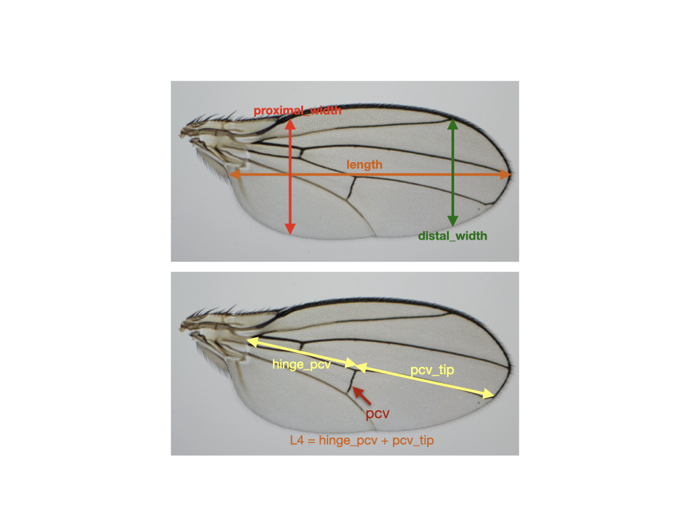
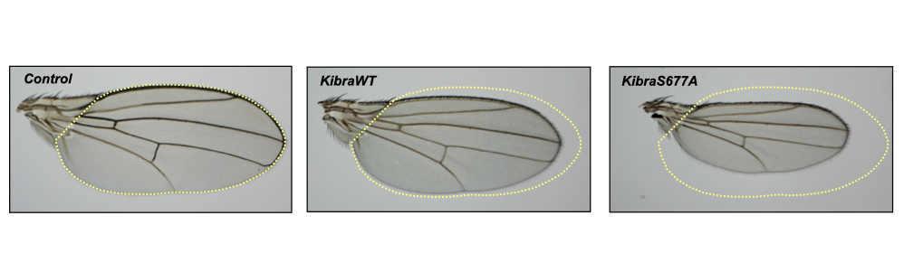

```{r setup, include=FALSE}
knitr::opts_chunk$set(echo = TRUE)
```

## HW 04: Measuring the effects of ectopic expression of a tumor suppressor protein Kibra on *Drosophila* wing size.

My research focuses on how organ growth is regulated at the molecular level. A key signaling pathway that regulates organ growth in animals is called the Hippo tumor suppressor pathway (Hippo pathway). The function of the Hippo pathway in development is to suppress growth when organs reach their optimal size. So, hyperactivation of the Hippo pathway leads to disproportionately small organs, and inactivation of the pathway leads to disproportionally large organs.

In this excersize, I will investigate the effect of ectopic expression of one of the Hippo pathway components, Kibra, on the fly wing growth. I generated a gain-of-function mutant of Kibra, which should lead to enhanced growth-suppression.

In this exercise control = no ectopic Kibra (only endogenous Kibra is expressed), KibWT = wild-type Kibra is expressed ectopically, and KibS677A = gain-of-function mutant Kibra is ectopically expressed. For a sample image of a *Drosophila* wing and the measurement annotations, please see images below. .

```{r}
library(dplyr)
library(magrittr)
library(ggplot2)
wings_data <- read.csv("wing_dimensions.csv", header = TRUE, stringsAsFactors = FALSE) #read in the data
size_compare <- wings_data %>%
  select(genotype, area, length, width) #select specifically the area columns for each genotype
size_compare %>%
  group_by(genotype) %>%
  summarize(avg_size = mean(area)) %>%
  arrange(desc(avg_size))

ggplot(wings_data, aes(x = reorder(genotype, -area), area, fill = genotype)) +  #reorder(genotype, -area) will order the bars in the descending order.
  geom_boxplot() +
  geom_jitter(height = 0, width = 0.05, aes(alpha = 0)) +
  labs(x = "Genotype", y = "Wing Area (AU)", title = "Effect of ectopic Kibra expression on fly wing size") +
  theme(legend.position = "none")

```

As predicted from a growth suppressing protein, ectopic expression of Kibra leads to smaller wing size. Note that expression of the gain-of-function mutant version ofKibra (KibS677A) leads to a very dramatic undergrowth.

The growth difference is apparent in the images below, where the dashed yellow line shows the outline of the control wing. .

However, if we look carefully at the shape of the wings, we can see that the shape of the wing expressing KibraS677A is very different from the control wing, suggesting that Kibra might inhibit growth in specific regions in the wing.

We can investigate that by comparing growth changes across multiple dimensions in the wings.

```{r}
aspect_ratios <- wings_data %>%
  select(genotype, length, width, proximal_width, distal_width) %>%
  mutate(centralAR = width/length, proximalAR = proximal_width/length, distalAR = distal_width/length)
```
The code above produces a new variable, aspect ratios, that will have new columns added with calculated aspect ratios using distal, central, or proximal width. 

```{r}
library(tidyr)
library(forcats) 
aspect_ratios %>%
  select(genotype, 6:8) %>%
  gather(key = "Region", value = "Ratio", 2:4) %>%  #rearranges data into long format
  ggplot(mapping = aes(x = as_factor(genotype), Ratio, fill = Region)) +
  geom_boxplot() +
  labs(x = "Genotype", y = "Aspect Ratio by Wing Region", title = "KibraS677A mutant suppresses growth stronger in the proximal wing region")

```

The graph above shows that the decrease in wing width is more dramatic in the proximal region than in the distal region of the wing when the hyperactive version of Kibra, Kibra S677A, is expressed, suggesting that the mutation affects Kibra activity more in the proximal wing region.

We can also graph the data by plotting the region in the x-axis and faceting by genotype.
```{r}
aspect_ratios %>%
  select(genotype, 6:8) %>%
  gather(key = "Region", value = "Ratio", 2:4) %>%  #rearranges data into long format
  ggplot(mapping = aes(x = Region, Ratio, fill = Region)) +
  geom_boxplot() +
  labs(x = "Wing Region", y = "Aspect Ratio by Wing Region", title = "KibraS677A mutant suppresses growth stronger in the proximal wing region") +
  facet_wrap(~as_factor(genotype))
```


